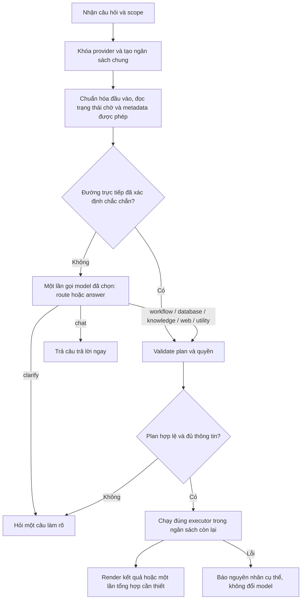

# Kế hoạch xử lý dứt điểm routing chat, model, embedding và chi phí token

Ngày: 27/09/2026  
Trạng thái: Kế hoạch triển khai; chưa triển khai kiến trúc mới trong tài liệu này.  
Phạm vi: Chat chính, chat nhúng, API chat và các nhánh nghiệp vụ/database/tài liệu/web.

## 1. Kết quả cần đạt

1. Người dùng chọn model nào thì toàn bộ suy luận của lượt chat dùng đúng provider/model đó. Không tự chuyển sang Ollama hoặc một model khác khi lỗi.
2. Chat thông thường không gọi embedding, Qdrant, SQL hoặc gửi toàn bộ danh mục nghiệp vụ vào nhiều vòng model.
3. `bge-m3` tiếp tục phục vụ lập chỉ mục và truy hồi kho dữ liệu. Chỉ gọi khi đã xác định cần truy hồi; không dùng để quyết định chat thường hay nghiệp vụ.
4. Một quyết định định tuyến được dùng xuyên suốt request. Các tầng sau không tự phân loại lại bằng những bộ regex độc lập.
5. Chat thường trả lời trong một lần gọi model ở đường đi thành công thông thường. Khi mơ hồ, hỏi lại thay vì thử nhiều workflow/model.
6. Mọi lần gọi model, kể cả chọn nghiệp vụ, chọn bảng, repair và retry, thuộc một ngân sách chung có giới hạn.
7. Nếu không hoàn tất, hiển thị nguyên nhân và bước khắc phục cụ thể. Không chỉ trả “Chưa thể hoàn tất” hoặc `fetch failed`.
8. Danh sách dữ liệu xác định rõ có thể trả bằng SQL đã kiểm tra và renderer, không cần model tạo lại câu trả lời.

“Dứt điểm” được nghiệm thu bằng trace, kiểm thử và số liệu runtime; không chỉ bằng việc hết một dòng log hoặc tăng timeout.

## 2. Hiện trạng và bằng chứng

### 2.1. Vấn đề đã xác định trong code

| Vị trí | Hiện trạng | Hậu quả |
| --- | --- | --- |
| `src/backend/intelligent_core/core.js` | Gọi `automation/orchestrator.handle()` trước khi khởi tạo `executionBudget` | Routing nghiệp vụ chưa nằm trong giới hạn chung của harness |
| `src/backend/automation/orchestrator.js` | Có shortlist theo batch, classification, social verification, semantic review và scope verification | Một câu ngắn có thể tốn nhiều model call trước khi đến chat chính |
| `src/backend/intelligent_core/schema_context_service.js` | Dùng regex, glossary, lexical và Qdrant; mới có đường tắt danh sách rõ đối tượng | Các câu chưa nằm trong đường tắt vẫn có thể gọi embedding không cần thiết |
| `src/backend/intelligent_core/knowledge_intent.js` | Dùng từ khóa và khớp token tiêu đề tài liệu | Có thể nhầm kiến thức chung với yêu cầu tìm kho tài liệu |
| `src/backend/agent_core/harness/request_execution_budget.js` | Giới hạn thời gian, số model call, SQL và tool; chưa có ngân sách token toàn request | Nhiều prompt lớn vẫn tiêu thụ rất nhiều token dù chưa vượt số call |
| `src/backend/agent_core/harness/guarded_agent_harness.js` | Mặc định remote tối đa 12 model call, 3 SQL attempt, 20 tool call | Giới hạn quá rộng cho chat hoặc truy vấn đơn giản |
| `src/backend/intelligent_core/adapters/*` và `core.js` | Nhiều nơi chỉ truyền `error.message` | Mất `cause.code`, endpoint và stage; khó phân biệt Gemini, Ollama, embedding |
| `core.js`, các harness và automation | Còn nhiều điểm resolve provider/fallback | Cần một provider snapshot duy nhất, kể cả khi client không gửi providerId |

### 2.2. Những sửa chữa đã có trong code khi lập kế hoạch

- Khóa provider khi `providerId` được truyền rõ; từ chối ID không tồn tại.
- Bỏ giới hạn độ dài câu trong gate chat thường; tránh nhầm “bằng” thành “bảng”.
- Tìm kiếm web không chạy schema retrieval trước đó.
- Thu hẹp một số từ khóa tìm tài liệu và database.
- Danh sách đơn giản khớp duy nhất metadata có thể bỏ Qdrant, tạo SQL bảng đơn và trả dữ liệu trực tiếp.
- Nhánh danh sách trực tiếp trên guarded harness dừng khi SQL lỗi, không tiếp tục repair bằng model.
- Bỏ phân loại catalog workflow cho một số câu danh sách khi không có nghiệp vụ đang chờ.

Các sửa chữa trên là giải pháp từng phần. Không xem regex đã chỉnh là kiến trúc định tuyến hoàn chỉnh. Đặc biệt, đường tắt danh sách phải được rà lại để không vượt qua workflow có ý nghĩa nghiệp vụ khác hoặc các ràng buộc nguồn/quyền.

### 2.3. Những gì chưa được chứng minh

- Ảnh “ds kh” báo 30.635 token là bằng chứng về chi phí của một lượt; chưa có trace đầy đủ để quy chính xác từng token cho từng stage của lượt đó.
- Kiểm tra trước đây thấy endpoint Gemini truy cập được qua HTTP và Ollama `127.0.0.1:11434` từ chối kết nối. Đây là ảnh chụp trạng thái tại thời điểm kiểm tra, không chứng minh lỗi mạng của mọi lượt chat.
- Provider active trong PostgreSQL từng là Ollama; cấu hình đang chạy phải đọc từ PostgreSQL, không suy ra từ file JSON cũ.
- Lần chạy test đầy đủ gần nhất trước tài liệu này: 397 test, 386 đạt, 11 bỏ qua. Kết quả fixture không thay thế nghiệm thu trên provider và dữ liệu thật.

## 3. Nguyên tắc kiến trúc

### 3.1. Một model cho toàn bộ suy luận của lượt chat

- Resolve provider trước mọi thao tác workflow/chat/model; tạo snapshot bất biến gồm ID, model, adapter, endpoint và capability.
- Có `providerId`: resolve đúng ID, lỗi thì báo lỗi; không dùng model mặc định thay thế.
- Không có `providerId`: lấy model mặc định một lần ở đầu request, ghi rõ `selectionSource=default`, sau đó vẫn khóa snapshot đó.
- Cấu hình provider thay đổi giữa request chỉ có hiệu lực ở request tiếp theo.
- Retry mạng nếu được phép chỉ dùng cùng snapshot và cùng ngân sách. Loại bỏ fallback chéo provider khỏi đường chat mới.
- Embedding là dependency riêng của retrieval, không tham gia danh sách provider chat dự phòng.
- Workflow có bước AI phải nhận cùng snapshot nếu chạy trong lượt chat. Job chạy nền tiếp tục dùng cấu hình đã ghim, không lấy ngầm provider active mới.

### 3.2. Không định tuyến nghiệp vụ bằng danh sách từ khóa đóng

- Không thêm nhánh runtime riêng cho “KH”, “NV”, “hợp đồng”, “Excel” hoặc tên bảng cụ thể.
- Metadata/alias/glossary do quản trị viên cấu hình chỉ tạo ứng viên có nguồn, không tự chứng minh ý định.
- Phân biệt “hợp đồng là gì?” với “liệt kê hợp đồng” bằng yêu cầu và capability, không bằng sự xuất hiện của một từ.
- Model trả quyết định theo contract; backend kiểm tra ID, scope, quyền, dữ liệu đầu vào và khả năng thực thi.
- Validation cấu trúc không chứng minh model hiểu đúng ý định. Nếu scope không khớp hoặc thiếu bằng chứng thì hỏi lại, không âm thầm chọn mẫu gần nhất.

### 3.3. Tách chat, dữ liệu và tài liệu

| Nhánh | Model chat | SQL | Embedding/Qdrant |
| --- | --- | --- | --- |
| Chat thường | Model đã chọn | Không | Không |
| Tiện ích như tính toán/giờ hiện tại | Model đã chọn nếu cần | Không | Không |
| Danh sách database rõ bảng | Có thể không cần gọi model | Có, sau validation | Không nếu metadata đã đủ |
| Database phức tạp | Model đã chọn | Có, theo plan đã validate | Chỉ khi cần truy hồi schema bổ sung |
| Kho tài liệu | Model đã chọn trả lời từ bằng chứng | Không mặc định | `bge-m3` khi thực hiện dense retrieval |
| Workflow | Model đã chọn cho routing/AI step | Theo định nghĩa workflow | Chỉ nếu workflow có bước truy hồi |
| Web | Model đã chọn và công cụ web | Không mặc định | Không gọi kho nội bộ khi chỉ chọn web |

## 4. Luồng đích



Đường trực tiếp chỉ dùng khi có đủ metadata và một scope rõ ràng. Không coi mọi câu ngắn bắt đầu bằng “ds” là đã đủ điều kiện.

### 4.1. Context đầu request

Tạo `ChatRequestContext` trước khi gọi orchestrator:

```text
requestId, sessionId, accountId, tenantId
providerSnapshot, selectionSource
sourceScope: dbSourceId, knowledgeSourceIds, webSearch, permissions
originalQuestion, relevantHistory, pendingWorkflow
catalogRevision, routeDecision, executionBudget, abortSignal
```

- UI truyền rõ provider đang hiển thị; tránh hiển thị Gemini nhưng gửi `providerId=null`.
- Đầu vào từ route chat, stream, embed và API tương thích phải cùng đi qua lớp chuẩn hóa này.
- Không gửi toàn bộ 20 lượt lịch sử theo thói quen: dùng tóm tắt và lượt liên quan trong ngân sách riêng.
- Một câu danh sách mới như “ds kh” không được nối ngầm với điều kiện của câu hỏi chủ đề trước.

### 4.2. Chuẩn bị catalog gọn, không cần embedding cho chat thường

- Snapshot metadata lọc quyền gồm ID/version, tên, mục đích, scope hỗ trợ và dấu hiệu input bắt buộc.
- Không gửi SQL binding, toàn bộ instructions, examples, lịch sử thực thi hoặc nội dung tài liệu vào bước router.
- Dùng lexical/fuzzy index trên metadata để lấy ứng viên; không gọi `bge-m3` chỉ để quyết định có cần kho dữ liệu hay không.
- Candidate recall phải được đo bằng tập viết tắt, không dấu, sai chính tả và diễn đạt khác. Không ép chọn khi shortlist không chứa đối tượng phù hợp.
- Catalog lớn: dùng mô tả capability ở cấp nhóm và shortlist có giới hạn. Nếu vẫn thiếu ngữ cảnh thì trả clarification hoặc lấy metadata bổ sung trong ngân sách; không quét tất cả batch bằng nhiều model call.
- Cache metadata theo tenant/account, quyền, nguồn và revision. Không cache đáp án dữ liệu động như câu trả lời chung.

### 4.3. Contract route-or-answer

Đề xuất contract có version, dùng schema tương ứng với từng route:

```json
{
  "version": 1,
  "route": "chat|utility|workflow|database|knowledge|web|clarify",
  "replyText": null,
  "resourceIds": [],
  "scope": "collection|targeted|aggregate|none|unclear",
  "inputs": {},
  "inputEvidence": {},
  "missingInputs": [],
  "needsRetrieval": false,
  "reasonCode": "..."
}
```

- `chat`: chứa câu trả lời hoàn chỉnh trong `replyText`; trả ngay, không chạy tiếp harness dữ liệu.
- `clarify`: chỉ hỏi thông tin cần thiết; không phát sinh SQL, embedding hoặc workflow run mới.
- `workflow`: chỉ chấp nhận ID trong catalog được phép; tải definition đã chọn để validate các slot và scope.
- `database`: chọn metadata ID có thật; không tự tạo tên bảng/cột. Nếu cần schema chi tiết, executor mới tải thêm.
- `knowledge`: chỉ tìm trong scope được chọn/được phép; nguồn không có hoặc quyền thiếu thì báo rõ.
- `web`: tuân theo lựa chọn web của người dùng và capability hiện có.
- `utility`: chỉ cung cấp tập công cụ cần dùng; không kéo theo database/knowledge tools.
- Literal và slot phải có provenance từ câu gốc, lượt trước được tham chiếu hoặc default của definition. Không coi confidence do model tự khai là bằng chứng.
- JSON sai: tối đa một lần repair nhỏ trong ngân sách. Nếu vẫn sai thì kết thúc có lỗi cụ thể, không rơi về một pipeline cũ không giới hạn.
- Với provider hỗ trợ structured output, dùng capability đó; provider khác dùng JSON contract và validator. Không yêu cầu API mới nếu adapter chưa hỗ trợ.

### 4.4. Workflow và trạng thái đang chờ

- Router xem tóm tắt workflow đang chờ cùng input còn thiếu; phân biệt trả lời slot, hủy, chủ đề mới và yêu cầu chạy mới.
- Giữ kiểm tra collection/targeted/aggregate: “danh sách tất cả” không được chuyển thành mẫu bắt nhập mã một đối tượng.
- Missing input được hỏi trực tiếp theo definition; không gọi model chỉ để viết lại câu hỏi có sẵn.
- Bỏ các call social verification/semantic review/scope verification mặc định sau khi tập đánh giá chứng minh contract mới giữ được độ chính xác. Không xóa kiểm tra an toàn mà chưa có thay thế.
- Workflow nhiều bước chạy theo definition đã ghim, có idempotency và trạng thái; không định tuyến lại mỗi bước.
- Job nền dài có execution budget riêng được khai báo khi tạo job, tách khỏi ngân sách chat. Không tạo một request budget mới bí mật để tiếp tục vòng gọi AI.

### 4.5. Database và kho tài liệu

- Database: chọn bảng từ metadata trước; chỉ semantic retrieval khi thật sự thiếu ứng viên/schema. Câu đã xác định rõ bảng không phụ thuộc Ollama.
- Giữ whitelist cột, scope database, giới hạn dòng, quan hệ JOIN đã xác minh và quyền `sql:read` trước thực thi.
- Không mở rộng scope hoặc tự bỏ bộ lọc khi SQL trả 0 dòng. 0 dòng là kết quả hợp lệ.
- Danh sách trực tiếp render từ rows đã sanitize; không yêu cầu model “xác nhận” lại các dòng đã lấy được.
- RAG: `bge-m3` tiếp tục phục vụ index/query; giữ nhất quán model, dimension và version index. Không đổi embedding theo model chat.
- Embedding lỗi: không dùng vector giả để che lỗi. Nếu có lexical fallback đủ bằng chứng thì báo chế độ suy giảm; nếu không đủ thì báo retrieval unavailable.
- Không dùng circuit breaker của embedding để đánh dấu model chat là unavailable và ngược lại.

## 5. Ngân sách toàn request

Các giá trị dưới đây là mức khởi đầu để hiệu chỉnh bằng benchmark, chưa phải số đo latency/chi phí đã đạt.

| Loại yêu cầu | Mục tiêu call thành công | Trần call toàn lượt, kể cả retry | Trần token đầu vào cộng dồn dự kiến | Trần token đầu ra cộng dồn | Deadline khởi điểm |
| --- | ---: | ---: | ---: | ---: | ---: |
| Chat thường | 1 | 2 | 6.000 | 2.000 | 30 giây |
| Hỏi làm rõ | 1 | 2 | 4.000 | 500 | 20 giây |
| Danh sách trực tiếp | 0 | 0 | 0 | 0 | 15 giây cho SQL |
| Chọn workflow / hỏi slot | 1 | 2 | 6.000 | 1.000 | 30 giây |
| Database cần model | 1–2 | 3 | 12.000 | 3.000 | 60 giây |
| Tài liệu hoặc web | 1–2 | 3 | 12.000 | 3.000 | 60 giây |

Quy tắc triển khai:

1. Tạo budget trước router, chia sẻ cùng đối tượng qua mọi adapter/harness/orchestrator.
2. Trước call, ước lượng system + history + catalog + tool definitions + output reserve. Reserve ngân sách, không gửi rồi mới kiểm tra.
3. Khi có usage thật, reconcile với reservation; phân loại input/output/cached/reasoning nếu provider trả về. Không cộng usage hai lần giữa workflow và core.
4. Tokenizer khác nhau giữa model: ngưỡng ước lượng cần safety margin. Không hứa trần tiền tuyệt đối nếu nhà cung cấp không trả usage hoặc có token nội bộ không giới hạn qua API.
5. Usage thiếu: đánh dấu `estimated`, ghi nhận reservation bảo thủ; không coi là 0 token.
6. Mọi retry/repair đều tiêu ngân sách còn lại. Không reset timeout ở từng stage rồi kéo dài tổng request.
7. Retry transport tối đa một lần với cùng provider khi có khả năng phục hồi; không retry lỗi auth, model sai, tool capability thiếu hoặc client đã hủy.
8. SQL lỗi kết nối/schema không được kích hoạt nhiều vòng model để sửa lỗi hạ tầng. Chỉ repair SQL khi lỗi có thể sửa và còn ngân sách.
9. Khi đã có kết quả đầy đủ từ tool, dừng; không tổng hợp thêm nếu renderer đáp ứng yêu cầu.
10. Các ngưỡng phải configurable và hỗ trợ số 0 cho nhánh không được phép gọi model. Hàm `positiveNumber` hiện tại cần được rà lại vì biến 0 thành fallback.

## 6. Lỗi, log và giao diện

### 6.1. Chuẩn hóa lỗi

Thêm utility lỗi provider/retrieval dùng chung:

```text
requestId, stage, errorCode, retryable
providerId, model, adapter, endpointOrigin
httpStatus, causeCode, durationMs, attempt
dependency: chat_model | embedding | qdrant | sql | workflow_tool
```

- Giữ nguyên `cause.code`, kể cả lỗi lồng trong AggregateError; phân biệt DNS, TLS, timeout, reset, refused, HTTP 401/403/404/429/5xx.
- Log endpoint origin an toàn; không log API key, authorization header, URL query chứa key, mật khẩu hoặc toàn bộ prompt/dữ liệu khách hàng.
- HTTP 404 từ URL gốc không có nghĩa API model hợp lệ. Provider health và model capability cần kiểm tra đúng endpoint khi kiểm thử có xác thực.
- Dòng log phải chỉ ra dependency và model; không dùng nhãn `[Qdrant]` chung cho lỗi embedding bên dưới.
- UI hiển thị lỗi dễ xử lý, ví dụ: “Không kết nối được dịch vụ embedding để tìm tài liệu” hoặc “Model đã chọn bị từ chối xác thực”. Có request ID để tra cứu.
- Khi provider lỗi, hiển thị đã dừng và số token đã dùng; không biến lỗi thành câu trả lời thành công hoặc lưu vào memory như kiến thức đúng.

### 6.2. Trace và usage

- Ghi số call/token theo stage: routing, model planning, answer, repair, workflow AI, retrieval và tools.
- Trace route decision, nguồn quyết định, resource ID/version, lý do retrieval chạy/bỏ qua và stop reason.
- Không lưu chain-of-thought. Chỉ lưu quyết định có cấu trúc và số liệu thực thi.
- UI Thinking hiển thị các bước thật; không tạo nhiều bước giả khi không có call thực tế.
- Hiển thị model đã dùng và embedding đã dùng riêng. `status=connected` lưu từ lần test trước không được coi là health hiện tại.
- Chống submit kép/stream reconnect bằng request ID và idempotency. Không chạy lại SQL/workflow mutation khi client reconnect.

## 7. Danh sách thay đổi theo file

Tên file mới bên dưới là đề xuất; ưu tiên tái sử dụng module sẵn có sau khi kiểm tra trách nhiệm.

| File/module | Thay đổi cần làm |
| --- | --- |
| `src/backend/intelligent_core/core.js` | Entry point thống nhất; context/provider/budget trước workflow; dùng route decision duy nhất |
| `src/backend/intelligent_core/request_router.js` (mới) | Route-or-answer, contract validation, clarification; không thực thi mutation |
| `src/backend/intelligent_core/capability_catalog.js` (mới) | Catalog ngắn, permission filtering, revision/cache và shortlist metadata |
| `src/backend/automation/orchestrator.js` | Tách routing khỏi execution; nhận workflow decision đã validate; bỏ vòng phân loại dư |
| `src/backend/intelligent_core/schema_context_service.js` | Nhận route/scope; truy hồi có điều kiện; thay các gate regex bằng quyết định chung |
| `src/backend/intelligent_core/knowledge_intent.js` | Giảm vai trò xuống candidate hint/compatibility, không quyết định cuối độc lập |
| `src/backend/agent_core/harness/request_execution_budget.js` | Tổng budget token/call/deadline, reserve/reconcile, hỗ trợ limit=0 |
| `src/backend/agent_core/harness/{agent_harness,guarded_agent_harness,local_model_harness}.js` | Cùng context và budget; không tự đổi provider; dừng đúng lỗi/cancel |
| `src/backend/intelligent_core/adapters/*.js` | Chuẩn hóa usage/cause/capability; không retry ẩn ngoài budget |
| `src/backend/services/provider_error.js` (mới) | Mã lỗi an toàn, nguyên nhân gốc, endpoint đã loại thông tin bí mật |
| `src/backend/services/qdrant_service.js` | Tách nhãn lỗi embedding và Qdrant; telemetry/circuit breaker phù hợp |
| `src/backend/services/sql_enrichment_builder.js`, `training_core/request_planner.js` | Đường trực tiếp dựa trên plan đã xác minh; không tự bỏ filter/relationship |
| `src/backend/routes/router.js` | Chuẩn hóa mọi chat route; truyền provider/scope/requestId; stream lỗi và cancel nhất quán |
| `src/frontend/js/modules/page_chat.js`, chat embed và UI liên quan | Provider hiển thị khớp payload; usage theo stage, lỗi cụ thể, chống gửi lặp |
| `src/backend/utils/chat_diagnostics.js`, logger/memory | Persist diagnostics đúng; không lưu câu lỗi làm kết quả thành công |
| Settings service, help và `.env.example` | Cấu hình budget, routing version và giải thích rõ model chat/embedding |

## 8. Các giai đoạn triển khai và điều kiện chuyển bước

### P0 — Đo baseline và khóa hành vi mong muốn

- Thu trace mới cho “ds kh”, chat thường, câu hỏi nghiệp vụ, RAG và `fetch failed` trên môi trường đang chạy.
- Ghi provider thực tế từ PostgreSQL, request payload, catalog size, số call/token từng stage và stop reason; loại dữ liệu bí mật khỏi fixture.
- Xác định server đang dùng build nào; thêm build/revision vào diagnostic nếu chưa có.
- Chốt contract và bộ case đánh giá trước khi xóa routing cũ.
- Gate: tái hiện được vấn đề hoặc có trace đủ chỉ ra stage; không suy luận toàn bộ nguyên nhân từ một dòng log.

### P1 — Provider và budget xuyên suốt

- Tạo context/budget từ đầu; truyền qua automation, adapters, mọi harness.
- Khóa model kể cả default đã resolve; kiểm tra model invalid, provider config đổi giữa request, client không gửi ID.
- Ghi cause và usage theo stage; ngăn retry ẩn, ghi estimated khi thiếu usage.
- Gate: không có provider ngoài snapshot nhận request; router cũng bị chặn khi vượt budget; cancel kết thúc mọi call còn lại.

### P2 — Router thống nhất và catalog gọn

- Triển khai route-or-answer và catalog lọc quyền; thêm schema validator và clarification.
- Đưa chat thường ra khỏi vòng agent nhiều lượt; trả ngay câu trả lời của router.
- Ánh xạ workflow pending/input/cancel vào contract; giữ idempotency và provenance.
- Gate: chat thường đạt một model call trong các case thành công; không gọi embedding/SQL; không chọn sai scope workflow trong case bắt buộc.

### P3 — Executor có điều kiện

- Database/knowledge/web/utility chỉ chạy theo route; không prefetch Qdrant trước router.
- Thay đường tắt “câu ngắn” bằng điều kiện đủ về metadata, quyền, nguồn và yêu cầu không mơ hồ.
- Rà các nhánh legacy/local để không đi vòng ngoài budget hoặc tự mở lại fallback.
- Gate: Ollama tắt vẫn chat Gemini và chạy danh sách database đã biết bảng; RAG cần embedding báo lỗi đúng dependency.

### P4 — Giảm token và chất lượng phản hồi

- Rút history/catalog/tools đúng scope; cache metadata theo revision; không lặp gửi definition lớn để xác minh cùng quyết định.
- Renderer cho rows/chart/export; kết thúc sớm khi đủ bằng chứng; thông báo thiếu capability và lỗi hạ tầng rõ.
- Gate: đạt ma trận giới hạn mục 5 trên fixtures; đo mức giảm token trên baseline thật với cùng prompt/catalog/provider.

### P5 — Nghiệm thu và chuyển đổi

- Chạy unit/integration/regression, benchmark cùng dữ liệu đã khử nhạy cảm và smoke test thật có usage cap.
- Kiểm tra chat chính, embed, API, local/cloud, quyền và multi-tenant; kiểm tra restart/reconnect.
- Bật routing mới bằng feature flag cho môi trường thử nghiệm trước; theo dõi route quality và chi phí.
- Gate phát hành: toàn bộ tiêu chí bắt buộc mục 10 đạt; công bố kết quả đo, không dùng số test pass thay số liệu thực tế.

## 9. Ma trận kiểm thử bắt buộc

| Nhóm | Câu/tình huống tiêu biểu | Kết quả bắt buộc |
| --- | --- | --- |
| Chat thường | Chào hỏi, viết thơ, giải thích cầu vồng, hướng dẫn Excel | Model đã chọn trả lời; embedding/SQL/workflow execution = 0 |
| Từ khóa gây nhầm | “Hợp đồng là gì?”, “lập kế hoạch học”, “giải thích biểu đồ” | Không truy kho chỉ vì từ khóa |
| Viết tắt/không dấu/typo | “ds kh”, “danh sach khach hang”, câu sai chính tả | Hiểu theo metadata; thiếu bằng chứng thì hỏi lại, không mặc định chat hoặc bịa dữ liệu |
| Danh sách xác định | “ds kh” với duy nhất bảng khách hàng phù hợp | SQL đúng nguồn, cột được phép; không embedding/model call ở đường trực tiếp |
| Danh sách có filter | Khách hàng theo tên, thời gian, trạng thái | Không dùng đường trực tiếp làm mất điều kiện |
| Scope workflow | List collection so với mẫu tìm một đối tượng | Không đổi collection thành targeted; hỏi lại nếu thiếu capability |
| Workflow pending | Trả lời slot, hủy, đổi chủ đề, gửi lại | Không tạo run trùng; không dùng dữ liệu cũ sai chủ đề |
| Thiếu metadata | Hai bảng cùng tên/nghiệp vụ ở hai nguồn | Không chọn tùy tiện; tôn trọng scope hoặc hỏi nguồn |
| RAG | Theo tài liệu đã chọn/kho nội bộ | Embedding chỉ trong retrieval; câu trả lời có dẫn chứng đúng |
| RAG lỗi | Ollama tắt, index sai dimension, Qdrant tắt | Lỗi đúng dependency; không bịa citation hoặc đổi sang model local chat |
| Web | Chọn web khi Ollama tắt | Không Qdrant/schema lookup; có nguồn hoặc báo lỗi web |
| Provider selection | Gemini được chọn, default là Ollama | Mọi suy luận chỉ gọi Gemini đã chọn |
| Provider invalid | ID sai, 401, model 404, thiếu tool support | Dừng và báo đúng nguyên nhân; không fallback sang provider khác |
| Network | DNS/TLS/refused/reset/timeout/AggregateError | Log an toàn có cause, model và stage; retry không vượt budget |
| Ngân sách | Catalog lớn, history dài, usage thiếu, model lặp tool | Reserve trước call; bounded retry; stop reason cụ thể |
| SQL | Mất kết nối, 0 dòng, quyền thiếu, JOIN chưa xác minh | Không loop model sửa hạ tầng; không nới quyền/filter; 0 dòng là hợp lệ |
| Isolation | Tenant/account khác nhau, cache revision thay đổi | Không lộ catalog/tài liệu/câu trả lời chéo scope |
| Stream | Double submit, reconnect, hủy giữa chừng | Không chạy lặp workflow/tool; không tiếp tục tiêu token sau cancel nếu provider hỗ trợ hủy |

Tạo integration tests kiểm đếm trực tiếp các adapter/embedding/SQL call, không chỉ kiểm tra replyText. Fixture phải bao gồm trường hợp thất bại, tool chưa xác minh, câu trả lời JSON sai và phủ định yêu cầu.

## 10. Tiêu chí nghiệm thu

Các gate bắt buộc:

- 100% case chat thường trong bộ regression không gọi embedding/Qdrant/SQL.
- 100% case chọn model không gọi provider khác, kể cả đường lỗi và thiếu providerId sau khi đã resolve default.
- 100% case budget exhaustion/cancel dừng đúng hợp đồng; không vòng lặp ngoài budget.
- Case “ds kh” metadata đầy đủ: 0 model call, 0 embedding call, một SQL thành công và trả rows đã xác minh.
- Chat thường thành công: một model call; các call ngoại lệ do retry được báo riêng, không che vào metric trung bình.
- Không tăng lỗi route/scope trên bộ semantic regression so với baseline; không có execution trái quyền, sai tenant hoặc trái scope được chọn.
- Mọi lỗi mạng có requestId, stage, dependency và causeCode nếu có; không lộ secret.
- RAG vẫn hoạt động với `bge-m3`; chat Gemini vẫn hoạt động khi Ollama tắt.
- Dữ liệu thất bại/PARTIAL không vào memory như một câu trả lời đã xác minh.
- Unit/integration/regression đạt; các test bị skip phải được liệt kê cùng lý do và phần nghiệm thu còn thiếu.

Metric cần báo cáo theo từng nhóm yêu cầu: route accuracy, clarification rate, success/PARTIAL/error rate, model calls, input/output tokens, estimated usage rate, p50/p95 latency và tỷ lệ retrieval không cần thiết. Chỉ công bố phần trăm tiết kiệm sau khi đo cùng tập câu hỏi và điều kiện chạy.

## 11. Rollout, rollback và vận hành

- Đề xuất flag `CHAT_ROUTING_VERSION=legacy|unified`; tên cấu hình là đề xuất, chưa tồn tại nếu chưa triển khai.
- Đưa lock provider, log lỗi và global budget thành bảo đảm chung, kể cả khi rollback router. Không rollback về fallback chéo model hoặc call không giới hạn.
- Không shadow bằng hai lần gọi model thật cho mỗi lượt production. Đánh giá offline/replay hoặc nhóm request thử nghiệm có budget.
- Không đổi `.env` provider mặc định hoặc embedding model tự động khi bật router mới; hiển thị rõ cấu hình đang hiệu lực.
- Không cần re-index tài liệu nếu vẫn giữ `bge-m3`, dimension và nội dung index hiện tại.
- Catalog/cache invalidation khi publish workflow, đổi dictionary/glossary, quyền hoặc nguồn dữ liệu.
- Sau restart, kiểm tra build/revision và gửi một câu chat thường, một danh sách, một RAG request để xác nhận đúng code đang chạy.
- Rollback khi tăng lỗi scope, mất dữ liệu, sai provider hoặc vượt budget; lưu trace đã khử nhạy cảm cho lần sửa tiếp theo.

## 12. Quan hệ với kế hoạch cũ và bàn giao

- Kế hoạch này cập nhật thứ tự thực hiện trong [SEMANTIC_QUERY_UNDERSTANDING_PLAN_220926.md](SEMANTIC_QUERY_UNDERSTANDING_PLAN_220926.md): truy hồi sơ bộ trước router chỉ là metadata lexical/fuzzy; không mặc định dense embedding trước khi biết cần kho dữ liệu.
- Giữ nguyên nguyên tắc không hard-code nghiệp vụ và contract thống nhất của kế hoạch semantic understanding.
- Tái sử dụng runtime/registry/validation của [QUESTION_TEMPLATE_APP_AUTOMATION_PLAN_240926.md](QUESTION_TEMPLATE_APP_AUTOMATION_PLAN_240926.md); thay bước routing, không xây lại workflow engine.
- Giữ trạng thái nghiệm thu thực tế trong [WORKFLOW_PHASE1_PROGRESS_260926.md](WORKFLOW_PHASE1_PROGRESS_260926.md); test fixture chưa đồng nghĩa phát hành trên dữ liệu thật.

Hồ sơ hoàn tất phải có: code và tests, mô tả cấu hình mới, baseline/benchmark trước-sau, trace cho case “ds kh” và `fetch failed`, hướng dẫn restart/smoke test, danh sách giới hạn còn lại và cách rollback. Chỉ đánh dấu hoàn tất sau khi đáp ứng mục 10 trên môi trường nghiệm thu.
