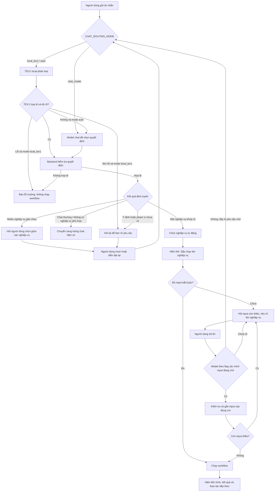

# Luồng Chat và Nghiệp vụ: TEV1 local hoặc model chat quyết định

Ngày cập nhật: 04/10/2026. Trạng thái: đã triển khai routing theo flag; cần khởi động lại ứng dụng để nạp code và cấu hình mới.

## Mục tiêu

Người dùng nhập yêu cầu tự nhiên trong cùng một ô chat. Model nhận diện đó là chat thường hay yêu cầu nghiệp vụ, tự chọn nghiệp vụ khi có một kết quả phù hợp rõ ràng, và chỉ hỏi lại khi ý định còn mơ hồ hoặc có nhiều lựa chọn sát nhau. Giao diện thể hiện rõ nghiệp vụ đang được đề xuất/chạy và thông tin cần bổ sung.

## Model quyết định và flag cấu hình

Đã kiểm tra Ollama trên máy có `tev1:4b`. Runtime mặc định dùng `auto`: ưu tiên TEV1, chuyển sang đúng model chat khi quyết định chưa đủ rõ hoặc local không xử lý được. Không dùng nhầm `LOCAL_AI_MODEL` hiện là `qwen3.5:9b`. Model quyết định routing và model trả lời chat là hai vai trò riêng.

Các flag đã có trong `.env`, `.env.example` và trang Settings, nhóm Mẫu nghiệp vụ:

```dotenv
CHAT_ROUTING_MODE=auto
CHAT_QUICK_GREETING_ENABLED=true
CHAT_ROUTING_LOCAL_MODEL=tev1:4b
CHAT_ROUTING_LOCAL_BASE_URL=http://127.0.0.1:11434
CHAT_ROUTING_TIMEOUT_MS=60000
CHAT_ROUTING_MIN_PROBABILITY=0.65
CHAT_ROUTING_MIN_MARGIN=0.15
```

| `CHAT_ROUTING_MODE` | Ai quyết định? | Khi nào dùng? |
| --- | --- | --- |
| `local_tev1` | TEV1 local đề xuất ý định, workflow, phạm vi và câu trả lời input; backend kiểm tra trước thực thi | Muốn tách routing khỏi model chat; chỉ bật tự động thực thi với nghiệp vụ đã kiểm chứng chất lượng TEV1 |
| `chat_model` | Đúng model chat người dùng đã chọn quyết định toàn bộ các bước trên | Muốn một model xử lý toàn bộ suy luận, không phụ thuộc TEV1, hoặc TEV1 chưa đạt chất lượng với nghiệp vụ |
| `auto` (mặc định) | TEV1 trước; chuyển quyền quyết định cuối cho đúng model chat nếu cần | Ưu tiên local và để model chat xử lý các câu tiếng Việt, scope hoặc input mà TEV1 chưa quyết định chắc |

- Resolve và ghim `chatProviderSnapshot` gồm provider/model/adapter/endpoint ngay đầu request từ lựa chọn người dùng; nếu không chọn thì resolve mặc định một lần. `local_tev1` và `auto` resolve riêng `routingProviderSnapshot` bằng adapter `ollama-decision`, endpoint local đã cấu hình và `tev1:4b`. Các harness local/cloud và luồng legacy chat đều giữ snapshot; không fallback sang provider khác. Cấu hình lưu qua Settings có hiệu lực sau khi người vận hành khởi động lại.
- `chat_model` không gọi TEV1. `local_tev1` gặp ý định mơ hồ thì hỏi lại; gặp timeout, lỗi kết nối hoặc output sai schema thì báo lỗi routing có thể thử lại, không tự đổi model và không chạy workflow.
- `auto` chuyển một lần sang model chat khi TEV1 abstain, có nhiều ứng viên sát nhau, thiếu bằng chứng phạm vi, vượt giới hạn ngữ cảnh, timeout, unavailable hoặc output sai schema. Model chat nhận ngữ cảnh gốc và ứng viên, quyết định lại theo cùng contract. Nếu vẫn mơ hồ thì hỏi người dùng; nếu lỗi thì báo lỗi. Không thực thi đề xuất TEV1 trước khi có quyết định cuối.
- Sau routing, câu trả lời tự do và suy luận SQL/RAG dùng `chatProviderSnapshot`. TEV1 chỉ trả quyết định có cấu trúc; câu hỏi input đơn giản dựng bằng template từ metadata đã kiểm tra. Workflow phase 1 hiện chưa hỗ trợ bước AI; khi bổ sung, bước đó phải nhận cùng snapshot. Không âm thầm chuyển model chat sang TEV1.
- Flag thuộc cấu hình backend/quản trị, không thêm bộ chọn mode bắt buộc trong composer. Giá trị flag không hợp lệ phải báo lỗi cấu hình. Timeout 60 giây được chọn sau khi đo chuyển model local; mỗi stage vẫn bị chặn bởi deadline chung. Mọi lần đánh giá TEV1, model chat, retry và escalation dùng chung ngân sách request. Ngân sách local toàn lượt mặc định 12 lần đánh giá/gọi model; không tạo ngân sách mới khi chuyển model.

### Dùng đúng API quyết định của TEV1

TEV1 dùng `/v1/systemone` với `state` và `questions`, thay vì sinh contract bằng `/api/chat`. Theo [tài liệu Ollama](https://ollama.com/library/tev1), đây là model chọn phương án và scorer dùng ngữ cảnh khoảng 2.000 token.

- Backend tạo các lựa chọn hữu hạn từ catalog được phép, cùng lựa chọn chat, unclear, input hoặc hủy run. Cùng một HTTP request đánh giá route, scope và các ứng viên input; backend ghép kết quả thành contract chung. Mỗi câu hỏi được tính riêng vào ngân sách model và tổng token thực tế, trace phân biệt `httpRequests` với `decisionEvaluations`.
- Ứng viên input là giá trị literal/span từ tin nhắn, lọc bằng schema và giữ quote gốc. Không có bộ từ khóa nghiệp vụ đóng, không gọi embedding và không tự sinh giá trị/default. Không tìm được input thì workflow đã chọn hỏi bổ sung qua runtime.
- Chỉ chấp nhận lựa chọn khi xác suất và khoảng cách hai phương án cao nhất đạt hai flag ngưỡng, đồng thời scope/ID/input/run vượt kiểm tra backend. Các ngưỡng không phải độ chính xác của model. Scope không nhất quán hoặc phân loại input chưa chắc dẫn tới unclear/escalation; một giá trị đứng riêng không được tạo run mới trùng run đang hỏi giá trị đó.
- Không cắt bỏ ứng viên theo thứ tự catalog để ép vừa prompt. Quá giới hạn ngữ cảnh, số lựa chọn, số giá trị input hoặc ngân sách TEV1 thì `auto` dùng model chat; `local_tev1` trả lỗi có hướng xử lý.

## Contract quyết định và flag theo dõi

Router nhận tin nhắn, ngữ cảnh hội thoại liên quan, catalog đã lọc quyền và trạng thái run/input đang chờ. TEV1 và model chat dùng cùng contract:

```json
{
  "route": "workflow",
  "workflowId": "catalog_workflow_id",
  "candidateIds": [],
  "inputDisposition": "new_request",
  "pendingRunId": null,
  "inputs": {},
  "inputEvidence": {},
  "evidence": [{ "source": "user_message", "text": "Tra cứu hợp đồng" }],
  "requestedScope": "targeted",
  "supportedScope": "targeted",
  "needsClarification": false,
  "abstain": false,
  "cancelPending": false
}
```

- `route` thuộc `chat | workflow | unclear`; `workflowId` chỉ có giá trị ở nhánh `workflow`, còn lại là `null`. `inputDisposition` thuộc `none | slot_answer | new_request | unclear`. Với `slot_answer`, `pendingRunId` phải khớp run đang chờ và có bằng chứng trả lời đúng trường; chưa chắc thì không ghi input vào run.
- Backend kiểm tra schema, ID, quyền, scope, evidence và input trước khi thực thi. Confidence tự khai của model không đủ để cho phép chạy. Thiếu input dẫn tới hỏi bổ sung sau khi chọn workflow, không phải chuyển sang chat. Key evidence tùy chọn thuộc slot đã khai báo nhưng không có input tương ứng được bỏ qua; không tạo giá trị từ evidence đó. Hủy task chỉ được thực hiện khi quyết định hủy chỉ rõ run đang chờ; runtime kiểm tra quyền và revision.
- Backend tự ghi `routingMode`, `decisionSource=local_tev1|chat_model`, `routingModel`, `chatModel`, `escalated`, `escalationReason`, request ID, latency và số call/token theo stage; không lấy các flag nguồn model từ output tự khai. Các API chat JSON, SSE và embed trả metadata `routing`; audit lưu phần routing đã lọc prompt/input/credentials. Trace cho biết rõ ai quyết định và ai trả lời; UI thường chỉ hiển thị nghiệp vụ. Nếu workflow tắt, thiếu session hoặc catalog rỗng, không gọi router và ghi `skippedReason`.
- Một quyết định cuối dùng xuyên suốt request, các tầng sau không tự phân loại lại để ghi đè. Tin nhắn input ở lượt tiếp theo là request mới, được đánh giá với trạng thái run hiện tại và cùng chính sách chọn model.

## Sơ đồ luồng



## Quy tắc định tuyến

1. **Model quyết định theo flag và ý nghĩa yêu cầu.** TEV1 hoặc model chat được chọn theo `CHAT_ROUTING_MODE`, dùng mô tả nghiệp vụ, phạm vi, ví dụ và các input đã khai báo trong catalog; không yêu cầu người dùng chọn chế độ trên UI.
2. **Chỉ tự chọn khi khớp rõ.** Nếu có một nghiệp vụ phù hợp và không xung đột với phạm vi người dùng yêu cầu, chọn nghiệp vụ đó. Thiếu input không phải lý do để chuyển yêu cầu thành chat; chọn nghiệp vụ rồi hỏi phần còn thiếu.
3. **Hỏi lại khi mơ hồ.** Nếu nhiều nghiệp vụ gần nhau, phạm vi khác nhau hoặc chưa đủ căn cứ để phân loại, trình bày lựa chọn bằng tên và mô tả ngắn, hoặc hỏi một câu làm rõ. Không chạy ứng viên gần nhất theo phỏng đoán.
4. **Giữ chat thường là chat thường.** Chào hỏi, cảm ơn, câu hỏi giải thích và yêu cầu không thuộc catalog đi theo luồng chat hiện có. Model có thể abstain và nhường xử lý cho chat/SQL/RAG theo routing hiện có.
5. **Tách câu trả lời input khỏi yêu cầu mới.** Khi một run đang chờ input, chỉ gắn tin nhắn vào run nếu nội dung thực sự cung cấp thông tin được hỏi. Câu hỏi khác hoặc yêu cầu nghiệp vụ mới được phân loại lại độc lập; không ép thành input chỉ vì schema nhận được kiểu dữ liệu đó.
6. **Nêu rõ hành động trong chat.** Trước khi bắt đầu, thêm thẻ trạng thái như “Đang thực hiện: Tra cứu hợp đồng” hoặc lời dẫn tương đương. Với nghiệp vụ có tác động đáng kể, yêu cầu xác nhận theo chính sách nghiệp vụ trước khi thực thi; bước xác nhận không phải là bộ chọn chế độ chung.

## Trạng thái giao diện

| Trạng thái | Cách hiển thị |
| --- | --- |
| Chat thường | Hội thoại bình thường, không hiện nhãn đang chạy nghiệp vụ |
| Định tuyến | Trạng thái ngắn “Đang xác định yêu cầu…” nếu cần phản hồi trung gian |
| Đã chọn nghiệp vụ | Thẻ có tên nghiệp vụ và trạng thái “Đang chuẩn bị” / “Đang thực hiện” |
| Cần làm rõ | Câu hỏi ngắn hoặc danh sách lựa chọn có tên, mục đích và khác biệt đầu ra |
| Chờ input | Câu hỏi ghi rõ tên nghiệp vụ và trường cần cung cấp; input gắn đúng run |
| Đang chạy / hoàn tất | Tiến trình, kết quả, trạng thái, cùng thao tác hủy hoặc chạy lại phù hợp |

Không đổi composer sang chế độ nghiệp vụ cố định. Người dùng luôn có thể gửi câu mới; khi có workflow chờ input, câu mới phải được đánh giá theo ý nghĩa trước khi nối vào run đang chờ.

## Nguyên tắc UI giúp tránh nhầm lẫn

- Giữ một ô nhập tự nhiên cho chat và yêu cầu nghiệp vụ.
- Phân biệt nghiệp vụ bằng thẻ trong transcript, có tên, trạng thái và kết quả; không chỉ dùng màu hoặc icon.
- Câu hỏi thu thập input nêu rõ đang phục vụ nghiệp vụ nào và hỏi trường gì.
- Khi có nhiều ứng viên, hiển thị tối đa vài lựa chọn với mô tả/đầu ra khác nhau; cho phép “Không phải nghiệp vụ này, tôi muốn hỏi việc khác”.
- Giữ tác vụ chờ trong transcript nếu người dùng chuyển chủ đề; có thể quay lại tiếp tục từ thẻ tác vụ.
- Không tự chạy khi model trả về unclear, có xung đột phạm vi hoặc không có evidence phù hợp.

## Áp dụng vào hệ thống hiện tại

Backend đã có các nhánh `workflow`, `chat`, `unclear`, xử lý nhiều ứng viên, kiểm tra phạm vi nghiệp vụ và xác minh câu trả lời cho input đang chờ. Có thể giữ nguyên cách người dùng nhập tự do và hoàn thiện trải nghiệm tập trung vào:

1. Hiện tên nghiệp vụ đã chọn trước/trong lúc chạy để người dùng hiểu hệ thống đang làm gì.
2. Làm rõ lựa chọn khi catalog trả về nhiều nghiệp vụ tương đồng.
3. Làm rõ câu hỏi bổ sung input gắn với đúng tác vụ và tránh nhận nhầm yêu cầu mới thành input.
4. Đo riêng lỗi chọn nhầm workflow, bỏ sót workflow, nhầm input và tỷ lệ câu hỏi làm rõ; chỉ nới tự động thực thi sau khi đạt ngưỡng chính xác theo từng nghiệp vụ.

## Đối chiếu kế hoạch và nghiệm thu

Đặc tả này bổ sung ngoại lệ có cấu hình cho nguyên tắc “một model cho toàn bộ suy luận” trong [kế hoạch tối ưu routing](CHAT_ROUTING_TOKEN_OPTIMIZATION_PLAN_270926.md): nguyên tắc đó áp dụng đầy đủ ở `chat_model`; `local_tev1`/`auto` cho phép model riêng ở giai đoạn quyết định routing. Model trả lời vẫn được ghim. Một HTTP request TEV1 có thể gồm nhiều phép đánh giá; không áp tiêu chí một model call tổng cho mode này. Ở `chat_model`, runtime hiện dùng một call quyết định và luồng chat riêng để trả lời khi có catalog; việc gộp thành một call là tối ưu tiếp theo, chưa được triển khai.

Khi triển khai, kiểm thử cả ba mode với chat thường, workflow rõ/mơ hồ, thiếu input, trả lời input và chuyển chủ đề; kiểm tra thêm TEV1 timeout/unavailable/output lỗi, model chat lỗi, ID hoặc scope không hợp lệ. Xác nhận `chat_model` không gọi TEV1; `local_tev1` không tự fallback; `auto` chỉ chuyển một lần và chưa chạy workflow trước quyết định cuối. Trace phải khớp model thực gọi, model trả lời không bị thay đổi, mọi call thuộc ngân sách chung. Không dùng embedding `bge-m3` để quyết định routing.

Các điểm triển khai chính: `src/backend/automation/chat_router.js`, `tev1_decision.js`, `orchestrator.js`, adapter `ollama_decision.js`, `intelligent_core/core.js` và các harness. API chính `orchestrator.handle()` luôn dùng router mới; helper `handleLegacy`/`interpretLegacy` chỉ giữ tương thích và có test riêng, không được gọi trong luồng chat chính.

Chạy `npm test` để kiểm tra regression. Chạy `npm run eval:routing` để đo TEV1 thật với bộ câu tổng hợp, không thực thi SQL/workflow hoặc ghi dữ liệu ứng dụng. Muốn đo auto cùng Qwen, đặt `CHAT_ROUTING_EVAL_MODE=auto`, `CHAT_ROUTING_EVAL_CHAT_MODEL=qwen3.5:9b` trong môi trường của lệnh; báo cáo nằm ở `artifacts/chat-routing-evaluation-auto.json`. Bộ câu tổng hợp chưa thay thế nghiệm thu trên catalog nghiệp vụ thực tế. TEV1 riêng có nhiều trường hợp abstain; vì vậy cấu hình đang áp dụng là auto. Nạp lại model local có thể làm lượt chuyển model mất hàng chục giây.

Trong `auto`, TEV1 phải chừa ít nhất hai call cho model chat quyết định và trả lời; không đủ thì bỏ qua TEV1 và chuyển thẳng sang model chat. Nếu quyết định của model chat vẫn `unclear` hoặc bước routing gặp lỗi model/schema/context, hỏi thêm hoặc hiển thị lựa chọn nghiệp vụ, không đưa lỗi routing sang luồng SQL tự do. Chỉ quyết định `chat` hợp lệ mới tiếp tục chat dữ liệu. Hủy yêu cầu và hết ngân sách/deadline vẫn được giữ nguyên. Trace ghi `chatFallbackReason`; giao diện hiển thị lỗi backend trong bong bóng assistant khi không thể hoàn thành.

Native task TEV1 chỉ chứa tin nhắn hiện tại, thông tin pending và catalog routing; lịch sử chat/bảng kết quả và instructions thực thi đầy đủ chỉ gửi model chat nếu cần. Các phương án ghi tên, mô tả và ví dụ nghiệp vụ trực tiếp, sắp theo ID để không thay đổi ký tự lựa chọn theo thứ tự DB. `routingScope` tùy chọn trên template khai báo phạm vi cố định; contract chỉ chấp nhận collection/targeted/aggregate. Lookup có scope targeted dùng kiểm tra độc lập dạng yes/no cùng kiểm tra scope nhiều phương án; không hạ ngưỡng 0.65/0.15, và kết quả phủ định đủ chắc chặn lookup. Model phải xác nhận có giá trị input thực trước khi lấy ứng viên chuỗi; nhắc tên nghiệp vụ không trở thành mã tra cứu.

Gemini routing dùng temperature 0 và structured JSON qua `responseMimeType`/`responseJsonSchema`, theo [API generateContent](https://ai.google.dev/api/generate-content); chat thông thường giữ format mặc định.

Kết quả kiểm tra ngày 04/10/2026: `npm test` đạt 436 test, bỏ qua 11 test, không có lỗi. Bộ thử thật mới với catalog PostgreSQL, TEV1 và `gemini-3.5-flash-lite` đạt 8/8, gồm lịch sử bảng dài và pending. TEV1 quyết định trực tiếp 5 yêu cầu chi tiết, thời gian routing trung bình 683 ms khi model đã sẵn sàng; 3 trường hợp còn lại chuyển model chat. Báo cáo `artifacts/tev1-live-catalog-auto.json`. Chạy `node --require ./tests/helpers/setup_isolated_data.js scripts/evaluate_tev1_live_catalog.js`, có thể đặt `CHAT_ROUTING_EVAL_CHAT_MODEL` để chọn model đang cấu hình trong DB. Lệnh chỉ đọc metadata và gọi model, không thực thi SQL/workflow. `--local-only` đo riêng TEV1 và ghi các trường hợp abstain là chưa đạt kết quả kỳ vọng. Bộ thử tổng hợp trước đây 14/14 không thay thế báo cáo catalog thật này.

## Trạng thái logic

`CHAT_IDLE` → `ROUTING` → `CHAT_REPLY` | `WORKFLOW_SELECTED` | `WORKFLOW_CLARIFY` → `WORKFLOW_INPUT` → `WORKFLOW_RUNNING` → `WORKFLOW_RESULT`.

Khi đang ở `WORKFLOW_INPUT`, tin nhắn kế tiếp được đánh giá là `SLOT_ANSWER` chỉ khi nó thực sự trả lời trường đang hỏi. Nếu là yêu cầu mới, quay lại `ROUTING` mà vẫn giữ run cũ để người dùng tiếp tục sau.

## Chào hỏi nhanh bằng TEV1

`CHAT_QUICK_GREETING_ENABLED=true` (mặc định bật) áp dụng cho `auto` và `local_tev1`. Tin nhắn tối đa 160 ký tự được kiểm tra bằng một phép đánh giá TEV1 nhỏ, chỉ có tin nhắn hiện tại. Khi TEV1 xác nhận chỉ chào hỏi với ngưỡng xác suất và margin hiện có, backend trả “Chào bạn! Bạn muốn tra cứu thông tin gì?” và không gọi model chat. Log ghi `quickReplyKind=greeting`; token/call của TEV1 vẫn được tính.

Câu chào kèm yêu cầu, câu hỏi thông tin, câu trả lời input hoặc phân loại chưa chắc chắn tiếp tục routing bình thường. Tác vụ đang chờ không bị sửa/hủy khi chào hỏi. Bước kiểm tra dùng chung ngân sách request; tin nhắn dài hơn bỏ qua bước này. `false` tắt trả lời nhanh; `chat_model` giữ quyết định bằng model chat.
