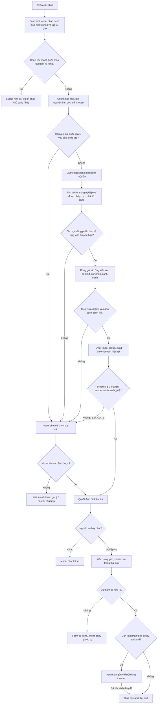

# Plan lọc ứng viên nghiệp vụ bằng embedding trước TEV1

Ngày: 04/10/2026. Trạng thái: đề xuất, chưa triển khai, chưa đổi cấu hình hay restart hệ thống.

## 1. Kết luận và phạm vi

Khả thi cho danh mục khoảng 100 nghiệp vụ. Backend truy hồi ứng viên từ chỉ mục đã nhúng sẵn, TEV1 đánh giá danh sách rút gọn, model chat đã chọn xử lý trường hợp chưa rõ. Vector không quyết định thực thi và không cấp quyền.

Lợi ích dự kiến: ngữ cảnh TEV1 tăng theo số ứng viên thay vì toàn bộ danh mục; giảm số trường đầu vào không liên quan; giảm trường hợp vượt context. Chưa có benchmark chứng minh độ chính xác hoặc thời gian của thiết kế này trên hệ thống.

Giữ luồng một request TEV1 đang có cho tập ứng viên, gồm quyết định nghiệp vụ/phạm vi/input trong cùng task. **Không khôi phục thử nghiệm tách chọn nghiệp vụ rồi gọi TEV1 riêng để lấy tham số đã bị người dùng yêu cầu bỏ.** Nếu task vẫn quá dài, chuyển model chat thay vì âm thầm mất ứng viên hoặc tham số.

Phạm vi đầu tiên: nghiệp vụ chỉ đọc, khoảng 100 nghiệp vụ, tiếng Việt và viết tắt, dùng chung backend cho page/popup/embed chat. Nghiệp vụ ghi hoặc liên quan tiền chỉ đưa vào sau khi có cơ chế xác nhận và chống thực thi lặp.

## 2. Những điểm chỉnh so với sơ đồ ban đầu

| Ý ban đầu | Thiết kế đề xuất |
| --- | --- |
| Trên 500 token luôn chuyển model lớn | Dùng 500 làm ngưỡng ban đầu cho câu hiện tại; phải tính cả task, context tác vụ chờ và dự phòng. Đây là policy ứng dụng, không phải giới hạn riêng của TEV1. Không cắt câu mất phủ định/tên/mã. |
| Lấy cố định top-15 | Truy hồi tối đa 15; đóng gói theo ngân sách token thực tế, thường 5–10 nhưng không bảo đảm con số cố định. Nếu không giữ được các ứng viên cạnh tranh thì escalate. |
| Cosine thấp là yêu cầu lạ | Chỉ là dấu hiệu retrieval chưa tốt; thử hợp nhất với từ khóa/viết tắt và ngữ cảnh tác vụ chờ trước. Không kết luận không có nghiệp vụ chỉ từ cosine. |
| Jev trả confidence | Hệ thống hiện dùng TEV1 qua API tương thích Jev. Không tự chuyển sang dịch vụ Jev khác. Dùng phân phối xác suất, p1 và p1-p2; confidence chỉ là thông tin phụ. |
| Top-1/top-2 sát nhau | Phân biệt khoảng cách cosine ở bước tìm kiếm và khoảng cách xác suất ở TEV1. Không dùng chung một ngưỡng cho hai đại lượng. |
| Thiếu tham số chuyển model lớn | Chọn đúng nghiệp vụ rồi hiện form hỏi phần thiếu. Chỉ escalate khi chưa rõ ý định hoặc tham số có bằng chứng nhưng không xác định được chắc chắn. |
| Kiểm tra quyền cuối luồng | Lọc quyền trước truy hồi/đóng gói và kiểm tra lại trước thực thi. Áp dụng cả ở nhánh model lớn. |
| Ghi nguyên yêu cầu/kết quả | Log metadata để đo; che thông tin cá nhân, không log SQL/credentials/toàn bộ kết quả theo mặc định. |

Theo [tài liệu TEV1 của Ollama](https://ollama.com/library/tev1), scorer sử dụng khoảng 2.000 token, mỗi câu hỏi được đánh giá cùng state/question set; confidence đo mức tập trung xác suất, không phải khả năng đúng. Model còn cần kiểm chứng tiếng Việt và prompt injection. Tài liệu khuyến nghị 2–24 lựa chọn cho choice. Những điểm này là giới hạn thiết kế phải giữ, không suy ra cửa sổ lớn từ model nền.

## 3. Luồng xử lý hoàn chỉnh

Mỗi nhánh đều phát trace, kể cả fallback và lỗi. Hết quyền phải từ chối; lỗi dependency không được diễn giải thành “không có nghiệp vụ”. Người dùng gửi câu mới trong khi có tác vụ chờ không được tự sửa/hủy tác vụ đó. Chọn gợi ý phải đi qua hành động chọn rõ ràng và kiểm tra trạng thái run hiện có.

Model lớn nhận câu gốc, ngữ cảnh liên quan, danh mục được phép và ứng viên. Nếu retrieval không đáng tin, không chỉ cung cấp tập ứng viên đã lọc sai: dùng danh mục đầy đủ nếu vừa context model lớn; nếu không, truy hồi mở rộng hoặc hỏi làm rõ. Model lớn vẫn phải qua cùng bộ kiểm tra contract/quyền/schema.

## 4. Danh mục và chỉ mục

### Metadata cần cho mỗi nghiệp vụ

- ID ổn định; published version; enabled; tenant/phạm vi truy cập.
- Tên, mô tả routing ngắn, đối tượng, thao tác và `routingScope`.
- Từ đồng nghĩa/viết tắt và 5–10 ví dụ đại diện; ví dụ không phù hợp để viết rõ ranh giới.
- Schema input đầy đủ giữ trong catalog nguồn, không nhúng SQL hay dữ liệu khách hàng vào mô tả.
- `riskLevel`, `requiresConfirmation` và permissions là metadata do admin/backend quản lý, không tin đánh giá model.

Ví dụ ba nghiệp vụ hiện tại phải phân biệt: nhân viên theo tên/mã; hợp đồng theo tên khách hàng/mã; sản lượng điện theo tháng là báo cáo aggregate. Thiếu tên/mã không làm lookup thành danh sách toàn bộ.

### Cách lập chỉ mục

Tạo collection riêng `workflow_routing_v1`, không trộn với tài liệu RAG. Ban đầu 1 vector/nghiệp vụ từ mô tả, aliases và ví dụ. So sánh thêm phương án nhiều vector/nghiệp vụ: một vector mô tả và các nhóm ví dụ; truy hồi rồi gộp theo workflow ID. Khi có nhiều vector, top-15 phải là 15 **nghiệp vụ khác nhau**, không phải 15 point.

Payload gồm ID/version/hash metadata, embedding model/digest/dimension, index generation và các trường lọc. Danh mục published là nguồn sự thật; vector chỉ là chỉ mục dẫn đường. [Qdrant hỗ trợ payload filter và payload index](https://qdrant.tech/documentation/search/filtering/) cho các trường cần lọc. ACL phức tạp vẫn kiểm tra ở backend; có thể truyền tập ID được phép vào truy vấn.

Nhúng khi publish/thay đổi metadata, không chỉ “offline một lần rồi để mãi”. Chuẩn bị generation mới, kiểm tra đủ dữ liệu rồi chuyển active generation; xóa/vô hiệu hóa phải loại khỏi truy hồi ngay. Đổi model/dimension/prompt embedding cần generation mới và nhúng lại. Index cũ/stale: fallback an toàn, không chạy sai version.

Hệ thống có `qdrant_service.embedTexts`, mặc định example là `bge-m3`, nên có thể tái sử dụng transport sau khi kiểm tra timeout, abort, usage và model identity. **Không dùng `generateDeterministicVector` làm fallback retrieval nghiệp vụ**: vector đó không chứng minh độ tương đồng ngữ nghĩa. Embedding lỗi phải chuyển model chat hoặc thông báo dịch vụ chưa sẵn sàng.

Với 100 nghiệp vụ, phép cosine rất nhỏ: 100 × 1.024 × 4 byte khoảng 400 KiB vector thô; 1.000 vector khoảng 3,9 MiB, chưa gồm payload/index. Embedding inference, TEV1 và model switching là phần cần tập trung đo. Có thể dùng quét cosine chính xác thay vì ANN cho tập nhỏ; Qdrant thuận tiện vì hệ thống đã có.

## 5. Truy hồi và đóng gói context

Giữ câu gốc cho evidence; bản chuẩn hóa chỉ trim, Unicode normalize, xử lý khoảng trắng. Không xóa dấu, mã hoặc phủ định trong đầu vào model. Từ khóa có thể có bản chuẩn hóa không dấu riêng. Aliases từ catalog quản trị, không hardcode chỉ ba nghiệp vụ hiện tại.

Một embedding câu yêu cầu, ưu tiên cache theo câu chuẩn hóa + embedding model/digest. Câu nối tiếp như “người đó”, “7”, “HD001” cần ngữ cảnh tác vụ chờ có giới hạn; phải kiểm chứng cách tạo query bổ sung, không biến một câu trả lời tham số thành nghiệp vụ mới. ID tác vụ chờ chỉ được thêm vào ứng viên nếu người dùng còn quyền. Không tự chọn chỉ vì đang có pending.

Retrieval hợp nhất cosine với matches aliases/từ khóa. Không so trực tiếp điểm từ hai hệ khác nhau; dùng hợp nhất thứ hạng và đánh giá nhãn rõ ràng. Một cosine query hoặc margin retrieval thấp không cho phép vector tự quyết định chạy nghiệp vụ.

Ngân sách hiện tại: `estimateTokens(task) + 200 <= 2050`. Giai đoạn đầu nhắm task <= 1.700 token để có thêm biên an toàn vì estimator chưa phải tokenizer thực. Giữ giới hạn choice hiện có: tối đa 22 nghiệp vụ khi không pending, 20 khi có pending; top-15 nằm trong số lựa chọn nhưng chưa chắc vừa context.

Ví dụ ngân sách thiết kế: câu 200 + chỉ dẫn/câu hỏi cố định 450 + pending 150 + trường/candidate input 300 + dự phòng 200 = 1.300 token. Còn khoảng 750 token cho mô tả ứng viên: 15 mục chỉ khoảng 50 token/mục. Câu 500 token làm phần còn lại xuống khoảng 450; nhiều field/câu hỏi tiếp tục giảm. Đây là ví dụ tính toán, cần thay bằng số đo task thật.

Mô tả đầy đủ phục vụ retrieval offline; mô tả ngắn dành cho task. Giữ đối tượng/thao tác/scope và điểm loại trừ quan trọng. Thử k = 5/8/10/15. Khi giảm k để vừa token phải log lý do, đánh giá recall và giữ cả nhóm có điểm sát nhau. Không cắt cuối danh mục theo thứ tự hoặc bỏ ứng viên cạnh tranh chỉ để ép vừa. Nếu không giữ được nhóm cạnh tranh: escalate.

Tổng token TEV1 thực tế không bằng một lần kích thước task: phải ghi usage và số `decisionEvaluations`, vì mỗi câu hỏi có thể được đánh giá với cùng context. Một HTTP request không đồng nghĩa một phép đánh giá.

## 6. Cổng quyết định và tham số

Sau retrieval, TEV1 dùng task/contract hiện có trên tập ứng viên. Có các nhãn chat/unclear cùng slot/cancel khi có pending; `ESCALATE` ánh xạ về unclear/abstain, không phải workflow ID được thực thi. Không thêm một schema song song làm lệch page/popup/embed.

Chấp nhận chỉ khi ID nằm trong catalog snapshot được phép; output đúng schema; phân phối xác suất hữu hạn và nhất quán; p1 và p1-p2 đạt ngưỡng; scope đúng; input hợp schema và có quote bằng chứng từ câu gốc. Nếu không chắc ở input, không suy diễn default hoặc boolean. Chọn được workflow nhưng thiếu input thì runtime hiện form.

Ngưỡng probability/margin hiện có 0,65/0,15 chỉ là điểm khởi đầu; phải hiệu chỉnh sau retrieval vì tập lựa chọn đã đổi. Cosine threshold không có giá trị phổ quát: hiệu chỉnh theo embedding và dữ liệu giữ lại để test; không mặc định lấy 0,7 từ probability sang cosine. Retrieval gap thấp chỉ báo cần giữ các ứng viên cạnh tranh, không nhất thiết phải fallback nếu TEV1 phân biệt được chắc chắn.

Nghiệp vụ ghi: xác nhận server-issued gắn user, workflow version, params hash, hạn dùng; chống replay và idempotency. Kiểm tra quyền/version/run ngay trước commit; transaction và audit theo nghiệp vụ. Đây là hạng mục cần triển khai/kiểm tra riêng, không tuyên bố hệ thống hiện đã có đủ. Model không được tự bỏ xác nhận.

## 7. Cấu hình đề xuất

Các biến bảng dưới **chưa tồn tại**, chỉ thêm khi triển khai. Không đổi `.env` ở bước lập plan.

| Biến dự kiến | Giá trị ban đầu | Ý nghĩa |
| --- | --- | --- |
| `CHAT_ROUTING_RETRIEVAL_MODE` | `off` | off / shadow / on; mặc định giữ luồng hiện tại |
| `CHAT_ROUTING_RETRIEVAL_COLLECTION` | `workflow_routing_v1` | Collection nghiệp vụ riêng |
| `CHAT_ROUTING_RETRIEVAL_TOP_K` | `15` | Số ứng viên tối đa, không bảo đảm đều vào task |
| `CHAT_ROUTING_RETRIEVAL_QUERY_MAX_TOKENS` | `500` | Giới hạn câu hiện tại cho fast path |
| `CHAT_ROUTING_RETRIEVAL_TASK_TARGET_TOKENS` | `1700` | Mục tiêu thấp hơn hard guard hiện có |
| `CHAT_ROUTING_RETRIEVAL_MIN_SCORE` | hiệu chỉnh trước on | Cosine tối thiểu; không tự bật với ngưỡng chưa đo |
| `CHAT_ROUTING_EMBED_TIMEOUT_MS` | `1000` | Deadline embedding, điều chỉnh theo p95 máy thật |
| `CHAT_ROUTING_VECTOR_TIMEOUT_MS` | `300` | Deadline vector query |
| `CHAT_ROUTING_TEV1_TIMEOUT_MS` | `3000` | Deadline TEV1, độc lập model lớn |
| `CHAT_ROUTING_CHAT_TIMEOUT_MS` | `15000` | Deadline routing bằng model chat, không phải trả lời |
| `CHAT_ROUTING_RETRIEVAL_CACHE_TTL_MS` | `300000` | Cache 5 phút, giới hạn dung lượng, không cache quyền stale |

Tái sử dụng mode `auto/local_tev1/chat_model`, hai ngưỡng probability/margin, greeting flag và endpoint embedding/TEV1 hiện có. Quy định rõ local_tev1 không gọi model lớn: lỗi thì trả thông báo/hỏi lại phù hợp. chat_model bỏ fast path TEV1. `CHAT_ROUTING_TIMEOUT_MS` giữ tương thích khi các biến timeout riêng chưa đặt; không giảm toàn hệ thống một cách ngầm định.

Deadlines trên là mục tiêu cấu hình, không bảo đảm inference đạt. Tất cả stage dùng chung request deadline/model-call budget; retry có giới hạn, tối đa một escalation; hủy chat phải abort embedding/vector/TEV1. Cache query embedding không chứa kết quả cấp quyền; cache shortlist phải key theo tenant/principal/ACL revision/catalog generation, hoặc luôn re-filter quyền.

## 8. Cấu hình máy và cách tính tài nguyên

Đây là **ước lượng kỹ thuật để thử tải**, không phải yêu cầu tối thiểu chính thức hoặc benchmark tốc độ. Khoảng 100 nghiệp vụ không đòi GPU riêng cho cosine; GPU chủ yếu phục vụ model inference.

| Tình huống | Cấu hình khởi điểm đề xuất | Giới hạn cần lưu ý |
| --- | --- | --- |
| Dev/ít người, model chat ở API | CPU hiện đại 4–8 core, RAM 16 GB, SSD còn trống 20–30 GB | Chạy CPU được nếu backend tương thích; chưa cam kết TEV1 dưới 3 giây |
| Máy phục vụ nhóm nhỏ | CPU 6–8 core, RAM 32 GB, NVIDIA tương thích Ollama 12 GB VRAM, NVMe | Đo việc TEV1 và embedding cùng nằm trong VRAM, giới hạn concurrency ban đầu 1–2 |
| Apple Silicon phục vụ nhóm nhỏ | RAM unified 24–32 GB, SSD, phiên bản OS/backend được Ollama hỗ trợ | Cần đo bge-m3 + TEV1 cùng resident và queue p95 |
| Nhiều chat đồng thời hoặc model trả lời local | RAM 32–64 GB, GPU 16–24 GB hoặc tách máy inference | Sizing theo số request đồng thời, model trả lời và context; không suy ra chỉ từ 100 nghiệp vụ |
| Mac mini 2014, RAM 16 GB | Phù hợp thử nghiệm khi backend/OS hỗ trợ hoặc gọi inference máy khác | CPU cũ là nút thắt; không dùng làm cơ sở cam kết độ trễ 1–3 giây; xác minh hỗ trợ OS trước cài |

[TEV1 trên Ollama](https://ollama.com/library/tev1) có bản 4B khoảng 4,5 GB download và 0,8B khoảng 812 MB. [bge-m3](https://ollama.com/library/bge-m3) khoảng 1,2 GB download và hỗ trợ nhiều ngôn ngữ. Dung lượng download không bằng RAM/VRAM resident. Ước lượng kế hoạch cho TEV1 + embedding resident khoảng 7–10 GB, cộng OS/app/PostgreSQL/Qdrant; phải xác minh bằng monitor thực tế, không áp dụng cứng cho mọi quantization/backend. Bản TEV1 nhỏ cần eval riêng; không đổi chỉ vì tiết kiệm RAM.

[Ollama FAQ](https://docs.ollama.com/faq) mô tả thiếu bộ nhớ làm queue/unload model và concurrency tăng nhu cầu memory. Giữ embedding và TEV1 resident nếu đủ RAM/VRAM; đo cold/warm riêng. Không đổi `OLLAMA_NUM_PARALLEL` hoặc giữ nhiều model vô hạn trước khi đo. Nếu dùng bge-m3 chung với RAG, tải RAG cũng phải tính vào capacity; có thể tách endpoint embedding/routing. [Hỗ trợ macOS](https://docs.ollama.com/macos) cần kiểm tra theo bản cài cụ thể.

Ngân sách thời gian mục tiêu warm, một request ít tải: embedding <= 200–500 ms; query vector <= 50 ms; TEV1 <= 500–1.500 ms; tổng routing p95 <= 3 giây trên máy mục tiêu. Đây là mục tiêu nghiệm thu, không phải số đã đo. Không tính SQL/model tạo câu trả lời vào routing. Tải lớn phải ghi queue_ms; queue hết ngân sách thì fallback có kiểm soát hoặc trả lỗi quá tải, tránh dồn vô hạn sang model lớn.

## 9. Rủi ro và kiểm soát

| Rủi ro | Hậu quả | Kiểm soát |
| --- | --- | --- |
| Retrieval bỏ nghiệp vụ đúng | TEV1 chọn sai dù rất tự tin | Recall@k, hybrid aliases, mở rộng/fallback trên danh mục được phép |
| Mô tả gần giống/viết tắt tiếng Việt | Nhầm nhân viên/khách hàng/hợp đồng | Ví dụ phân biệt, scope, test tiếng Việt có/không dấu |
| Tác vụ chờ chi phối câu mới | Gắn input nhầm run | Include pending có giới hạn, evidence, kiểm tra inputDisposition/run |
| Confidence cao nhưng sai | Tự chạy nhầm | Hiệu chỉnh ngưỡng theo tập test độc lập, backend checks, chỉ đọc pilot |
| Boolean/default bị suy diễn | Tự vẽ chart/xuất file sai | Không infer, quote evidence, schema và bộ test tham số |
| Token estimate thấp hơn thực | Context bị cắt | Biên dự phòng, đo API usage/template, fallback, không cắt câu |
| Vector stale/model mismatch | Truy hồi sai version | Generation/version/hash checks, atomic switch, rebuild |
| Quyền thay đổi sau retrieval | Lộ metadata/chạy trái phép | Lọc trước và kiểm tra lại, snapshot/catalog revision, cache ACL-aware |
| Injection trong câu/metadata | Model nghe hướng dẫn giả | Dữ liệu không là chỉ dẫn, validate ID/schema/quyền, test đối kháng |
| Embedding lỗi/fallback giả | Điểm cosine vô nghĩa | Fail closed ở retrieval, không dùng deterministic vector |
| Cold start/model switching/queue | Chat chậm hơn cũ | Warm/queue metrics, residency, timeout riêng, giới hạn concurrency |
| Fallback nhiều | Tốn token và độ trễ | Theo dõi coverage/chi phí, circuit breaker, hiệu chỉnh dựa trên lỗi |
| Log tên/mã/kết quả nhạy cảm | Rò rỉ dữ liệu | Mask/hash, phân quyền log, TTL, raw trace chỉ bật khi cần |

## 10. Đo chất lượng và điều kiện bật

Tạo bộ 2.000–3.000 câu độc lập cho khoảng 100 nghiệp vụ: tối thiểu 15–20 câu/nghiệp vụ và nhóm chat/no-match/ambiguous/multi-intent/pending/denied/injection. Có mã, tên nhiều từ, typo, phủ định, list-vs-detail, report-vs-profile và tham số boolean. Tách tập hiệu chỉnh ngưỡng khỏi tập test; không dùng toàn bộ ví dụ đã embedding làm bằng chứng recall/accuracy.

So sánh: luồng hiện tại; vector shortlist + router hiện tại; hybrid shortlist + router; tùy chọn 0,8B nếu cần. Không dùng kết quả thử nghiệm tách bước đã bỏ để khẳng định chất lượng thiết kế mới. Đánh giá correctness end-to-end, không chỉ route label.

| Chỉ số nghiệm thu đề xuất | Mục tiêu trước bật |
| --- | --- |
| Recall nghiệp vụ đúng trong tập được đóng gói | >= 99% trên yêu cầu rõ ràng, báo thêm theo từng nghiệp vụ |
| Đúng trong nhóm tự chọn, không tính fallback | >= 98%, kèm coverage và khoảng tin cậy thống kê |
| Chất lượng cuối sau fallback | Không thấp hơn baseline trên bộ test độc lập |
| Lỗi cấp quyền, gắn input sai run, thực thi không xác nhận | 0 trong bộ test; không coi đây là chứng minh không còn lỗi |
| Warm routing p95 máy mục tiêu | <= 3 giây ở tải đã định nghĩa |
| Cold start và tải đồng thời | Báo riêng, không lẫn với warm |
| Token và chi phí | Tổng embedding + TEV1 mọi evaluation + fallback; giảm so baseline tại cùng mức correctness |

Coverage = tỷ lệ tự chọn trên các yêu cầu nghiệp vụ rõ ràng; không được đạt accuracy cao bằng escalate gần hết. Mục tiêu pilot có thể 60–80% tự chọn nhưng phải đo theo bộ thật, không đặt làm cam kết trước khi thử. Báo p50/p95/p99, requests/evaluations, fallback reason, workflow confusion matrix, index generation và queue_ms.

## 11. Kế hoạch triển khai và rollback

1. **Baseline và metadata:** rà 3 nghiệp vụ hiện có; chuẩn hóa mô tả ngắn, quyền, scope; xây bộ nhãn và ghi token/latency baseline. Chưa đổi runtime.
2. **Chỉ mục:** thêm service retrieval riêng, dùng catalog published và embedding thật; generation lifecycle và ACL filter. Kiểm tra rebuild/version mismatch/disabled/deleted.
3. **Shadow:** chạy retrieval trên câu thật được phép log; không dùng quyết định mới để thực thi. Sampling để tránh tăng tải/chi phí, không trì hoãn câu trả lời hiện tại.
4. **Đóng gói + router:** truyền tập ứng viên vào `chat_router`/`tev1_decision`; giữ full authorized catalog snapshot riêng cho fallback và validate. Giữ nguyên form/input contract và pending semantics.
5. **Integration tests:** lỗi/timeout/abort, low recall, overflow, unavailable embedding, ACL change, model snapshot, pending/new topic, chart/export, concurrent requests.
6. **Pilot chỉ đọc:** bật có phạm vi tenant/user, 5–10% traffic hoặc nhóm admin test; so baseline cùng bộ, tăng nếu đạt tiêu chí. Page/popup/embed dùng chung backend; embed không hiển thị timeline/process theo yêu cầu hiện có.
7. **Mở rộng 100 nghiệp vụ:** monitor từng nghiệp vụ, drift, candidate packing recall, p95 theo tải; chưa tự bật nghiệp vụ ghi.
8. **Nghiệp vụ ghi:** triển khai xác nhận/idempotency/transaction riêng rồi kiểm chứng trước mở.

Rollback: đặt retrieval mode `off`, dùng luồng trước đó; không xóa/sửa catalog published hoặc pending run. Chỉ mục mới có thể giữ để debug nhưng không tham gia quyết định. Nếu đổi code/env cần người dùng quyết định reload/restart theo quy tắc dự án. Không migration phá hủy, không tự publish hoặc chạy nghiệp vụ thật trong eval.

Các điểm code dự kiến: `automation/chat_router.js` (orchestration/snapshot/fallback), `automation/tev1_decision.js` (task rút gọn), service retrieval mới, adapter embedding có timeout/abort, lifecycle catalog publish, `settings_help.js`/Settings/env docs, routing diagnostics. Kiểm tra nhánh legacy `orchestrator.interpret` và nhánh router mới trước tích hợp để tránh gọi hai bộ shortlist hoặc bỏ qua feature flag.

## 12. Trace đề xuất

Ghi request ID, principal/tenant định danh an toàn, mode, index/catalog generation, embedding model/digest, query token estimate, cache hit, embedding/vector/packing/TEV1/fallback timings, queue_ms, candidates IDs + score + rank, số ứng viên truy hồi/đóng gói, overflow reason, selected ID/version, probability/margin, số evaluation, usage, permission/confirmation/input status và kết quả success/error code.

Không lưu nguyên kết quả SQL hay câu chứa tên/mã theo mặc định. Dùng dấu vết đã che dữ liệu và lưu raw trace có kiểm soát khi điều tra, theo retention của hệ thống. Các trace cả page/popup/embed cùng một contract; backend diagnostics đủ để kiểm tra luồng mà không cần thêm UI process cho embed.

## 13. Điều kiện bắt đầu

Plan không yêu cầu mua máy trước. Đo máy hiện tại với TEV1 và bge-m3 warm/cold, xác định số chat đồng thời mục tiêu, xây bộ câu nhãn rồi chạy shadow. Chỉ triển khai active sau khi shortlist giữ được nghiệp vụ đúng và toàn luồng đạt chất lượng ít nhất bằng baseline. Hướng này phù hợp mở rộng danh mục, nhưng không tự chữa mọi lỗi semantic của TEV1.
