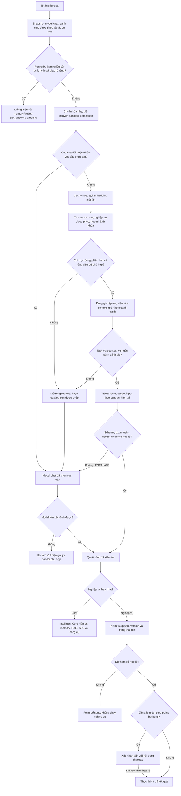

# Plan lọc ứng viên nghiệp vụ bằng embedding trước TEV1

Ngày lập: 04/10/2026. Cập nhật thiết kế: 08/10/2026. Đã triển khai bản đầu, lập chỉ mục và đặt cấu hình máy hiện tại `on`; trạng thái tiến trình đang chạy phải kiểm tra riêng, không suy ra từ cấu hình. Các mục thiết kế bên dưới gồm cả phần còn dự kiến; xem mục 15–16 và runbook để biết phạm vi thực tế và công việc tiếp theo.

Rà soát cập nhật: 07/10/2026, đối chiếu code hiện tại và `TEV1_CAPACITY_REPORT.md` ngày 05/10; sau rà soát đã triển khai bản đầu theo yêu cầu người dùng.

## 1. Kết luận và phạm vi

Mục tiêu kiểm chứng: danh mục khoảng 100 nghiệp vụ. Backend truy hồi ứng viên bằng hybrid hoặc BM25 độc lập, TEV1 đánh giá danh sách rút gọn, model chat đã chọn xử lý trường hợp chưa rõ. Vector không quyết định thực thi và không cấp quyền.

Lợi ích dự kiến: ngữ cảnh TEV1 tăng theo số ứng viên thay vì toàn bộ danh mục; giảm số trường đầu vào không liên quan; giảm trường hợp vượt context. Đã có eval trên lịch sử thật của catalog nhỏ, nhưng chất lượng toàn luồng còn thấp hơn baseline; chưa có benchmark chứng minh lợi ích trên catalog lớn (xem mục 16).

Giữ luồng một request TEV1 đang có cho tập ứng viên, gồm quyết định nghiệp vụ/phạm vi/input trong cùng task. **Không khôi phục thử nghiệm tách chọn nghiệp vụ rồi gọi TEV1 riêng để lấy tham số đã bị người dùng yêu cầu bỏ.** Nếu task vẫn quá dài, chuyển model chat thay vì âm thầm mất ứng viên hoặc tham số.

Phạm vi đầu tiên: nghiệp vụ chỉ đọc, khoảng 100 nghiệp vụ, tiếng Việt và viết tắt, dùng chung backend cho page/popup/embed chat. Nghiệp vụ ghi hoặc liên quan tiền chỉ đưa vào sau khi có cơ chế xác nhận và chống thực thi lặp.

## 2. Những điểm chỉnh so với sơ đồ ban đầu

| Ý ban đầu | Thiết kế đề xuất |
| --- | --- |
| Trên 500 token luôn chuyển model lớn | Dùng 500 làm ngưỡng ban đầu cho câu hiện tại; phải tính cả task, context tác vụ chờ và dự phòng. Đây là policy ứng dụng, không phải giới hạn riêng của TEV1. Không cắt câu mất phủ định/tên/mã. |
| Lấy cố định top-15 | Truy hồi tối đa 15; đóng gói theo ngân sách token thực tế, thường 5–10 nhưng không bảo đảm con số cố định. Nếu không giữ được các ứng viên cạnh tranh thì escalate. |
| Cosine thấp là yêu cầu lạ | Chỉ là dấu hiệu retrieval chưa tốt; thử hợp nhất với từ khóa/viết tắt và ngữ cảnh tác vụ chờ trước. Không kết luận không có nghiệp vụ chỉ từ cosine. |
| Jev trả confidence | Hệ thống hiện dùng TEV1 qua API tương thích Jev. Không tự chuyển sang dịch vụ Jev khác. Dùng phân phối xác suất, p1 và p1-p2; confidence chỉ là thông tin phụ. |
| Top-1/top-2 sát nhau | Phân biệt khoảng cách cosine ở bước tìm kiếm và khoảng cách xác suất ở TEV1. Không dùng chung một ngưỡng cho hai đại lượng. |
| Thiếu tham số chuyển model lớn | Chọn đúng nghiệp vụ rồi hiện form hỏi phần thiếu. Chỉ escalate khi chưa rõ ý định hoặc tham số có bằng chứng nhưng không xác định được chắc chắn. |
| Kiểm tra quyền cuối luồng | Lọc quyền trước truy hồi/đóng gói và kiểm tra lại trước thực thi. Áp dụng cả ở nhánh model lớn. |
| Ghi nguyên yêu cầu/kết quả | Log metadata để đo; che thông tin cá nhân, không log SQL/credentials/toàn bộ kết quả theo mặc định. |

Theo [tài liệu TEV1 của Ollama](https://ollama.com/library/tev1), scorer sử dụng khoảng 2.000 token, mỗi câu hỏi được đánh giá cùng state/question set; confidence đo mức tập trung xác suất, không phải khả năng đúng. Model còn cần kiểm chứng tiếng Việt và prompt injection. Tài liệu khuyến nghị 2–24 lựa chọn cho choice. Những điểm này là giới hạn thiết kế phải giữ, không suy ra cửa sổ lớn từ model nền.

## 3. Luồng xử lý hoàn chỉnh

Mỗi nhánh đều phát trace, kể cả fallback và lỗi. Hết quyền phải từ chối; lỗi dependency không được diễn giải thành “không có nghiệp vụ”. Người dùng gửi câu mới trong khi có tác vụ chờ không được tự sửa/hủy tác vụ đó. Chọn gợi ý phải đi qua hành động chọn rõ ràng và kiểm tra trạng thái run hiện có.

Model lớn nhận câu gốc, ngữ cảnh liên quan, danh mục được phép và ứng viên. Nếu retrieval không đáng tin, không chỉ cung cấp tập ứng viên đã lọc sai: dùng danh mục đầy đủ nếu vừa context model lớn; nếu không, truy hồi mở rộng hoặc hỏi làm rõ. Model lớn vẫn phải qua cùng bộ kiểm tra contract/quyền/schema.

## 4. Danh mục và chỉ mục

### Metadata cần cho mỗi nghiệp vụ

- ID ổn định; published version; enabled; tenant/phạm vi truy cập.
- Tên, mô tả routing ngắn, đối tượng, thao tác và `routingScope`.
- Từ đồng nghĩa/viết tắt và 5–10 ví dụ đại diện; ví dụ không phù hợp để viết rõ ranh giới.
- Schema input đầy đủ giữ trong catalog nguồn, không nhúng SQL hay dữ liệu khách hàng vào mô tả.
- `riskLevel`, `requiresConfirmation` và permissions là metadata do admin/backend quản lý, không tin đánh giá model.

Ví dụ ba nghiệp vụ hiện tại phải phân biệt: nhân viên theo tên/mã; hợp đồng theo tên khách hàng/mã; sản lượng điện theo tháng là báo cáo aggregate. Thiếu tên/mã không làm lookup thành danh sách toàn bộ.

### Cách lập chỉ mục

Tạo collection riêng `workflow_routing_v1`, không trộn với tài liệu RAG. Ban đầu 1 vector/nghiệp vụ từ mô tả, aliases và ví dụ. So sánh thêm phương án nhiều vector/nghiệp vụ: một vector mô tả và các nhóm ví dụ; truy hồi rồi gộp theo workflow ID. Khi có nhiều vector, top-15 phải là 15 **nghiệp vụ khác nhau**, không phải 15 point.

Payload gồm ID/version/hash metadata, embedding model/digest/dimension, index generation và các trường lọc. Danh mục published là nguồn sự thật; vector chỉ là chỉ mục dẫn đường. [Qdrant hỗ trợ payload filter và payload index](https://qdrant.tech/documentation/search/filtering/) cho các trường cần lọc. ACL phức tạp vẫn kiểm tra ở backend; có thể truyền tập ID được phép vào truy vấn.

Nhúng khi publish/thay đổi metadata, không chỉ “offline một lần rồi để mãi”. Chuẩn bị generation mới, kiểm tra đủ dữ liệu rồi chuyển active generation; xóa/vô hiệu hóa phải loại khỏi truy hồi ngay. Đổi model/dimension/prompt embedding cần generation mới và nhúng lại. Index cũ/stale: fallback an toàn, không chạy sai version.

Hệ thống có `qdrant_service.embedTexts`, mặc định example là `bge-m3`, nên có thể tái sử dụng transport sau khi kiểm tra timeout, abort, usage và model identity. **Không dùng `generateDeterministicVector` làm fallback retrieval nghiệp vụ**: vector đó không chứng minh độ tương đồng ngữ nghĩa. Embedding lỗi phải chuyển model chat hoặc thông báo dịch vụ chưa sẵn sàng.

Với 100 nghiệp vụ, phép cosine rất nhỏ: 100 × 1.024 × 4 byte khoảng 400 KiB vector thô; 1.000 vector khoảng 3,9 MiB, chưa gồm payload/index. Embedding inference, TEV1 và model switching là phần cần tập trung đo. Có thể dùng quét cosine chính xác thay vì ANN cho tập nhỏ; Qdrant thuận tiện vì hệ thống đã có.

## 5. Truy hồi và đóng gói context

Giữ câu gốc cho evidence; bản chuẩn hóa chỉ trim, Unicode normalize, xử lý khoảng trắng. Không xóa dấu, mã hoặc phủ định trong đầu vào model. Từ khóa có thể có bản chuẩn hóa không dấu riêng. Aliases từ catalog quản trị, không hardcode chỉ ba nghiệp vụ hiện tại.

Một embedding truy vấn khi cần, ưu tiên cache theo truy vấn + embedding model/digest và định dạng tạo truy vấn. Chỉ dùng chung vector với RAG khi cùng model/digest/dimension và cùng nội dung, cách tiền xử lý truy vấn. Routing ghép ngữ cảnh còn RAG dùng câu gốc thì không dùng chung vector. Câu nối tiếp như “người đó”, “7”, “HD001” ưu tiên luồng memory/pending hiện có; nếu vẫn phải retrieval thì ghép workflow/kết quả liên quan có giới hạn và kiểm chứng cách tạo query, không biến câu trả lời tham số thành nghiệp vụ mới. ID tác vụ chờ chỉ được thêm vào ứng viên nếu người dùng còn quyền. Không tự chọn chỉ vì đang có pending.

Retrieval hợp nhất cosine với matches aliases/từ khóa. Không so trực tiếp điểm từ hai hệ khác nhau; dùng hợp nhất thứ hạng và đánh giá nhãn rõ ràng. Một cosine query hoặc margin retrieval thấp không cho phép vector tự quyết định chạy nghiệp vụ.

Ngân sách hiện tại: `estimateTokens(task) + 200 <= 2050`. Giai đoạn đầu nhắm task <= 1.700 token để có thêm biên an toàn vì estimator chưa phải tokenizer thực. Giữ giới hạn choice hiện có: tối đa 22 nghiệp vụ khi không pending, 20 khi có pending; top-15 nằm trong số lựa chọn nhưng chưa chắc vừa context.

Ví dụ ngân sách thiết kế: câu 200 + chỉ dẫn/câu hỏi cố định 450 + pending 150 + trường/candidate input 300 + dự phòng 200 = 1.300 token. Còn khoảng 750 token cho mô tả ứng viên: 15 mục chỉ khoảng 50 token/mục. Câu 500 token làm phần còn lại xuống khoảng 450; nhiều field/câu hỏi tiếp tục giảm. Đây là ví dụ tính toán, cần thay bằng số đo task thật.

Mô tả đầy đủ phục vụ retrieval offline; mô tả ngắn dành cho task. Giữ đối tượng/thao tác/scope và điểm loại trừ quan trọng. Thử k = 5/8/10/12/15; 8–12 là phương án thử, chưa phải cấu hình chốt. Bổ sung nhóm cạnh tranh theo đối tượng và phạm vi: lookup/list/aggregate cho cùng đối tượng khi các workflow đó có trong catalog được phép. RRF hoặc bảo vệ đồng điểm không bảo đảm giữ đủ nhóm này. Khi giảm k để vừa token phải log lý do, đánh giá recall sau packing và tỷ lệ giữ đủ nhóm. Không cắt cuối danh mục theo thứ tự hoặc bỏ ứng viên cạnh tranh chỉ để ép vừa. Nếu không giữ được nhóm cạnh tranh: escalate với tập mở rộng hoặc hỏi rõ.

Tổng token TEV1 thực tế không bằng một lần kích thước task: phải ghi usage và số `decisionEvaluations`, vì mỗi câu hỏi có thể được đánh giá với cùng context. Một HTTP request không đồng nghĩa một phép đánh giá.

Đóng gói phải kiểm tra **cả context lẫn số evaluation**, không chỉ top-k/token. `buildTask` hiện có 2 câu cố định, thêm câu targeted/aggregate khi cần, pending khi có run, một câu scope cho mỗi workflow thiếu `routingScope`, và câu chọn/presence cho các input có ứng viên. `callRouter` tính mỗi câu này vào ngân sách dùng chung; ở `auto` giữ thêm 2 lượt cho escalation và câu trả lời. Greeting/memory probe trước đó cũng tiêu ngân sách. Cấu hình `.env` lúc rà soát đặt local budget 12; đây là cấu hình, không phải giới hạn cố định của model. Lấy budget còn lại từ request thực tế thay vì hardcode 9 câu hay một số workflow tối đa thực tế.

Chuẩn hóa `routingScope` ở bước publish cho nghiệp vụ mới; kiểm kê/migrate metadata nghiệp vụ cũ qua quy trình publish hiện có, không tự suy luận rồi ghi scope. Thiếu scope vẫn dùng kiểm tra hiện tại và có thể escalate. Dựng task trước khi dispatch để ghi `questionCount`, token estimate, remaining/reserved calls và lý do overflow. Một HTTP request vẫn chứa route/scope/input cùng nhau. Không giải quyết thiếu budget bằng tăng giới hạn toàn hệ thống khi chưa đo.

## 6. Cổng quyết định và tham số

Sau retrieval, TEV1 dùng task/contract hiện có trên tập ứng viên. Có các nhãn chat/unclear cùng slot/cancel khi có pending; `ESCALATE` ánh xạ về unclear/abstain, không phải workflow ID được thực thi. Không thêm một schema song song làm lệch page/popup/embed.

Chấp nhận chỉ khi ID nằm trong catalog snapshot được phép; output đúng schema; phân phối xác suất hữu hạn và nhất quán; p1 và p1-p2 đạt ngưỡng; scope đúng; input hợp schema và có quote bằng chứng từ câu gốc. Nếu không chắc ở input, không suy diễn default hoặc boolean. Chọn được workflow nhưng thiếu input thì runtime hiện form.

Ngưỡng probability/margin hiện có 0,65/0,15 chỉ là điểm khởi đầu; phải hiệu chỉnh sau retrieval vì tập lựa chọn đã đổi. Cosine threshold không có giá trị phổ quát: hiệu chỉnh theo embedding và dữ liệu giữ lại để test; không mặc định lấy 0,7 từ probability sang cosine. Retrieval gap thấp chỉ báo cần giữ các ứng viên cạnh tranh, không nhất thiết phải fallback nếu TEV1 phân biệt được chắc chắn.

Nghiệp vụ ghi: xác nhận server-issued gắn user, workflow version, params hash, hạn dùng; chống replay và idempotency. Kiểm tra quyền/version/run ngay trước commit; transaction và audit theo nghiệp vụ. Đây là hạng mục cần triển khai/kiểm tra riêng, không tuyên bố hệ thống hiện đã có đủ. Model không được tự bỏ xác nhận.

## 7. Cấu hình đề xuất

Bảng dưới gồm cấu hình đã có và đề xuất chưa triển khai, không phải danh sách biến đều đang hoạt động. Đã có `CHAT_ROUTING_RETRIEVAL_MODE`, `CHAT_ROUTING_RETRIEVAL_COLLECTION`, `CHAT_ROUTING_RETRIEVAL_TOP_K`, `CHAT_ROUTING_RETRIEVAL_TASK_TARGET_TOKENS`; deadline retrieval hiện dùng chung `CHAT_ROUTING_RETRIEVAL_TIMEOUT_MS` (mặc định 15.000 ms). Các biến query limit, min score, timeout từng stage và TTL trong bảng vẫn là đề xuất. Không đổi `.env` trong lần cập nhật plan này.

| Biến dự kiến | Giá trị ban đầu | Ý nghĩa |
| --- | --- | --- |
| `CHAT_ROUTING_RETRIEVAL_MODE` | `off` | off / shadow / on; mặc định giữ luồng hiện tại |
| `CHAT_ROUTING_RETRIEVAL_COLLECTION` | `workflow_routing_v1` | Collection nghiệp vụ riêng |
| `CHAT_ROUTING_RETRIEVAL_TOP_K` | `15` | Số ứng viên tối đa, không bảo đảm đều vào task |
| `CHAT_ROUTING_RETRIEVAL_QUERY_MAX_TOKENS` | `500` | Giới hạn câu hiện tại cho fast path |
| `CHAT_ROUTING_RETRIEVAL_TASK_TARGET_TOKENS` | `1700` | Mục tiêu thấp hơn hard guard hiện có |
| `CHAT_ROUTING_RETRIEVAL_MIN_SCORE` | hiệu chỉnh trước on | Cosine tối thiểu; không tự bật với ngưỡng chưa đo |
| `CHAT_ROUTING_EMBED_TIMEOUT_MS` | `1000` | Deadline embedding, điều chỉnh theo p95 máy thật |
| `CHAT_ROUTING_VECTOR_TIMEOUT_MS` | `300` | Deadline vector query |
| `CHAT_ROUTING_TEV1_TIMEOUT_MS` | `3000` | Deadline TEV1, độc lập model lớn |
| `CHAT_ROUTING_CHAT_TIMEOUT_MS` | `15000` | Deadline routing bằng model chat, không phải trả lời |
| `CHAT_ROUTING_RETRIEVAL_CACHE_TTL_MS` | `300000` | Cache 5 phút, giới hạn dung lượng, không cache quyền stale |

Tái sử dụng mode `auto/local_tev1/chat_model`, hai ngưỡng probability/margin, greeting flag và endpoint embedding/TEV1 hiện có. Quy định rõ local_tev1 không gọi model lớn: lỗi thì trả thông báo/hỏi lại phù hợp. chat_model bỏ fast path TEV1. `CHAT_ROUTING_TIMEOUT_MS` giữ tương thích khi các biến timeout riêng chưa đặt; không giảm toàn hệ thống một cách ngầm định.

Deadlines trên là mục tiêu cấu hình, không bảo đảm inference đạt. Tất cả stage dùng chung request deadline/model-call budget; retry có giới hạn, tối đa một escalation; hủy chat phải abort embedding/vector/TEV1. Cache query embedding không chứa kết quả cấp quyền; cache shortlist phải key theo tenant/principal/ACL revision/catalog generation, hoặc luôn re-filter quyền.

## 8. Cấu hình máy và cách tính tài nguyên

Đây là **ước lượng kỹ thuật để thử tải**, không phải yêu cầu tối thiểu chính thức hoặc benchmark tốc độ. Khoảng 100 nghiệp vụ không đòi GPU riêng cho cosine; GPU chủ yếu phục vụ model inference.

| Tình huống | Cấu hình khởi điểm đề xuất | Giới hạn cần lưu ý |
| --- | --- | --- |
| Dev/ít người, model chat ở API | CPU hiện đại 4–8 core, RAM 16 GB, SSD còn trống 20–30 GB | Chạy CPU được nếu backend tương thích; chưa cam kết TEV1 dưới 3 giây |
| Máy phục vụ nhóm nhỏ | CPU 6–8 core, RAM 32 GB, NVIDIA tương thích Ollama 12 GB VRAM, NVMe | Đo việc TEV1 và embedding cùng nằm trong VRAM, giới hạn concurrency ban đầu 1–2 |
| Apple Silicon phục vụ nhóm nhỏ | RAM unified 24–32 GB, SSD, phiên bản OS/backend được Ollama hỗ trợ | Cần đo bge-m3 + TEV1 cùng resident và queue p95 |
| Nhiều chat đồng thời hoặc model trả lời local | RAM 32–64 GB, GPU 16–24 GB hoặc tách máy inference | Sizing theo số request đồng thời, model trả lời và context; không suy ra chỉ từ 100 nghiệp vụ |
| Mac mini 2014, RAM 16 GB | Phù hợp thử nghiệm khi backend/OS hỗ trợ hoặc gọi inference máy khác | CPU cũ là nút thắt; không dùng làm cơ sở cam kết độ trễ 1–3 giây; xác minh hỗ trợ OS trước cài |

[TEV1 trên Ollama](https://ollama.com/library/tev1) có bản 4B khoảng 4,5 GB download và 0,8B khoảng 812 MB. [bge-m3](https://ollama.com/library/bge-m3) khoảng 1,2 GB download và hỗ trợ nhiều ngôn ngữ. Dung lượng download không bằng RAM/VRAM resident. Ước lượng kế hoạch cho TEV1 + embedding resident khoảng 7–10 GB, cộng OS/app/PostgreSQL/Qdrant; phải xác minh bằng monitor thực tế, không áp dụng cứng cho mọi quantization/backend. Bản TEV1 nhỏ cần eval riêng; không đổi chỉ vì tiết kiệm RAM.

[Ollama FAQ](https://docs.ollama.com/faq) mô tả thiếu bộ nhớ làm queue/unload model và concurrency tăng nhu cầu memory. Giữ embedding và TEV1 resident nếu đủ RAM/VRAM; đo cold/warm riêng. Không đổi `OLLAMA_NUM_PARALLEL` hoặc giữ nhiều model vô hạn trước khi đo. Nếu dùng bge-m3 chung với RAG, tải RAG cũng phải tính vào capacity; có thể tách endpoint embedding/routing. [Hỗ trợ macOS](https://docs.ollama.com/macos) cần kiểm tra theo bản cài cụ thể.

Ngân sách thời gian mục tiêu warm, một request ít tải: embedding <= 200–500 ms; query vector <= 50 ms; TEV1 <= 500–1.500 ms; tổng routing p95 <= 3 giây trên máy mục tiêu. Đây là mục tiêu nghiệm thu, không phải số đã đo. Không tính SQL/model tạo câu trả lời vào routing. Tải lớn phải ghi queue_ms; queue hết ngân sách thì fallback có kiểm soát hoặc trả lỗi quá tải, tránh dồn vô hạn sang model lớn.

## 9. Rủi ro và kiểm soát

| Rủi ro | Hậu quả | Kiểm soát |
| --- | --- | --- |
| Retrieval bỏ nghiệp vụ đúng | TEV1 chọn sai dù rất tự tin | Recall@k, hybrid aliases, mở rộng/fallback trên danh mục được phép |
| Mô tả gần giống/viết tắt tiếng Việt | Nhầm nhân viên/khách hàng/hợp đồng | Ví dụ phân biệt, scope, test tiếng Việt có/không dấu |
| Tác vụ chờ chi phối câu mới | Gắn input nhầm run | Include pending có giới hạn, evidence, kiểm tra inputDisposition/run |
| Confidence cao nhưng sai | Tự chạy nhầm | Hiệu chỉnh ngưỡng theo tập test độc lập, backend checks, chỉ đọc pilot |
| Boolean/default bị suy diễn | Tự vẽ chart/xuất file sai | Không infer, quote evidence, schema và bộ test tham số |
| Token estimate thấp hơn thực | Context bị cắt | Biên dự phòng, đo API usage/template, fallback, không cắt câu |
| Vector stale/model mismatch | Truy hồi sai version | Generation/version/hash checks, atomic switch, rebuild |
| Quyền thay đổi sau retrieval | Lộ metadata/chạy trái phép | Lọc trước và kiểm tra lại, snapshot/catalog revision, cache ACL-aware |
| Injection trong câu/metadata | Model nghe hướng dẫn giả | Dữ liệu không là chỉ dẫn, validate ID/schema/quyền, test đối kháng |
| Embedding lỗi/fallback giả | Điểm cosine vô nghĩa | Fail closed ở retrieval, không dùng deterministic vector |
| Cold start/model switching/queue | Chat chậm hơn cũ | Warm/queue metrics, residency, timeout riêng, giới hạn concurrency |
| Fallback nhiều | Tốn token và độ trễ | Theo dõi coverage/chi phí, circuit breaker, hiệu chỉnh dựa trên lỗi |
| Log tên/mã/kết quả nhạy cảm | Rò rỉ dữ liệu | Mask/hash, phân quyền log, TTL, raw trace chỉ bật khi cần |

## 10. Đo chất lượng và điều kiện bật

Tạo bộ 2.000–3.000 câu độc lập cho khoảng 100 nghiệp vụ: tối thiểu 15–20 câu/nghiệp vụ và nhóm chat/no-match/ambiguous/multi-intent/pending/denied/injection. Có mã, tên nhiều từ, typo, phủ định, list-vs-detail, report-vs-profile và tham số boolean. Tách tập hiệu chỉnh ngưỡng khỏi tập test; không dùng toàn bộ ví dụ đã embedding làm bằng chứng recall/accuracy.

So sánh: luồng hiện tại; vector shortlist + router hiện tại; hybrid shortlist + router; tùy chọn 0,8B nếu cần. Không dùng kết quả thử nghiệm tách bước đã bỏ để khẳng định chất lượng thiết kế mới. Đánh giá correctness end-to-end, không chỉ route label.

| Chỉ số nghiệm thu đề xuất | Mục tiêu trước bật |
| --- | --- |
| Recall nghiệp vụ đúng trong tập được đóng gói | >= 99% trên yêu cầu rõ ràng, báo thêm theo từng nghiệp vụ |
| Giữ đủ nhóm cạnh tranh sau packing | Báo riêng cho lookup/list/aggregate; không được làm mất lựa chọn cần phân biệt phạm vi để ép vừa task |
| Gọi nhầm workflow trên câu chat/câu hỏi khả năng | Không tăng so baseline trên tập test độc lập; báo số lỗi và tỷ lệ riêng |
| Đúng trong nhóm tự chọn, không tính fallback | >= 98%, kèm coverage và khoảng tin cậy thống kê |
| Chất lượng cuối sau fallback | Không thấp hơn baseline trên bộ test độc lập |
| Lỗi cấp quyền, gắn input sai run, thực thi không xác nhận | 0 trong bộ test; không coi đây là chứng minh không còn lỗi |
| Warm routing p95 máy mục tiêu | <= 3 giây ở tải đã định nghĩa |
| Cold start và tải đồng thời | Báo riêng, không lẫn với warm |
| Token và chi phí | Tổng embedding + TEV1 mọi evaluation + fallback; giảm so baseline tại cùng mức correctness |

Coverage = tỷ lệ tự chọn trên các yêu cầu nghiệp vụ rõ ràng; không được đạt accuracy cao bằng escalate gần hết. Mục tiêu pilot có thể 60–80% tự chọn nhưng phải đo theo bộ thật, không đặt làm cam kết trước khi thử. Báo p50/p95/p99, requests/evaluations, fallback reason, workflow confusion matrix, index generation và queue_ms.

## 11. Kế hoạch triển khai và rollback

1. **Baseline và metadata:** rà 3 nghiệp vụ hiện có; chuẩn hóa mô tả ngắn, quyền, scope; xây bộ nhãn và ghi token/latency baseline. Chưa đổi runtime.
2. **Chỉ mục:** thêm service retrieval riêng, dùng catalog published và embedding thật; generation lifecycle và ACL filter. Kiểm tra rebuild/version mismatch/disabled/deleted.
3. **Shadow:** chạy retrieval trên câu thật được phép log; không dùng quyết định mới để thực thi. Sampling để tránh tăng tải/chi phí, không trì hoãn câu trả lời hiện tại.
4. **Đóng gói + router:** truyền tập ứng viên vào `chat_router`/`tev1_decision`; giữ full authorized catalog snapshot riêng cho fallback và validate. Giữ nguyên form/input contract và pending semantics.
5. **Integration tests:** lỗi/timeout/abort, low recall, overflow, unavailable embedding, ACL change, model snapshot, pending/new topic, chart/export, concurrent requests.
6. **Pilot chỉ đọc:** bật có phạm vi tenant/user, 5–10% traffic hoặc nhóm admin test; so baseline cùng bộ, tăng nếu đạt tiêu chí. Page/popup/embed dùng chung backend; embed không hiển thị timeline/process theo yêu cầu hiện có.
7. **Mở rộng 100 nghiệp vụ:** monitor từng nghiệp vụ, drift, candidate packing recall, p95 theo tải; chưa tự bật nghiệp vụ ghi.
8. **Nghiệp vụ ghi:** triển khai xác nhận/idempotency/transaction riêng rồi kiểm chứng trước mở.

Rollback: đặt retrieval mode `off`, dùng luồng trước đó; không xóa/sửa catalog published hoặc pending run. Chỉ mục mới có thể giữ để debug nhưng không tham gia quyết định. Nếu đổi code/env cần người dùng quyết định reload/restart theo quy tắc dự án. Không migration phá hủy, không tự publish hoặc chạy nghiệp vụ thật trong eval.

Các điểm code dự kiến: `automation/chat_router.js` (orchestration/snapshot/fallback), `automation/tev1_decision.js` (task rút gọn), service retrieval mới, adapter embedding có timeout/abort, lifecycle catalog publish, `settings_help.js`/Settings/env docs, routing diagnostics. Kiểm tra nhánh legacy `orchestrator.interpret` và nhánh router mới trước tích hợp để tránh gọi hai bộ shortlist hoặc bỏ qua feature flag.

## 12. Trace đề xuất

Ghi request ID, principal/tenant định danh an toàn, mode, index/catalog generation, embedding model/digest, query token estimate, cache hit, embedding/vector/packing/TEV1/fallback timings, queue_ms, candidates IDs + score + rank, số ứng viên truy hồi/đóng gói, overflow reason, selected ID/version, probability/margin, số evaluation, usage, permission/confirmation/input status và kết quả success/error code.

Không lưu nguyên kết quả SQL hay câu chứa tên/mã theo mặc định. Dùng dấu vết đã che dữ liệu và lưu raw trace có kiểm soát khi điều tra, theo retention của hệ thống. Các trace cả page/popup/embed cùng một contract; backend diagnostics đủ để kiểm tra luồng mà không cần thêm UI process cho embed.

## 13. Điều kiện bắt đầu

Plan không yêu cầu mua máy trước. Đo máy hiện tại với TEV1 và bge-m3 warm/cold, xác định số chat đồng thời mục tiêu, xây bộ câu nhãn rồi chạy shadow. Chỉ triển khai active sau khi shortlist giữ được nghiệp vụ đúng và toàn luồng đạt chất lượng ít nhất bằng baseline. Hướng này phù hợp mở rộng danh mục, nhưng không tự chữa mọi lỗi semantic của TEV1.

## 14. Cập nhật sau rà soát 07/10/2026

### Bằng chứng mới và giới hạn kết luận

[Báo cáo capacity ngày 05/10](TEV1_CAPACITY_REPORT.md) dùng 3 workflow thật: eval local-only đạt 5/11 ca, 6 ca trả unclear. Trong tải sạch, throughput khoảng 1,57 lượt/giây; p95 router 0,71 giây ở concurrency 1, 2,58 ở 4, 7,10 ở 11 và 9,64 ở 15. Đây là tải router hiện tại, chưa gồm embedding, truy vấn vector, model trả lời hoặc SQL. Chưa chứng minh shortlist cải thiện chất lượng; bài eval nhỏ cũng chưa đủ quy nguyên nhân cho model hay ngưỡng. Mục tiêu warm p95 <=3 giây ở phần trên phải gắn tải mục tiêu rõ ràng; không dùng kết quả một request để cam kết burst 15 request.

Không khẳng định call budget luôn nghẽn trước token: thứ tự phụ thuộc scope, input, độ dài card và probe. Ước lượng token/workflow chỉ là giả thuyết; estimator hiện dùng số ký tự /3,2, chưa xác minh sai số tiếng Việt. Đo task thật và usage/template trước khi chốt hệ số hoặc capacity catalog.

### Thay đổi thiết kế cần chốt trước triển khai

1. **Hybrid retrieval cụ thể:** baseline lexical dùng tên/aliases/ví dụ (so sánh BM25 với matcher hiện có), vector dùng embedding thật; hợp nhất thứ hạng bằng RRF và gộp theo workflow ID. Snapshot catalog đã kiểm tra quyền là nguồn sự thật. Routing card ngắn giữ entity/operation/scope, ranh giới và tên/ý nghĩa slot; schema input cần thiết của các ứng viên vẫn có trong task để kiểm tra/extract cùng request. Không bỏ schema chỉ để giảm token, không đưa toàn bộ instructions thực thi vào prompt mặc định.
2. **Fallback theo ngân sách:** model chat trước hết nhận nhóm ứng viên khi retrieval đủ tin cậy. Khi có dấu hiệu bỏ sót, truy hồi mở rộng và giữ nhóm cạnh tranh; nếu không đủ coverage thì dùng catalog được phép đầy đủ khi vừa context hoặc hỏi rõ. Quy định tối đa một model-chat escalation mỗi request ở bản đầu; mở rộng retrieval trước lần gọi đó. Phương án gọi model chat hai lượt cần quyết định ngân sách riêng, chưa thuộc bản đầu. Không gửi tất cả workflow lên UI nếu quá lớn; dùng câu hỏi phân biệt/nhóm gợi ý nhỏ hoặc bộ chọn có tìm kiếm/phân trang.
3. **Embedding adapter bắt buộc strict:** `qdrant_service.embedTexts()` hiện có thể trả deterministic vector khi biến fallback bật. Routing cần đường gọi strict không phụ thuộc biến global, nhận abort/deadline và kiểm tra dimension, giá trị hữu hạn, norm khác 0, model/index identity. Không thể chỉ tái sử dụng hàm hiện tại rồi coi vector trả về là embedding ngữ nghĩa. Không đổi fallback của RAG ngoài phạm vi.
4. **Lối tắt có giới hạn:** regex greeting chỉ khớp toàn câu xã giao thuần túy; không bắt câu có yêu cầu nghiệp vụ. `registry.match()` ngưỡng 0,65 là độ trùng từ, không phải exact matcher hay probability; dùng để bổ sung retrieval. Chọn trực tiếp chỉ cân nhắc exact match duy nhất và vẫn qua contract/quyền/input/run; các trường hợp collision, phủ định, đa ý định phải được eval. Thao tác form chọn workflow/input là hành động backend rõ ràng, không cần biến thành câu chat để định tuyến lại.
5. **Cache và domain:** bản đầu cache embedding/retrieval; không cache quyết định chỉ theo câu + quyền vì câu không pending vẫn có thể tham chiếu dataset/history. Cache shortlist phải kiểm tra generation/ACL và re-filter. Nếu thêm decision cache, chỉ cho câu độc lập hoặc đưa fingerprint ngữ cảnh vào key. Domain dùng để ưu tiên/rerank, không làm bộ lọc cứng khi chưa chắc. `memory_policy.getDomain()` suy domain từ tên bảng/metadata, không phải bộ phân loại câu chat; không gọi trực tiếp để chọn domain từ câu người dùng.
6. **Tải và rollback:** thêm giới hạn concurrency/queue cho embedding và routing, stage deadline nằm trong deadline request; hết budget thì hỏi lại/báo quá tải theo mode, tránh fallback hàng loạt. Rollback `off` quay lại luồng cũ vốn vẫn có giới hạn catalog lớn: không coi rollback là bảo đảm scale. Giữ đường chọn thủ công có tìm kiếm khi cả luồng cũ và mới không đủ context.

### Thứ tự công việc và kiểm chứng bổ sung

- P0: baseline task/token/evaluation và lỗi semantic trên 3 workflow; bộ catalog 20/50/100 có nghiệp vụ gần nghĩa, scope/input đa dạng. Catalog tổng hợp kiểm tra capacity; nhãn và câu thực tế độc lập kiểm tra chất lượng.
- P1: routing card/version lifecycle, strict embedding adapter, hybrid retrieval và trace; chạy shadow có sampling/deadline riêng để không giữ tài nguyên request vô hạn.
- P2: packing theo token và evaluation, shortlist cho cả TEV1/model-chat, mở rộng retrieval và UI hỏi rõ giới hạn; giữ pending/memory/form semantics hiện có.
- P3: pilot chỉ đọc sau kiểm chứng chất lượng và tải toàn pipeline trên máy hiện tại; cache/domain nâng cao chỉ thêm khi số đo cho thấy lợi ích.

Đo riêng recall trước packing và sau packing, recall theo workflow/domain, coverage/accuracy tự chọn, chất lượng sau fallback, false workflow trên chat/no-match/denied, đúng input/run, lý do overflow, stage latency/queue, warm/cold, p95 ở concurrency 1/4/8/15 và tổng chi phí mọi evaluation. Giữ mục tiêu recall sau packing >=99% hiện có; cần báo số mẫu và khoảng tin cậy, không hạ thành 98% chỉ để dễ bật. Eval phải đi qua đường `handleRouted` và retrieval mới; không mặc định `npm run eval:routing` hiện tại đã kiểm thử những thành phần chưa triển khai.

## 15. Phạm vi đã triển khai ngày 07/10/2026

Đã có service retrieval Qdrant + BM25 + RRF, bộ lọc ID từ snapshot được phép, digest model embedding thật, hash/version point bất biến, index publish/overlay và script `npm run index:workflows`. Packing theo token/evaluation giữ pending, không cắt nhóm đồng điểm; router dùng shortlist cho quyết định chính, giữ contract và tối đa một escalation. Query embedding cache có giới hạn, vector lỗi không dùng deterministic fallback. Routing description/examples/aliases là metadata tùy chọn được validate. Trace retrieval đi vào diagnostics.

Đã index 3 nghiệp vụ published hiện có bằng bge-m3. Eval inference thật local-only đạt 5/11; auto đạt 11/11, trong đó TEV1 tự quyết định đúng 5 ca và model chat xử lý 6 ca. Không thực thi workflow/SQL nghiệp vụ trong eval. Đây là bộ nhỏ trên 3 nghiệp vụ, chưa chứng minh recall hay SLA ở 100 nghiệp vụ. Unit/integration có catalog giả lập 100 mục để kiểm tra plumbing, ACL, packing, pending và fallback.

Khác biệt/phần chưa triển khai: chưa hiệu chỉnh cosine hoặc nhóm gần điểm (guard hiện chỉ bảo vệ đồng điểm); chưa có queue/concurrency controller riêng, toàn bộ stage timings, shadow worker nền, GC point tự động, domain reranker, hoặc UI tìm kiếm/phân trang nghiệp vụ. Đã có script dọn point cũ có snapshot an toàn, chưa phải lifecycle GC tự động. Index dùng hash từng version thay cho active generation toàn catalog. Fallback uncertain vẫn dùng full catalog nếu vừa context, rồi dùng SELECT_TEMPLATE hiện có khi không vừa; chưa có vòng retrieval mở rộng. Những phần này cần eval và vòng triển khai tiếp, không coi là đã hoàn thành toàn bộ plan.

[Runbook triển khai và chuyển sang Mac mini](WORKFLOW_RETRIEVAL_RUNBOOK.md) mô tả cấu hình, index, giới hạn, rollback và các bài kiểm chứng.

## 16. Rà soát và thứ tự thực hiện ngày 08/10/2026

### Kết quả lịch sử đã đo

Replay 71 lượt từ 3 phiên, gồm 41 câu khác nhau, trên catalog 3 workflow. Đây là eval quyết định router với ngữ cảnh, không thực thi workflow/SQL, không phải benchmark end-to-end của toàn ứng dụng. Nhiều lượt liên quan cùng phiên nên không coi 71 lượt là 71 mẫu độc lập.

| Chỉ số | Retrieval off (baseline) | Retrieval on |
| --- | --- | --- |
| Đúng route/workflow/input theo nhãn strict | 66/71 | 63/71 |
| Đúng route | 69/71 | 67/71 |
| Router p95 trong bài replay | 2.658 ms | 3.530 ms |
| Quyết định local / escalation | 33 / 38 | 36 / 35 |

Retrieval giữ đúng workflow ở 28/28 ca nghiệp vụ được đo; top-1 cũng đúng 28/28, nhóm ứng viên trung bình 2,89. Mẫu nhỏ trên ba workflow không chứng minh recall >=98% hoặc >=99% ở catalog lớn. Shortlist tìm đúng nhưng toàn luồng giảm độ đúng: cần sửa quyết định semantic/input, không tăng confidence hoặc giảm K để che lỗi.

Các regression cần giải quyết trước pilot tiếp: câu hỏi khả năng “sản lượng điện bán ra có thể tổng hợp theo thời gian nào” bị chọn thành workflow; yêu cầu vẽ biểu đồ thiếu `drawChart`. Các lỗi chung baseline/on còn gồm câu danh sách bị chọn lookup hoặc unclear, bỏ sót tên và mã trong input. Nhãn cần được rà lại trước khi dùng làm tiêu chí nghiệm thu. Báo cáo chi tiết tạo bởi `scripts/report_history_routing_eval.js`; corpus/nhãn thô giữ riêng trong artifacts private.

### Quy tắc thiết kế chốt cho vòng tiếp theo

1. **Quyền trước retrieval:** BM25, vector, bổ sung nhóm cạnh tranh và fallback đều chỉ dùng snapshot catalog được phép, enabled/published. Kiểm tra lại quyền/version trước thực thi. Sơ đồ không đặt lọc quyền sau RRF.
2. **Nhóm cạnh tranh rõ ràng:** khai báo hoặc suy từ metadata đã kiểm chứng đối tượng/domain/operation/scope, không dùng domain làm lọc cứng. Giữ lookup/list/aggregate cần phân biệt; chỉ bảo vệ đồng điểm là chưa đủ. Log lý do thêm/loại từng ứng viên và overflow khi cả nhóm không vừa.
3. **Fallback phân biệt nguyên nhân:** TEV1 unclear với retrieval đủ coverage có thể dùng shortlist; lỗi embedding, thiếu/stale index, mất nhóm hoặc nghi bỏ sót phải mở rộng trước lần model-chat escalation duy nhất. Catalog gọn gồm id, tên, mô tả ngắn và scope; không mặc định id/tên đủ nghĩa. Nếu vẫn không vừa context, hỏi làm rõ/chọn thủ công. Không lặp lại shortlist đã nghi sai rồi coi đó là fallback an toàn.
4. **Không suy intent từ retrieval score:** cosine/RRF thấp không kết luận chat; vẫn có chat/unclear trong task. Điểm cao cũng không đủ cho phép chạy workflow. Câu hỏi về khả năng, giải thích và yêu cầu thực thi phải được phân biệt qua bằng chứng câu gốc.
5. **Ngữ cảnh và chi phí:** giữ memoryProbe/slot_answer/pending trước retrieval. Chỉ embed khi cần và cache miss; chỉ tái dùng vector RAG khi truy vấn và model identity trùng. Một request TEV1 có nhiều evaluation, greeting/memory cũng có thể dùng call; không cam kết mỗi lượt chỉ một embed và một model call.
6. **TEV1 giữ contract hiện tại:** yêu cầu `routingScope` khi publish, kiểm kê template cũ; chỉ tạo input questions cho tập đóng gói. Kiểm tra cả `estimateTokens(task)+200 <= 2050` và budget còn lại. Không tách TEV1 thành hai request, không bỏ schema/input hoặc cắt nhóm để ép vừa.

### Công việc tiếp theo, theo thứ tự ưu tiên

| Ưu tiên | Công việc | Bằng chứng hoàn thành |
| --- | --- | --- |
| P0 | Rà nhãn lịch sử và thêm câu ngắn, viết tắt, câu hỏi khả năng, chat thường, pending/tham chiếu; gắn input và nhóm cạnh tranh mong đợi | Tập hiệu chỉnh/test tách theo phiên hoặc họ câu, tránh bản gần trùng rơi vào cả hai; có số mẫu mỗi nhóm |
| P1 | Chạy retrieval riêng trên cùng tập và catalog 20/50/100; so vector/BM25/hybrid, K=5/8/10/12/15 | Recall trước/sau packing, giữ đủ nhóm cạnh tranh, token/questionCount/overflow; chưa chốt K=8–12 |
| P2 | Thêm nhóm cạnh tranh và fallback mở rộng theo nguyên nhân; sửa lỗi câu hỏi khả năng, lookup/list và input/chart | Regression đã biết qua, kiểm thử phủ định/ambiguous và không tạo regression mới; không hardcode câu lịch sử |
| P3 | Replay toàn luồng router off/on, sau đó kiểm thử runtime trong môi trường riêng | Strict route/workflow/input, false workflow trên chat, đúng run, coverage/escalation; chất lượng không thấp hơn baseline |
| P4 | Đo toàn pipeline trên máy mục tiêu warm/cold và concurrency 1/4/8/15 | Embedding/cache/vector/packing/TEV1/fallback/queue latency, mọi evaluation/token và lỗi quá tải |
| P5 | Pilot chỉ đọc có phạm vi sau khi đạt tiêu chí mục 10 | Recall sau packing mục tiêu >=99%, số mẫu/khoảng tin cậy, chất lượng cuối không giảm; rollout và rollback có số đo |

98% là mốc sàng lọc để nghiên cứu retrieval; giữ mục tiêu nghiệm thu sau packing >=99% đã đặt trong plan. Không công bố đạt chỉ từ 28/28. Nhóm cạnh tranh và false workflow là chỉ số riêng, không thay bằng recall của một workflow đúng. Retrieval không tự giải quyết throughput TEV1: p95 9,64 giây ở concurrency 15 của báo cáo capacity vẫn cần đối chiếu bằng bài tải pipeline mới.

Lần cập nhật này chỉ sửa tài liệu kế hoạch; không đổi runtime, ngưỡng, cấu hình K hoặc tự chạy nghiệp vụ.

## 17. Triển khai tiếp theo hướng project ngày 08/10/2026

Phần này cập nhật trạng thái sau mục 16 (mục 16 ghi nhận lần rà soát trước triển khai).

- Đã tách `CHAT_ROUTING_RETRIEVAL_METHOD=lexical|hybrid` khỏi `off|shadow|on`. Lexical dùng catalog được phép trong bộ nhớ, không gọi embedding/Qdrant; không match thì fallback/hỏi rõ theo mode, không coi đó là kết luận chat. Hybrid vẫn là mặc định để giữ cấu hình máy hiện có.
- Chat chỉ kiểm tra index hybrid, không tạo collection, upsert hoặc embedding workflow. Lập chỉ mục diễn ra khi publish/overlay hoặc qua script index; thêm `--check` chỉ đọc để kiểm tra sau restore. Hybrid publish lỗi index thì không cập nhật published; lexical publish không phụ thuộc index. Chưa triển khai outbox/worker index riêng.
- Thêm contract `routingGroup` tùy chọn, giữ cả nhóm được phép khi đóng gói. Nhóm vượt khả năng task thì fallback; không tự gán nhóm cho catalog đang published. Đây là metadata do người quản trị khai báo, không suy nhóm bằng tên domain một cách cứng nhắc.
- Model chat fallback dùng catalog gọn bỏ instructions thực thi, giữ scope và schema input để quyết định cùng một lượt. Chưa có truy hồi mở rộng theo nhiều bậc; full authorized catalog vượt context vẫn dùng SELECT_TEMPLATE hiện có.
- Nhánh chat vẫn trả về Intelligent Core hiện có để dùng memory/RAG/SQL/tools. Không biến workflow router thành bộ trả lời thay cho core.
- Đã bổ sung hướng dẫn phân biệt câu hỏi khả năng với yêu cầu tạo báo cáo vào task TEV1. Đây là điều chỉnh prompt cần eval, không khẳng định đã sửa toàn bộ regression semantic/input.
- Có runner retrieval riêng theo K và lexical/hybrid trên lịch sử, cùng lựa chọn replay router lexical lưu report riêng. Bộ 71 lượt hiện tại chỉ có 3 workflow; kiểm chứng chất lượng catalog 20/50/100 và pilot tải vẫn là việc tiếp theo, chưa coi là đạt nghiệm thu.

Máy Mac mini độc lập cần đặt method lexical. Điều này chỉ bỏ phụ thuộc embedding/Qdrant của bước routing; TEV1/model trả lời và RAG khác vẫn có yêu cầu dịch vụ riêng. Chuyển method qua cấu hình và khởi động lại theo quy trình vận hành; lần triển khai này không tự sửa `.env` máy hiện tại.

### Kết quả kiểm chứng vòng triển khai

- Suite toàn repo sau sửa guard: 504 test, 493 pass, 11 skip, 0 fail. Sau đó thêm ba ca plumbing lexical 20/50/100 mục; suite retrieval 20/20 qua. Không dùng dữ liệu giả lập này để khẳng định semantic recall ở catalog lớn.
- Kiểm tra index chỉ đọc trên máy hiện tại: `ready`, đủ 3 workflow published, không embedding lại.
- Retrieval riêng, 71 lượt lịch sử/28 lượt nghiệp vụ, K=5/8/10/12/15: lexical và hybrid đều tìm đúng 28/28. Lexical có 13 lượt cần fallback vì không có ứng viên; hybrid không có lỗi retrieval trên bộ này. Đây là số đo catalog ba workflow.
- Replay lexical ban đầu đạt strict 60/71. Sau khi không cho scope chung ghi đè việc phủ nhận lookup/report và chuyển input extraction mâu thuẫn/thiếu chắc chắn sang xác minh: strict 67/71, route 67/71, router wall p95 2.253 ms; 18 lượt local và 53 lượt escalation. Có 27 lượt nghiệp vụ đo được shortlist đều tìm đúng; lượt còn lại đi nhánh khác trước retrieval, không tính vào mẫu recall này.
- Bốn lượt còn sai gồm câu hỏi khả năng, câu danh sách và yêu cầu phụ thuộc ngữ cảnh. Chưa đạt hết regression gate. Tỷ lệ escalation cao là tradeoff phải báo rõ; không coi kết quả này chứng minh chạy local-only tốt hoặc đạt SLA Mac mini. Baseline lịch sử cũ 66/71 chỉ là tham chiếu, chưa phải A/B đồng thời của phiên bản mới.
- Báo cáo private mới: `artifacts/workflow-retrieval-evaluation-1791406486647.private.json` và `artifacts/history-routing-evaluation-lexical-1791406629578.private.json`. Giữ nguyên báo cáo baseline cũ.

### So sánh hybrid sau sửa guard (08/10/2026)

Chạy cùng 71 lượt/41 câu khác nhau, catalog 3 workflow, cùng nhãn và model chat với lượt lexical vừa đo. Runner có thêm `--hybrid` để chọn rõ phương pháp và lưu report timestamp riêng.

| Chỉ số router | Lexical | Hybrid (embedding + BM25 + RRF) |
| --- | --- | --- |
| Strict route/workflow/input đúng | 67/71 (94,4%) | 68/71 (95,8%) |
| Quyết định local | 18 | 22 |
| Model chat escalation | 53 | 49 |
| Recall trên lượt thực sự có shortlist và nhãn workflow | 27/27 | 27/27 |
| Wall p50 | 1.606 ms | 1.978 ms |
| Wall p95 | 2.253 ms | 2.590 ms |

Hybrid còn ba lượt sai. Chênh lệch strict chỉ một lượt trong nhóm hỏi khả năng; đây là replay tuần tự một lần, có context và model chat, chưa chứng minh cải thiện do embedding. Không suy ra throughput hoặc độ trễ Mac mini; số đo không gồm SQL/workflow thực thi. Cả hai phương pháp vẫn phụ thuộc fallback nhiều, chưa đạt mục tiêu pilot về chất lượng trên catalog lớn.

Báo cáo hybrid: `artifacts/history-routing-evaluation-hybrid-1791406869908.private.json`. Lệnh chạy lại: `node --require ./tests/helpers/setup_isolated_data.js scripts/evaluate_history_routing.js --retrieval-only --hybrid`.

## 18. Phân biệt giải thích và thực thi (08/10/2026)

Đã thêm mục đích `explain/execute/unclear/none` vào schema model chat và cùng task TEV1 hiện tại. Chỉ `execute` được tạo/cập nhật/hủy run. `explain` chọn ID liên quan nhưng giữ route chat; backend kiểm tra lại quyền qua registry rồi trả lời từ metadata bằng model chat đã ghim, không truyền tool/SQL/workflow steps. Mục đích chưa rõ với một ứng viên thì hỏi tìm hiểu hay thực hiện. Lỗi routing hỏi lại bằng văn bản thay cho bảng toàn catalog.

Metadata `capabilities` tùy chọn gồm summary/timeGranularities/units/limitations được validate khi import/validate/publish. Nội dung do catalog quyết định, không dùng regex theo câu hỏi, ID hay tên nghiệp vụ để rẽ nhánh. Nếu chưa khai báo, dùng mô tả/schema input hiện tại và không suy ra khả năng chưa được mô tả. UI gợi ý chỉ dùng summary công khai, bỏ mô tả routing kỹ thuật.

Kiểm chứng: suite toàn repo 510 test, 499 pass, 11 skip, 0 fail trước thay đổi nhỏ phần mô tả công khai của bảng gợi ý; kiểm tra router lại sau thay đổi đó. Test mới bao gồm explanation giữ nguyên pending, không tạo run, không sửa/hủy, không tool/SQL và từ chối ID ngoài quyền hoặc purpose trái route.

Eval model thật: 11/11 ca ở auto và 11/11 ở chat_model (22 ca), gồm câu giải thích, phủ định thực thi, yêu cầu thực thi sinh từ tên ba template và hai lượt capability trong lịch sử. Câu hỏi thời gian sản lượng điện đã chọn explain và trả lời theo tháng từ metadata, không chạy workflow. Report `artifacts/workflow-purpose-evaluation-1791408102371.private.json`. Đây là eval mục đích và nội dung giải thích trên catalog nhỏ, không thay thế replay 71 lượt hoặc bài tải/catalog 100 workflow. Không tự sửa metadata published hoặc restart server trong bước này.
