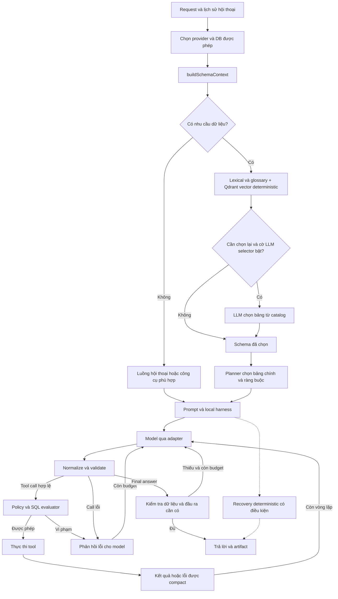
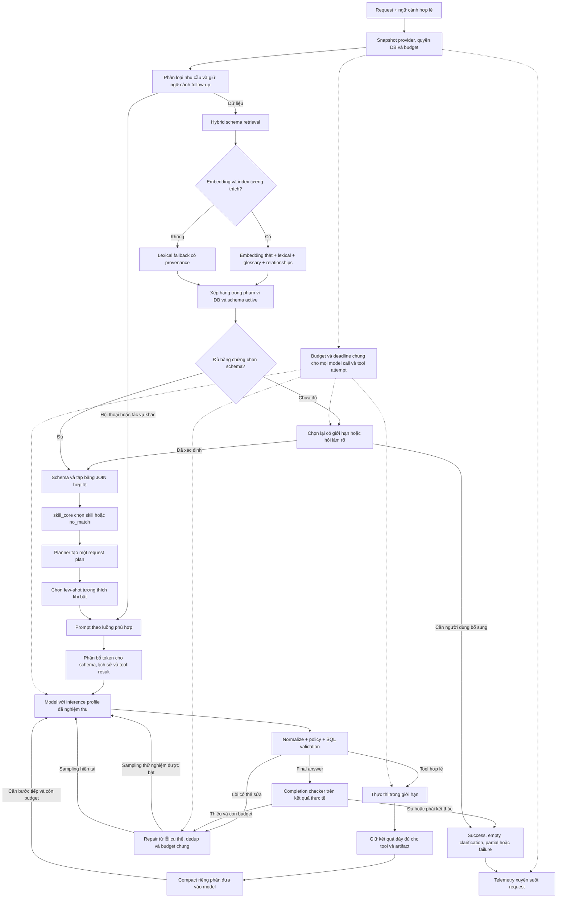
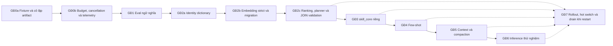

# Kế hoạch tối ưu Local Model — Qwen3.5 9B (v2)

Ngày lập: 2026-09-10. Trạng thái: kế hoạch triển khai, chưa thay đổi runtime. Phát triển từ [kế hoạch harness trước](LOCAL_MODEL_HARNESS_UPDATE_PLAN.md) và bản v1 của chính tài liệu này.

Trạng thái triển khai hiện tại:

- Giai đoạn 0a đã triển khai phần fixture dictionary/domain/provider ẩn danh, test bootstrap qua data directory tạm và đường export đi theo `KNOWLEDGEHUB_DATA_DIR`/`KNOWLEDGEHUB_EXPORT_DIR`. Hai biến đường dẫn này chủ ý chỉ cấu hình qua môi trường, không đưa lên Settings UI.
- Giai đoạn 0b đã sửa cộng dồn usage khi Ollama retry, thêm model/SQL/deadline budget dùng chung cho schema selector và local harness, tính cả fallback/synthesis và deterministic SQL recovery. SQL tool đã truyền abort signal xuống connector và hủy request/đóng connection khi caller abort. Deadline tự phát tín hiệu giữa lúc SQL đang chạy và schema Settings khai báo vẫn còn mở.
- Giai đoạn 1 đang triển khai: đã có semantic row comparator, corpus golden 12 case khởi đầu, SQL Server seed có chốt database, runner validate/live cô lập data directory và unit test. Chưa đạt gate 60 case và chưa có baseline live 3 lượt; vì vậy chưa được dùng số liệu này để kết luận model đã tối ưu.
- Kiểm tra hiện tại: toàn bộ `npm test` có 143/144 pass. Một lỗi độc lập đã tồn tại trong `tests/chat_pending_panel.test.js` do VM test thiếu `saveChatSessions`; các test semantic eval, identity, schema retrieval, skill và few-shot mới đều pass.

**Cập nhật sau review code:** bổ sung budget/cancellation xuyên suốt request, cô lập eval và artifact, migration identity dictionary trước embedding, hợp đồng validation JOIN, embedding strict, schema Settings và drain khi restart. Giữ `skill_core` thành giai đoạn riêng; tách nghiệm thu module khỏi điều kiện bật mặc định. Sửa cách diễn giải số liệu test và giới hạn bằng chứng.

## 1. Mục tiêu và cơ sở

Mục tiêu là tăng tỷ lệ hoàn thành đúng yêu cầu dữ liệu, SQL, chart/export trên local model với chi phí thời gian và bộ nhớ đo được. Mọi cải tiến phải có baseline, kiểm thử hồi quy, báo cáo live và đường rollback.

| Nhận định đã kiểm tra | Hiện trạng trong project | Công việc cần làm |
| --- | --- | --- |
| Eval chỉ đo format | `scripts/evaluate_local_harness.js` kiểm tra kind/tool; có rule SQL score, regression và eval document retrieval nhưng chưa có benchmark SQL end-to-end với đáp án chuẩn | Xây golden set và execution-match trên SQL Server fixture |
| Schema chỉ chọn bằng regex | Chưa đúng: `core.js` gọi retrieval kết hợp lexical, glossary và Qdrant; cờ schema selector chỉ tắt lượt LLM chọn lại bảng | Cải thiện pipeline hiện có, không tạo pipeline trùng |
| Schema chưa có embedding thật | `qdrantService.generateVector()` tạo vector từ ký tự và `sin(charCode + i)` cho cả index/query schema, không có bảo đảm tương đồng ngữ nghĩa hoặc khớp chuỗi con. Document search dùng `embedTexts`, nhưng hàm này cũng có thể fallback deterministic theo cấu hình | Migration schema sang embedding thật với chế độ strict và provenance (Giai đoạn 2) |
| Planner có thể khóa vào bảng sai | Planner chọn một bảng chính; evaluator/harness có thể ép SQL về bảng đó | Phân biệt lựa chọn rõ ràng với suy luận, hỗ trợ tập bảng JOIN và chọn lại có giới hạn |
| Context 16K chưa tối ưu | `.env.example` đặt 16K, adapter ưu tiên provider; compaction và schema có giới hạn riêng | Đo cấu hình hiệu lực và lượng thông tin mất; thử budget/context theo từng yếu tố |
| Thiếu few-shot nghiệp vụ | Prompt có mẫu JSON protocol và hướng dẫn SQL/chart/export, chưa có ví dụ SQL theo schema | Kho ví dụ kiểm duyệt, chọn theo skill/schema và giới hạn token |
| Recovery hoàn toàn deterministic | Chưa đúng: harness đã đưa lỗi lại cho model; chưa thấy repair đổi sampling hay self-consistency | Đo repair hiện có trước, thử sampling có điều kiện và dùng budget chung |
| **Mới:** usage bị đếm thiếu khi adapter retry | Xác nhận tại `src/backend/intelligent_core/adapters/ollama.js` (~dòng 83–99): khi model trả lời rỗng kèm `thinking`, adapter gọi lại với `think:false` và **gán đè toàn bộ biến `data`** bằng response thứ hai; `usage` sau đó chỉ tính `prompt_eval_count`/`eval_count` của lần gọi cuối — token của lần gọi đầu (đã tốn thật) bị bỏ qua | Cộng dồn usage cả hai lượt gọi trước khi trả về, sửa trong Giai đoạn 0 |
| Test phụ thuộc dữ liệu instance | Review chạy ba file test harness/schema/adapter với `KNOWLEDGEHUB_DATA_DIR` trỏ thư mục tạm trống: **44/51 pass, 7 fail**, các lỗi liên quan dictionary/domain-alias. Đây không phải phép thử git clone sạch | Fixture ẩn danh và runner cô lập (mục 4.5); ghi lệnh, phạm vi test và môi trường |
| Budget chưa bao phủ toàn request | Selector ngoài harness, synthesis sau vòng lặp; deterministic recovery kiểm tra policy với danh sách call rỗng; timeout chủ yếu theo lượt dispatch | Budget/deadline và cancellation dùng chung ở Giai đoạn 0 |
| Dictionary có thể gộp bảng trùng tên | `dictionary_service.js` tìm bảng khi lưu bằng `tableName`, chưa phân biệt đầy đủ nguồn/DB/schema | Migration identity trước backfill embedding |
| Eval artifact chưa được cô lập | StorageHelper hỗ trợ data directory riêng nhưng export tool ghi cứng `data/exports` | Đường artifact cấu hình được và test không ghi vào instance |

Các file trọng tâm:

- `src/backend/intelligent_core/core.js`, `schema_context_service.js`, `adapters/ollama.js`.
- `src/backend/agent_core/harness/local_model_harness.js`, `local_prompt_builder.js`, `local_result_compactor.js`.
- `src/backend/training_core/request_planner.js`, `sql_evaluator.js`, `regression_runner.js`.
- `src/backend/services/qdrant_service.js`, `scripts/evaluate_local_harness.js`.
- `src/backend/services/settings_help.js`, `settings_service.js` — **mới bắt buộc kiểm tra**: kể từ commit gần nhất, `settings_service.js` chỉ hiển thị trên UI những biến môi trường có mô tả trong `settings_help.js` (cộng một danh sách `safeServerKeys` cố định), không còn tự hiện mọi dòng trong `.env.example`. Mọi cờ mới ở các giai đoạn dưới đây phải thêm mô tả vào `settings_help.js` nếu muốn người dùng cấu hình được từ Settings UI; nếu cố tình để cờ chỉ đọc qua `.env`, ghi rõ lý do trong PR.

Kết quả trước review: 48/48 cho hai file harness/schema và 51/51 khi thêm ba test Ollama adapter trên instance có dữ liệu; eval format 3/3 pass. Chênh lệch tổng 48 và 51 do phạm vi test, không phải môi trường. Review gần nhất chạy ba file với data directory trống được 44/51 pass, 7 fail. Con số 41/48 trên clone sạch từng được ghi trong bản nháp chưa được tái xác minh bằng clone sạch trong review này. Các kết quả trên không phải benchmark Qwen live hoặc SQL execution accuracy.

## 2. Phạm vi và nguyên tắc

- Triển khai cho local harness trước. Xác định provider bằng ID, loại và model; không suy ra local model từ provider đang chọn trong IDE.
- Giữ SQL validation, quyền DB/tool, timeout, abort, dedup và local-only fallback. Không tăng quyền để nâng điểm benchmark.
- Thiết lập budget/deadline toàn request ở Giai đoạn 0, truyền qua selector, adapter và harness; harness sở hữu vòng lặp thực thi. Đây là công việc cần bổ sung, không phải bảo đảm đã có ở mọi nhánh hiện tại.
- Tách tác động retrieval, planner, skill, few-shot và inference bằng các cấu hình A/B. Mỗi PR có thể tắt riêng hoặc rollback về bản đã nghiệm thu.
- Không tự mở 262K context, bật thinking hay thêm nhiều candidate làm mặc định. Khả năng kiến trúc của model không chứng minh hiệu quả trên máy đang chạy.
- `skill_core` là module nghiệp vụ nội bộ, không phải hệ thống `SKILL.md` của Codex. Module này có giai đoạn và nghiệm thu riêng, trước few-shot.
- Mọi cờ môi trường mới phải có dòng trong `.env.example` **và** mô tả trong `settings_help.js` (trừ khi PR nêu rõ lý do cố tình ẩn khỏi UI). Dùng đúng tên cờ/script trong Phụ lục A, không đặt tên khác trong code rồi sửa tài liệu sau.
- Bản nháp few-shot/prompt, cờ "bật thinking cho câu phức tạp" và eval SQL dạng chấp nhận/từ chối theo nhãn được thử trong một phiên làm việc trước **chưa từng lên Git** và không phải nguồn chính thức của kế hoạch này. Có thể tham khảo cấu trúc câu ví dụ, nhưng kho ví dụ, tiêu chí bật reasoning và oracle SQL chính thức phải được xây lại đúng theo Giai đoạn 1 và Giai đoạn 4 dưới đây (golden set có oracle, execution-match, ví dụ đã kiểm duyệt trong `skill_core`).

## 3. Sơ đồ luồng chạy

### 3.1. Luồng hiện tại đã đối chiếu



Sơ đồ tóm tắt các nhánh chính. Giới hạn hiện tại chưa thống nhất: selector ngoài vòng lặp, synthesis có thể gọi model sau vòng lặp và deterministic recovery chưa tính đúng SQL budget chung. Giai đoạn 0 phải khắc phục trước khi thêm retry. Nhánh vector schema ở F chưa có bảo đảm ngữ nghĩa; Giai đoạn 2 thay bằng embedding thật.

### 3.2. Luồng mục tiêu sau tối ưu



Nhánh hội thoại không bắt buộc đi qua skill SQL. Khi các cờ mới tắt, request trở về hành vi tương ứng đã có. Không dùng fallback để bỏ qua thông tin mơ hồ thiết yếu hoặc để mở rộng quyền truy cập.

## 4. Đo lường và tiêu chí nghiệm thu chung

### 4.1. Golden set và oracle

Xây tối thiểu 60 case đã kiểm duyệt; tách tập phát triển và tập giữ kín trước khi tinh chỉnh. Bao phủ tên bảng/cột rõ ràng, paraphrase có/không dấu, câu ngắn, follow-up, lookup, tổng hợp thời gian, JOIN, chart/export, empty rows, mơ hồ, hội thoại không cần SQL và SQL bị cấm.

Mỗi case có ID, câu hỏi/lịch sử cần thiết, schema revision, DB snapshot, quyền truy cập, nhóm tác vụ, bảng/cột hợp lệ, filter, metric, quy tắc thời gian và kết quả kỳ vọng. Đầu ra kỳ vọng có thể là rows, artifact, câu hỏi làm rõ hoặc từ chối. SQL chuẩn phục vụ tạo oracle nhưng không bắt buộc SQL model giống nguyên văn.

- Dùng SQL Server fixture riêng, tài khoản chỉ đọc cho candidate, timeout và row limit. Seed/reset bằng bước quản trị riêng trong môi trường fixture.
- Dữ liệu phải phân biệt lỗi thực: NULL, trùng tên ở hai DB, JOIN nhân bản dòng, biên tháng/năm, thiếu tháng, ties, giá trị Decimal và Date.
- So sánh tập kết quả sau chuẩn hóa kiểu; chỉ bỏ thứ tự khi yêu cầu không cần thứ tự. Định nghĩa dung sai số cho từng metric, không bỏ qua sai khác tùy ý.
- Chart/export kiểm tra dữ liệu nguồn, nhãn, phạm vi thời gian và file thực tế trong thư mục tạm.
- Không đưa holdout vào few-shot hoặc dùng nhãn do chính rule evaluator tạo làm đáp án chuẩn.
- Case thiếu Ollama/SQL Server/Qdrant phải ghi skipped/incomplete và báo coverage; không coi là pass.

### 4.2. Hạ tầng SQL Server fixture (mới, chốt trước khi viết 60 case)

Mục "SQL Server fixture riêng" ở trên cần một quyết định hạ tầng cụ thể trước khi bắt tay viết case, nếu không việc này thường trở thành điểm nghẽn thực tế của Giai đoạn 1:

- Đề xuất mặc định: một container SQL Server riêng cho eval (tách hoàn toàn khỏi DB production/dev), khởi tạo qua script versioned trong repo (ví dụ `tests/fixtures/sql_server_seed/`), không chia sẻ instance với bất kỳ môi trường nào khác.
- Reset về trạng thái sạch trước mỗi lượt chạy batch bằng một lệnh duy nhất (ví dụ `npm run eval:seed:reset`), để 3 lượt live liên tiếp của cùng cấu hình không bị lệch vì dữ liệu trôi giữa các lượt.
- Tài khoản dùng cho SQL candidate chỉ có quyền đọc trên đúng schema fixture; không trỏ vào cùng tài khoản/DB mà harness dùng cho traffic thật.
- Nếu hạ tầng thực tế khác đề xuất trên (ví dụ dùng SQL Server LocalDB có sẵn, hoặc một schema riêng trong DB dev hiện có), ghi quyết định thật vào README của Giai đoạn 1 trước khi seed 60 case, để không phải viết lại case khi đổi hạ tầng giữa chừng.

### 4.3. Concurrency khi chạy live eval (mới)

Batch 60 case × tối thiểu 3 lượt/cấu hình (mục 4.4 dưới) là khối lượng gọi model không nhỏ trên một máy/một GPU. Mặc định chạy **tuần tự, concurrency = 1** cho batch đo accuracy, để độ trễ p50/p95 đo được phản ánh đúng một request tại một thời điểm, không bị nhiễu bởi cạnh tranh tài nguyên. Nếu cần số liệu ở concurrency thực tế triển khai (nhiều người dùng cùng lúc), đo ở một lượt riêng, tách khỏi số liệu accuracy, và ghi rõ mức concurrency đi kèm mọi con số latency/throughput được báo cáo.

### 4.4. Chỉ số

Lượt tải ở concurrency triển khai phải đo cả task success, timeout và tính đúng artifact, không chỉ latency/throughput. Tách cold start/model loading khỏi warm-run; ghi điều kiện cache và thứ tự A/B để tránh quy lợi ích warm-up cho một cấu hình.

| Nhóm | Chỉ số cần báo cáo |
| --- | --- |
| Schema | Recall bảng/cột cần thiết trong context cuối, table top-1 cho case một bảng, độ phủ bảng/khóa JOIN, tỷ lệ chọn lại và fallback |
| SQL | Execution accuracy trên oracle, SQL hợp lệ, lỗi quyền/policy, sai bảng/cột/filter/thời gian |
| Toàn tác vụ | Task success, artifact success, empty/clarification/refusal đúng, partial/failure |
| Skill | Chọn đúng skill, no_match đúng, chọn nhầm ngoài phạm vi, completion violations theo version |
| Repair | Thành công sau lỗi theo loại, số lần sửa, lặp SQL, tác động tăng thêm của sampling |
| Runtime | Model calls, token tất cả lượt (kể cả lượt bị bỏ khi retry — xem bug ở mục 1), p50/p95, throughput, RAM/VRAM đỉnh, timeout/abort |
| Protocol và context | Native/content_json/invalid/final, truncation theo nguồn, lượng dữ liệu trước/sau compaction |

Mỗi báo cáo ghi numerator/denominator, coverage, profile, dataset revision, **môi trường chạy (git clone sạch hay có dữ liệu instance thật — xem mục 1 và 4.5)** và ít nhất 3 lượt chạy live mỗi cấu hình. So sánh cùng tập case, snapshot và mức concurrency; công bố dao động giữa các lượt. Tập 60 case là điểm khởi đầu, cần mở rộng nếu dao động khiến chênh lệch chưa đáng tin.

### 4.5. Tái lập test và fixture dữ liệu (mới)

Ghi riêng phạm vi test và môi trường: 48/51 là hai tổng số test khác nhau; 7 ca fail khi data directory trống là vấn đề phụ thuộc dữ liệu cần xử lý:

- Tách rõ hai loại test trong `tests/*.test.js`: (a) test mock thuần, không đọc `data/*.json`, phải luôn pass trên một `git clone` sạch, không cấu hình gì thêm; (b) test đọc dữ liệu dictionary/domain-alias thật của instance — hiện đang fail trên clone sạch vì `data/dictionary.json`, `data/domain_aliases.json` không nằm trong Git (đúng, vì đó là dữ liệu nghiệp vụ riêng).
- Thêm một fixture tối thiểu, đã ẩn danh, cho nhóm (b): ví dụ `tests/fixtures/dictionary_seed.sample.json` với vài bảng/cột giả lập đủ để các assertion hiện tại chạy qua, nạp qua một loader test riêng thay vì đọc thẳng `data/` thật.
- Từ Giai đoạn 0 trở đi, mọi báo cáo baseline phải nêu rõ chạy trên "git clone sạch + fixture" hay "môi trường instance thật", và ghi số pass/fail kèm điều kiện đó — không dùng con số trần trụi như hai tài liệu trước.
- Tái sử dụng `KNOWLEDGEHUB_DATA_DIR` trong `storage_helper.js`; chạy runner bằng process riêng và đặt biến này trước khi require service singleton. Seed dictionary, aliases, relationships và DB/provider fixture tối thiểu; reset memory/history giữa case, chỉ giữ lịch sử được khai báo trong case follow-up.
- Cho export directory cấu hình/inject được; thay đường cứng trong `agent_core/tools/builtins/index.js` và thống nhất đường đọc/download artifact. Test chứng minh eval không ghi vào `data/exports` hoặc history của instance thật.
- Cố định provider ID và DB source ID trong runner; fail preflight khi thiếu/sai fixture marker, không fallback sang DB mặc định của instance. Qdrant eval có collection riêng. Reset chỉ được tác động DB/collection/thư mục được đánh dấu thuộc lần eval.
- Chạy kiểm tra clone sạch thực sự trước nghiệm thu; ghi commit, Node version, lệnh và fixture revision. Không đổi nhãn "data directory trống" thành "clone sạch" trong báo cáo.

### 4.6. Gate đề xuất

- Không có ca mới vượt quyền DB/tool hoặc thực thi SQL bị cấm. Nhóm chức năng bắt buộc không được hồi quy.
- Đối với thay đổi chất lượng: task success tăng ít nhất 5 điểm phần trăm hoặc số lỗi giảm ít nhất 20% so với bản được chấp nhận ngay trước đó; phải báo cả chênh lệch tuyệt đối.
- Profile mặc định có latency p95 tăng tối đa 20%, không OOM và không tăng timeout tại concurrency đã thống nhất trong baseline.
- Thay đổi chỉ nhằm observability/infra cần giữ chất lượng trong độ dao động baseline và đạt kiểm tra vận hành tương ứng; không bắt telemetry tự tạo thêm accuracy.
- Nếu baseline gần trần hoặc nhóm lỗi quá nhỏ, mở rộng tập case trước khi kết luận. Mọi điều chỉnh gate phải ghi trước lượt đánh giá nghiệm thu.
- Thay đổi không đạt gate vẫn để tắt, ghi kết quả và nguyên nhân; không kết luận thành công từ test mock.
- Gate hạ tầng/module: đúng contract, không hồi quy chức năng/quyền/budget và latency trong ngưỡng. Gate bật mặc định tính năng tối ưu: cần bằng chứng tăng chất lượng theo ngưỡng trên. `skill_core` có thể được nghiệm thu làm nền cho few-shot dù chưa đạt mức tăng 5 điểm phần trăm; khi đó cờ mặc định vẫn tắt.

## 5. Giai đoạn 0 — Cô lập eval, budget và telemetry (P0)

Phụ thuộc: không. Mục tiêu là biết hệ thống đang thực sự chạy cấu hình nào và lỗi ở đâu.

- Giữ `eval:local` hiện tại làm smoke test. Tạo script live riêng, nhận provider ID rõ ràng, không tự chuyển cloud.
- Ghi model tag/digest nếu có, phiên bản Ollama, capability native tool, context/predict/temperature/thinking hiệu lực, timeout, budget, phần cứng và concurrency.
- Đo một chu trình native đầy đủ: tool call → tool result → final answer. Tách kết quả native với content JSON fallback.
- Gắn request ID, bước pipeline và thời lượng. Đếm invalid ngay tại normalization/validation, cả SQL bị từ chối trước execution.
- Ghi provenance retrieval: embedding thật/deterministic/lexical fallback cùng model, index revision và nguyên nhân fallback.
- **Sửa bug đã xác nhận** trong `src/backend/intelligent_core/adapters/ollama.js` (~dòng 83–99): khi response đầu chỉ có `thinking` và rỗng `content`, adapter retry với `think:false` rồi gán đè toàn bộ `data` — token của lần gọi đầu bị bỏ khi tính `usage`. Sửa bằng cách cộng dồn `prompt_eval_count`/`eval_count` của cả hai lần gọi trước khi trả `usage`, không chỉ lấy lượt cuối.
- Log vận hành chỉ giữ metadata và dữ liệu đã che; fixture benchmark dùng dữ liệu tổng hợp. Thiết lập giới hạn dung lượng và thời gian giữ báo cáo/trace.
- Bổ sung fixture dictionary/domain-alias ẩn danh cho test theo mục 4.5, để baseline chạy lại được từ git clone sạch.
- Tạo request execution context từ trước schema selector: snapshot provider/config, `deadlineAt`, `modelCalls`, `sqlAttempts`, `repairAttempts` và fingerprint chung. Đếm mỗi lần gọi model thực tế, kể cả adapter retry/fallback/synthesis; phân biệt SQL candidate bị reject trước execution với SQL đã gửi DB.
- Kiểm tra ngân sách trước mọi dispatch và thực thi tool, bao gồm deterministic recovery. Không truyền danh sách call rỗng để né bộ đếm; mọi đường sửa dùng cùng fingerprint và không reset budget.
- Đặt timeout từng bước bằng phần thời gian còn lại của deadline tổng. Truyền abort qua retrieval/embedding, adapter, tool manager và SQL connector; SQL đang chạy phải được cancel/đóng theo hợp đồng, không chỉ ngừng chờ ở caller. Ghi trạng thái nếu hủy không thể hoàn tất ngay.
- Bổ sung test hết budget ở selector/adapter retry/synthesis/recovery, SQL trùng sau chuyển nhánh, abort giữa SQL và artifact. Giữ nguyên kết quả tool đã hoàn tất và báo partial/failure đúng khi hết deadline.
- Settings dùng schema khai báo `type`, `default`, bounds/choices và `restartRequired`, không suy ra kiểu từ giá trị `.env` lúc khởi động. Cờ không có trong `.env` vẫn phải hiện đúng kiểu và default nếu được đưa ra UI; mô tả trong `settings_help.js` không thay thế validation.

Đầu ra: runner cô lập, request budget/cancellation dùng chung, baseline JSON và bản đọc được, schema telemetry/settings có version. Ghi baseline trước/sau sửa nền tảng để không gộp hiệu quả sửa budget vào tối ưu sau này. Hoàn thành khi test tái lập từ clone sạch + fixture, artifact không ghi vào instance và mọi nhánh được kiểm tra budget/deadline.

## 6. Giai đoạn 1 — Eval SQL ngữ nghĩa (P0)

Phụ thuộc: giai đoạn 0. Chưa tối ưu model trước khi có phép đo này.

File triển khai: `scripts/evaluate_local_sql.js`, `scripts/eval/semantic_sql_evaluator.js`, `tests/fixtures/local_sql_golden.json`, `tests/fixtures/sql_server_seed/reset_local_eval.sql` và `tests/semantic_sql_evaluator.test.js`. Script npm: `eval:local:semantic` để validate offline và `eval:local:semantic:live` để chạy toàn luồng.

Trạng thái hiện tại: runner offline và contract chấm điểm đã nghiệm thu bằng unit test; corpus mới có 12 case. Máy phát triển không có Docker nên fixture dùng SQL Server/`sqlcmd` sẵn có với database chuyên dụng `KnowledgeHubLocalEval`. Runner live bắt buộc `KNOWLEDGEHUB_DATA_DIR` nằm ngoài `data` của project và có marker `knowledgehub-local-sql-eval`; bước seed/live baseline chỉ chạy sau khi cấu hình nguồn SQL/provider cô lập.

- Triển khai dataset và oracle theo mục 4; cố định thời điểm đánh giá cho câu hỏi calendar-relative.
- Trước khi viết case: chốt hạ tầng SQL Server fixture theo mục 4.2, và xác nhận quy tắc concurrency ở mục 4.3.
- Chạy toàn luồng request qua retrieval, planner, adapter, harness, tool và final/artifact. Khi skill được triển khai, bổ sung selection vào trace của cùng runner.
- Có chế độ offline kiểm tra oracle/scoring và chế độ live gọi Qwen. Không trộn hai loại điểm.
- Thêm case cho lỗi bảng top-1, cột bị cắt, JOIN, câu ngắn bị nhận nhầm là hội thoại và empty result hợp lệ.
- Lưu report chứa cấu hình, kết quả từng case, lỗi đã che dữ liệu và aggregate; so sánh hai báo cáo bằng dataset revision giống nhau **và cùng ghi rõ môi trường chạy** (mục 4.5).

Hoàn thành khi: đủ tối thiểu 60 case được duyệt, oracle bắt được SQL sai có chủ đích trong các nhóm quan trọng và có baseline live. Nếu dịch vụ chưa sẵn sàng, chỉ nghiệm thu runner offline; phần đánh giá chất lượng vẫn ghi chưa hoàn thành.

## 7. Giai đoạn 2 — Semantic schema retrieval và planner (P1)

Phụ thuộc: giai đoạn 1. Thực hiện trước skill để giảm ảnh hưởng của schema sai tới routing và binding.

Trạng thái triển khai: đã thêm identity ổn định `dbSourceId + dbName + schemaName + tableName`, giữ `TABLE_SCHEMA` khi đọc `INFORMATION_SCHEMA`, đưa table/column identity vào payload Qdrant và lọc retrieval theo DB source. Schema collection mặc định chuyển sang `database_schema_v2`, kích thước 1024 và dùng embedding provider thật với kiểm tra dimension; fallback deterministic chỉ hoạt động khi cấu hình rõ. Chưa chạy backfill/retrieval benchmark vì môi trường hiện không có Qdrant/SQL Server fixture.

### 7.1. Identity dictionary trước embedding

- Định danh ổn định bằng nguồn kết nối + database + schema + table; cột gắn với identity bảng. Bảo toàn schema khi import từ connector.
- Migration dictionary và relationships có version/backup; thay các lookup chỉ theo `tableName` trong lưu/sửa bảng, API/UI, planner, recovery và payload Qdrant. Metadata cũ thiếu nguồn/schema phải được đối chiếu trước migration; không đoán rồi gộp bảng.
- Test hai DB và hai schema cùng tên bảng, relationship liên bảng, cập nhật/xóa đúng bảng và rollback metadata. Dữ liệu đã bị ghi đè trước đó cần re-import từ nguồn; migration không thể tự phục hồi thông tin đã mất.
- Nghiệm thu identity trước backfill collection semantic; thêm `dictionary_service.js`, `sql_connector.js` và các API quản lý dictionary vào phạm vi PR.

### 7.2. Embedding và migration

- Tái sử dụng `embedTexts` cho index và query schema, thay cho `generateVector` (hash ký tự không mang ngữ nghĩa — mục 1). Kiểm tra đường fallback trước khi dùng. Không gọi `generateVector` cho query gửi vào collection embedding thật.
- Tạo collection schema có version mới. Đo dimension thực tế, lưu embedding model/version/dimension/schema revision; không trộn không gian vector dù cùng số chiều.
- Index bảng, cột, mô tả nghiệp vụ, glossary và relationships. Payload có DB/schema/table/column identity, trạng thái active và phạm vi truy cập cần thiết.
- Backfill collection mới, kiểm tra số lượng/metadata, chạy shadow retrieval và golden set, sau đó mới chuyển cấu hình/alias có kiểm soát.
- Không dùng nguyên luồng sync đang xóa collection phục vụ. Giữ collection cũ và cấu hình tương ứng để rollback; tách collection document khỏi migration schema.
- Nếu embedding hỏng hoặc index không tương thích: lexical fallback có trạng thái rõ ràng. Tránh request thất bại hoàn toàn chỉ vì dịch vụ embedding.
- `embedTexts` hiện có fallback deterministic: bổ sung chế độ strict cho schema hoặc kết quả có provenance để từ chối pseudo-vector. Không chỉ dựa vào dimension để phân biệt. Kiểm tra số vector, dimension nhất quán và mọi giá trị hữu hạn trước index/query.
- Lưu fingerprint embedding theo collection; index và query phải kiểm chứng cùng fingerprint. Không thay chính sách fallback document một cách ngầm định khi tái sử dụng hàm chung.
- Định nghĩa sync sau migration: cập nhật mô tả/cột/alias, deactivate/delete bảng và relationships; dùng ID ổn định và xóa điểm lỗi thời. Serialize sync/switch collection hoặc kiểm tra revision để tránh request trộn metadata/index của hai phiên bản.

### 7.3. Ranking, planner và validation JOIN

- Filter theo DB/quyền/schema active trước xếp hạng, dùng định danh đầy đủ thay vì chỉ `tableName` trong map và relationship lookup.
- Đo rồi sửa bộ lọc lexical đang có thể loại ứng viên chỉ có vector match. Thử hợp nhất theo rank hoặc trọng số trên tập phát triển; ghi cấu hình đã chọn.
- Câu dữ liệu ngắn và follow-up phải được xét cùng ngữ cảnh hợp lệ, tránh bỏ retrieval vì thiếu từ khóa. Không biến hội thoại chung thành SQL mặc định.
- Bảo toàn cột filter, metric, thời gian, khóa JOIN trước khi cắt context; đo recall trên context thực sự gửi model.
- Planner lưu nguồn lựa chọn: người dùng chỉ rõ, alias/default hay retrieval suy ra. `allowedTables`/`allowedColumns` phải thống nhất với evaluator và harness, hỗ trợ JOIN nhiều bảng.
- Lựa chọn confidence thấp được chọn lại tối đa một lần trong tập schema được phép nếu profile cho phép; lượt gọi này tính vào budget. Còn mơ hồ thiết yếu thì hỏi làm rõ.
- Giữ chặn bảng ngoài quyền. Không ép SQL về top-1 suy luận khi có bằng chứng hợp lệ cho bảng khác; cập nhật request plan nhất quán trước khi validate/thực thi.
- Chốt hợp đồng phân tích T-SQL cho alias, tên qualified, JOIN, CTE và subquery trước khi mở rộng `allowedTables`/`allowedColumns`. Evaluator regex hiện tại bỏ kiểm tra projection đơn giản khi có JOIN/CTE; việc thêm danh sách allowed chưa tự tạo validator đúng.
- Tách kiểm tra quyền DB/tool, phân giải tham chiếu cấu trúc và scoring nghiệp vụ. Đánh giá parser T-SQL phù hợp bằng corpus hiện có; đợt đầu công bố rõ cú pháp hỗ trợ. Cú pháp không phân giải được phải có kết quả unsupported/clarification hoặc đường validation đáng tin đã định nghĩa, không tự coi là hợp lệ.
- Test alias trùng, bảng cùng tên khác schema, CTE che tên bảng, correlated subquery, cột mơ hồ và bảng ngoài phạm vi. Không dùng rewrite regex để sửa SQL phức tạp chưa phân tích được.

Kiểm thử: mất Qdrant/embedding, dimension mismatch, DB trùng tên bảng, schema inactive, index cũ, paraphrase, câu ngắn, JOIN, chọn lại và rollback. Tách PR migration khỏi PR ranking/planner để xác định tác động.

Hoàn thành khi: provenance chính xác, nhóm paraphrase/JOIN cải thiện theo gate, phạm vi DB giữ nguyên và đã thử rollback collection lẫn cấu hình embedding tương ứng.

## 8. Giai đoạn 3 — skill_core riêng (P1)

Phụ thuộc: giai đoạn 2 và eval giai đoạn 1. Giai đoạn này nghiệm thu routing/contract khi chưa có few-shot.

Trạng thái triển khai: đã có registry, selector và hai skill `record_lookup`, `aggregate_report`; harness ghi selection vào trace và chỉ chèn hướng dẫn khi `LOCAL_MODEL_SKILL_CORE_ENABLED=true`. Unit test routing/fail-closed đã có; A/B semantic live được hoãn vì thiếu SQL Server.

```text
src/backend/skill_core/
  index.js
  skill_registry.js
  skill_selector.js
  skill_contract.js
  definitions/
tests/skill_core.test.js
tests/fixtures/skill_cases.json
```

- Contract khai báo gồm `id`, `version`, `supportedIntents`, `requiredInputs`, `schemaRequirements`, `allowedTools`, `steps`, `completionCriteria`, `exampleIds` mặc định rỗng.
- Registry kiểm tra ID/version trùng, tool không tồn tại, dependency vòng và loại completion không được hỗ trợ. Không chạy JavaScript/shell/SQL tùy ý từ định nghĩa.
- Selector dùng intent/context/schema đã có, chưa thêm lượt LLM riêng; trả `matched`, `no_match` hoặc `ambiguous` cùng bằng chứng.
- `core.js` gọi resolver sau retrieval; planner gắn resolved/missing inputs và required outputs vào một request plan duy nhất. Skill chỉ thu hẹp quyền tool hiện có.
- Tích hợp `record_lookup` và `monthly_report`; chart/export chỉ bắt buộc nếu yêu cầu thực tế cần. Phân biệt latest available với calendar-relative theo yêu cầu.
- Hướng dẫn skill đưa vào prompt; harness giữ loop/retry/budget/dedup và kiểm tra completion trên kết quả tool thực tế.
- Tối đa một skill mỗi request. Giữ snapshot skill/version suốt request; định nghĩa mới chỉ áp dụng request mới.
- Thêm cờ `LOCAL_MODEL_SKILL_CORE_ENABLED=false` (xem Phụ lục A) — nhớ thêm mô tả vào `settings_help.js` nếu muốn hiện trên Settings UI (mục 1). Khi tắt hoặc no_match, giữ luồng phù hợp trước đó; không bỏ qua mơ hồ thiết yếu.
- Bổ sung nhãn skill vào golden set và trace: ID/version, lý do chọn, input thiếu, completion violations.

Kiểm thử registry/selector, default mâu thuẫn yêu cầu, empty rows, lỗi SQL/artifact, budget/abort và bật/tắt. Nghiệm thu module khi hai skill chạy đúng contract qua harness, không hồi quy chức năng/quyền/budget, latency trong ngưỡng và có báo cáo A/B không few-shot. Sau nghiệm thu module được triển khai few-shot ở giai đoạn 4. Chỉ bật skill mặc định khi đạt gate tăng chất lượng; chưa đạt thì giữ cờ tắt, không chặn việc đánh giá few-shot.

## 9. Giai đoạn 4 — Few-shot theo skill và schema (P1)

Phụ thuộc: giai đoạn 3 đã nghiệm thu. Kho ví dụ chính thức nằm trong `skill_core`, không phải bản nháp prompt tham khảo nêu ở mục 2.

Trạng thái triển khai: đã có kho ví dụ versioned trong `skill_core/examples`, selector chỉ render ví dụ khi các cột cần thiết tồn tại trong request plan và giới hạn tối đa hai ví dụ. `local_prompt_builder` chỉ chèn ví dụ khi cả skill và `LOCAL_MODEL_FEW_SHOT_ENABLED=true`; hai cờ mặc định tắt và đã có schema Settings. Chưa bật mặc định do chưa có A/B live.

- Thêm `src/backend/skill_core/examples/`, nối `exampleIds` và selector ví dụ vào `local_prompt_builder.js`; không tạo kho nghiệp vụ song song.
- Ví dụ gồm câu hỏi, schema compatibility, protocol, SQL/tool sequence và kết quả rút gọn đã duyệt. Bắt đầu với lookup/filter, tổng hợp tháng và SQL → chart/export.
- Chọn tối đa 2–3 ví dụ, ngân sách ban đầu 1.000–1.500 token; điều chỉnh theo số đo. Chỉ chọn ví dụ có bảng/cột hợp lệ trong context hiện tại.
- Không có ví dụ phù hợp thì bỏ qua. Không dùng dữ liệu nhạy cảm hoặc holdout. Native tool và JSON fallback phải có biểu diễn đúng protocol tương ứng.
- Thêm cờ `LOCAL_MODEL_FEW_SHOT_ENABLED=false` (Phụ lục A); chỉ chèn khi cả skill và few-shot bật và có matched skill.
- So ba cấu hình: skill tắt; skill bật/few-shot tắt; cả hai bật. Giữ retrieval, sampling và context giống nhau.
- Kiểm tra token, schema mismatch, example thiếu/sai version và mọi tổ hợp cờ. Tắt few-shot vẫn giữ routing/contract; tắt skill bỏ cả hướng dẫn skill và ví dụ.

Hoàn thành khi: A/B chứng minh lợi ích tăng thêm của few-shot so với skill-only, đạt gate và không hồi quy protocol hoặc latency ngoài ngưỡng.

## 10. Giai đoạn 5 — Context, memory và compaction (P2)

Phụ thuộc: giai đoạn 0–1; nghiệm thu trên bản ổn định sau giai đoạn 4. Khảo sát token có thể làm sớm, nhưng không gộp thay đổi với A/B retrieval/few-shot.

- Ghi budget riêng cho system/tool definitions, schema, skill/examples, lịch sử, document context, tool results và output reserve.
- Khi không có tokenizer tương thích, ghi rõ token estimate là ước lượng và đối chiếu với usage thực; không coi ký tự là token.
- Đo thông tin bị mất vì các giới hạn hiện có: schema 6 bảng/40 cột/18.000 ký tự; tool result 6.000 ký tự, 20 phần tử mỗi mảng, chuỗi 1.500 ký tự. Các giá trị này là mặc định code/config mẫu, phải ghi giá trị runtime.
- Giữ rows đầy đủ cho tool/artifact; chỉ compact phần truyền model. Kiểm tra chart/export không nhận nhầm dữ liệu đã cắt.
- Ưu tiên fields và hàng cần cho câu hỏi, giữ tổng số hàng, cột, đơn vị, thứ tự/thời gian và dấu truncation. Nếu câu trả lời cần dữ liệu ngoài phần nhìn thấy, dùng phép tổng hợp/truy vấn có mục tiêu trong budget.
- Memory phải giữ filter, entity và mốc thời gian đang dùng; không hồi sinh yêu cầu cũ hoặc để summary ghi đè yêu cầu mới.
- Thử 16K → 32K; chỉ thử 64K khi bộ nhớ và throughput cho phép. Không đổi context và giới hạn tool-result/schema cùng một lượt thử.
- Với mỗi context, đo p50/p95, RAM/VRAM đỉnh, timeout, throughput và accuracy ở concurrency mục tiêu. Chưa đưa 262K vào profile mặc định.

Hoàn thành khi: profile được chọn có lợi ích đo được, không mất dữ liệu artifact, token budget có dự phòng output và rollback profile khôi phục được.

## 11. Giai đoạn 6 — Repair sampling và inference có điều kiện (P2)

Phụ thuộc: eval và telemetry repair; triển khai trên cấu hình context đã nghiệm thu. Giữ cơ chế model sửa từ lỗi hiện có làm đối chứng.

| Thử nghiệm | Cách triển khai và điều kiện |
| --- | --- |
| Repair sampling | Chỉ thử cho lỗi model còn phổ biến sau retrieval/planner/few-shot. Tối đa một lần repair dùng sampling khác cho mỗi request, trong giới hạn SQL/model/time chung; nhiệt độ lựa chọn trên tập phát triển |
| Thinking (cờ `LOCAL_MODEL_THINK_CONDITIONAL_ENABLED`, Phụ lục A) | So bật/tắt trên nhóm case khó đã gán nhãn trong golden set — không dùng heuristic đơn giản (ví dụ chỉ dựa vào có số tháng) làm tiêu chí cuối cùng; giữ abort, giới hạn thời gian/token và retry empty-content; cộng usage toàn bộ lượt (đã sửa ở Giai đoạn 0) |
| Structured output | Chỉ triển khai nếu invalid protocol đáng kể. Adapter cần truyền format có schema bao phủ cả tool call và final, kiểm tra tương thích native tools bằng probe thực |
| Self-consistency | Thử riêng sau cùng nếu repair đơn vẫn chưa đủ; tối đa hai candidate trong sandbox eval trước, chưa bật production |

- Phân loại syntax/schema/policy/timeout/no-progress trước retry. Quyền truy cập bị từ chối hoặc thao tác bị cấm không được giải quyết bằng đổi sampling để tìm đường vượt chặn.
- Model nhận lỗi cụ thể và schema được phép; candidate mới qua toàn bộ validators. SQL fingerprint trùng không được thực thi lại.
- Clone cấu hình theo request/lượt gọi, không mutate provider dùng chung. Retry mới không reset iterations, SQL attempts hoặc deadline.
- Với self-consistency, định nghĩa cách chọn trước khi đo: oracle chỉ dùng chấm điểm, không dùng chọn candidate ở runtime. Candidate bất đồng chưa được xác minh phải dẫn tới clarification/partial phù hợp, không tự coi SQL chạy được là SQL đúng.
- Không tạo chart/export cho từng candidate. Chỉ tạo artifact sau khi phương án được chấp nhận; mọi thực thi thử phải ở fixture chỉ đọc và tính vào chi phí.
- Báo cáo chất lượng tăng thêm trên mỗi model call/token/giây, cả nhóm thành công ngay lần đầu để phát hiện chi phí vô ích.

Hoàn thành khi: từng thử nghiệm đạt gate riêng. Thử nghiệm không có lợi ích tiếp tục tắt; việc thiếu self-consistency không tự động là lỗi cần sửa.

## 12. Giai đoạn 7 — Rollout, vận hành và hồi quy (P1)

Phụ thuộc: từng tính năng tương ứng đã đạt gate. Có thể rollout từng tính năng đã nghiệm thu mà không chờ mọi thử nghiệm P2.

- Mọi cờ mới mặc định tắt, mô tả trong `.env.example` **và** `settings_help.js` (mục 1); chỉ nối vào UI nếu người dùng thực sự cần cấu hình, ngược lại ghi rõ lý do để cờ chỉ đọc qua `.env`.
- Bật trong eval, tiếp đến nhóm request thử nghiệm có kiểm soát, rồi mở rộng sau khi số liệu vận hành đạt ngưỡng đã thống nhất. Ghi profile/index/skill version theo request để so sánh.
- Dashboard/report tối thiểu: task failure, protocol invalid, wrong-table, repair/fallback, p95, timeout và index health. Baseline chưa có số vận hành thì chưa tự đặt ngưỡng cảnh báo tuyệt đối.
- Hot switch chỉ áp dụng khi có snapshot config/skill/index theo request: request mới nhận version mới, request cũ giữ tài nguyên/version đã chọn đến khi kết thúc. Giữ collection cũ đến khi không còn request tham chiếu.
- Restart để áp dụng `.env` là đường riêng, không bảo toàn snapshot trong bộ nhớ. Supervisor hiện gửi `SIGTERM`; `server.js` có forced shutdown mặc định 10 giây, có thể cắt request local dài. Bổ sung trạng thái draining: ngừng nhận request mới, theo dõi request đang chạy, chờ trong thời hạn đã công bố rồi hủy phần còn lại và ghi partial/aborted.
- `/api/settings/restart` chỉ dùng được khi chạy dưới supervisor và có quyền admin. Diễn tập cả hot switch và restart/drain; không cam kết request không gián đoạn khi phải restart. Rollback collection phải khôi phục cả embedding configuration tương ứng.
- Nếu cần rollback code, dùng commit/release đã kiểm tra, giữ tương thích cấu trúc report/config. Dọn collection cũ chỉ sau thời gian giữ đã thống nhất và kiểm tra không còn request dùng.
- Đưa case lỗi thực tế đã che dữ liệu vào tập phát triển; duy trì holdout độc lập và có version. Không tự phát hành skill/examples từ hội thoại.

Hoàn thành khi: có hướng dẫn bật/tắt/rollback, báo cáo nghiệm thu cho từng tính năng và diễn tập fallback/rollback thành công.

## 13. Thứ tự PR và ma trận kiểm tra



| PR | Kiểm tra bắt buộc và đầu ra |
| --- | --- |
| Fixture và cô lập eval | Process/data/artifact riêng, preflight DB/provider, không ghi vào instance, test clone sạch |
| Budget/cancellation và baseline | Usage mọi lượt, SQL attempts/dedup/deadline ở mọi nhánh, abort SQL, schema Settings, baseline trước/sau |
| Semantic eval | Hạ tầng SQL Server fixture đã chốt (mục 4.2), oracle offline, báo cáo live đầu tiên kèm mức concurrency đã dùng |
| Identity dictionary | Migration nguồn/DB/schema/table, API/relationship/connector, trùng tên và rollback |
| Embedding/migration | Strict embedding/provenance, dimension/DB filters, sync update/delete, shadow eval, rollback |
| Ranking/planner và JOIN | Paraphrase/follow-up, phân giải alias/CTE/subquery, allowed schema nhất quán, A/B |
| skill_core | Registry/selector/contract, integration lookup/report, gate module riêng, A/B không few-shot, schema Settings |
| Few-shot | Compatibility/token/protocol/cờ, A/B so skill-only |
| Context/compaction | Bảo toàn artifact, truncation/memory, benchmark tài nguyên |
| Inference | Repair budget/dedup/abort, probe protocol, A/B từng yếu tố |
| Rollout | Snapshot/hot switch, restart có drain/deadline, theo dõi request và diễn tập rollback |

Mỗi PR chạy test liên quan. Trước khi merge bản triển khai, chạy `npm run test:ci` theo repo; hiện script này gồm unit tests, eval format và SQL security corpus, chưa gồm semantic live. Live eval chạy job/môi trường riêng có Ollama, SQL Server và Qdrant; không làm CI thông thường phụ thuộc GPU. Chỉ viết test cho hành vi cần bảo vệ, không dùng test pass để thay báo cáo chất lượng.

## 14. Rủi ro và phần để sau

| Rủi ro | Cách xử lý trong kế hoạch |
| --- | --- |
| Vector mới trộn index cũ | Collection có version, kiểm tra fingerprint embedding và rollback đồng bộ |
| Retrieval sai làm planner/skill sai theo | Eval từng tầng và end-to-end; confidence/provenance, clarification có mục tiêu |
| Thêm prompt làm chậm hoặc cắt dữ liệu quan trọng | Budget theo nguồn, A/B từng yếu tố, giữ full rows ngoài model |
| Điểm đẹp do leakage hoặc oracle yếu | Holdout độc lập, fixture phân biệt lỗi, review kết quả và coverage |
| Retry tăng chi phí và lặp artifact | Một budget request, fingerprint, completion dựa kết quả thực tế |
| Cải tiến trên máy thử nhưng kém khi concurrent | Benchmark đúng phần cứng và concurrency dự kiến triển khai (mục 4.3) |
| **Mới:** số liệu baseline không tái lập được vì thiếu dữ liệu seed | Fixture dictionary/domain-alias ẩn danh commit riêng cho test (mục 4.5); mọi báo cáo ghi rõ môi trường chạy |

LoRA/SFT lập kế hoạch riêng khi còn nhóm lỗi model ổn định sau các giai đoạn trên, có dữ liệu được duyệt, phần cứng và đường deploy adapter/quantization đã xác minh. `training_core` hiện tại không đồng nghĩa đã có pipeline huấn luyện hoàn chỉnh.

## 15. Phụ lục A — Chuẩn hoá tên cờ và script

Tên dưới đây là chuẩn dùng xuyên suốt tài liệu này; nếu triển khai đặt tên khác trong code, cập nhật lại bảng này trong cùng PR, không để tài liệu và code lệch tên như giữa hai bản kế hoạch trước.

| Tên | Loại | Giai đoạn | Mặc định |
| --- | --- | --- | --- |
| `eval:local` | npm script | có sẵn | — (smoke test format) |
| `eval:local:semantic` | npm script | Giai đoạn 1 | Validate corpus offline |
| `eval:local:semantic:live` | npm script | Giai đoạn 1 | Chạy tuần tự, data directory cô lập |
| `scripts/evaluate_local_sql.js` | script | Giai đoạn 1 | — |
| `tests/fixtures/local_sql_golden.json` | fixture | Giai đoạn 1 | — |
| `tests/fixtures/dictionary_seed.sample.json` | fixture | Giai đoạn 0 | — |
| `KNOWLEDGEHUB_DATA_DIR` | env path có sẵn | Giai đoạn 0 | Runner đặt thư mục tạm riêng trước khi load module |
| `eval:seed:reset` | npm script | Giai đoạn 1 | — |
| `LOCAL_MODEL_SKILL_CORE_ENABLED` | env flag | Giai đoạn 3 | `false` |
| `LOCAL_MODEL_FEW_SHOT_ENABLED` | env flag | Giai đoạn 4 | `false` |
| `LOCAL_MODEL_THINK_CONDITIONAL_ENABLED` | env flag | Giai đoạn 6 | `false` |

## 16. Tài liệu tham chiếu và giới hạn

- [Qwen3.5-9B model card](https://huggingface.co/Qwen/Qwen3.5-9B): context native 262.144 token; thông số kiến trúc không thay cho benchmark local.
- [Ollama context length](https://docs.ollama.com/context-length): context lớn cần thêm bộ nhớ; cấu hình theo tài nguyên thực.
- [Kế hoạch harness trước](LOCAL_MODEL_HARNESS_UPDATE_PLAN.md): chi tiết kiểm tra ban đầu và thiết kế skill. Tài liệu này đặt retrieval/planner trước skill; số giai đoạn chỉ có ý nghĩa trong từng tài liệu.

Các tên file/cờ/script chưa có trong code vẫn là đề xuất. Budget, artifact directory và semantic eval offline đã có implementation; strict embedding và schema Settings vẫn phải được chốt trong PR tương ứng. Chưa có số liệu chứng minh mức tăng accuracy, context tối ưu, hiệu quả few-shot hoặc repair sampling trên Qwen của project; chỉ chốt sau eval live. Review gần nhất đối chiếu code và chạy test với data directory tạm trống, chưa chạy lại bằng clone sạch hoặc benchmark live.
