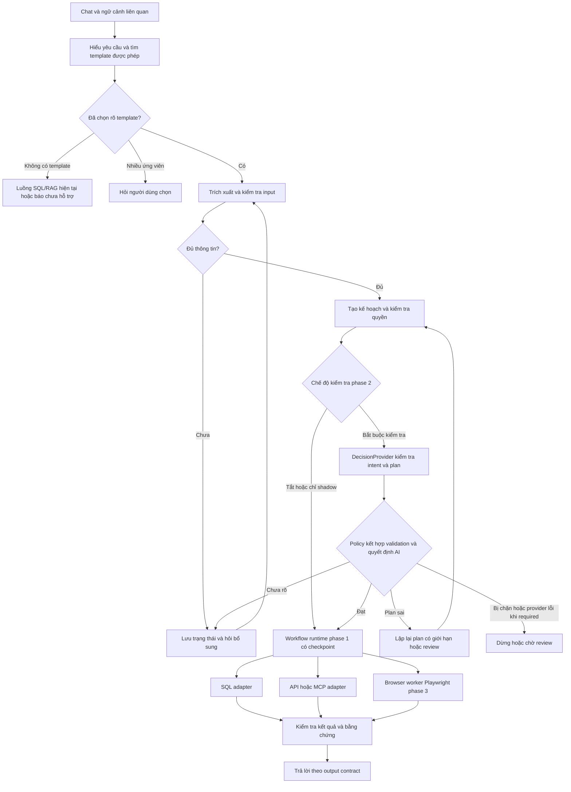

# Kế hoạch nâng cấp: template câu hỏi và bot thao tác ứng dụng

Ngày: 24/09/2026. Cập nhật: 26/09/2026. Trạng thái: đã triển khai BE/FE phase 1 và kiểm thử fixture; chưa nghiệm thu pilot dữ liệu thật/PostgreSQL live. Xem [báo cáo tiến độ](WORKFLOW_PHASE1_PROGRESS_260926.md) và [hướng dẫn vận hành](WORKFLOW_PHASE1_RUNBOOK.md).

## 0. Phân kỳ triển khai: 3 phase độc lập

Tách hai phần triển khai chính là workflow và bot; đặt nghiên cứu/tích hợp AI quyết định ở giữa thành **3 phase**, theo thứ tự người dùng yêu cầu. Mỗi phase có bản phát hành, kiểm thử và rollback riêng; không gom thành một lần thay đổi lớn.

| Phase | Kết quả bàn giao | Phụ thuộc | Khi có lỗi |
| --- | --- | --- | --- |
| **1 — Workflow và plugin nghiệp vụ** | Chạy nghiệp vụ theo workflow, phân loại qua catalog mở, hỗ trợ customize và import gói nghiệp vụ | Runtime hiện có; không cần Laya hoặc Playwright | Cô lập plugin/run lỗi, giữ luồng SQL/RAG cũ |
| **2 — Nâng cấp phase 1 bằng AI local** | Tích hợp thử nghiệm Laya local qua DecisionProvider vào chọn plugin/template, kiểm tra intent/slot/plan và quyết định hỏi lại của workflow phase 1 | Catalog, contract intent/plan và baseline của phase 1 | Tắt adapter; workflow phase 1 tiếp tục theo policy đã định |
| **3 — Bot Playwright** | Worker trình duyệt thực thi action do workflow giao, lấy dữ liệu/tải file có xác minh | Workflow phase 1 ổn định; phase 2 không bắt buộc với mọi workflow | Dừng browser job lỗi; workflow SQL và API độc lập vẫn chạy |

**MVP đầu tiên chỉ là phase 1.** Nghiệm thu phase 1 không đợi mô hình AI quyết định, tài khoản website, browser runtime hay locator. Phase 2 không đạt thì giữ ở thử nghiệm; phase 3 vẫn có thể chạy workflow đã publish bằng validation/policy của phase 1. Những workflow khai báo bắt buộc kiểm tra AI thì phải chờ kiểm tra hoặc review khi provider lỗi, không âm thầm bỏ qua.

Các mục 1–9 mô tả kiến trúc đích; phạm vi triển khai thực tế tuân theo mục 10. Phần browser, phiên đăng nhập và bot thuộc phase 3. Tác vụ ghi được mở riêng sau khi bot đọc ổn định.

## 1. Kết quả cần đạt

Nâng KnowledgeHub AI từ trả lời dựa trên SQL thành trợ lý thực hiện quy trình nghiệp vụ:

1. Hiểu câu hỏi, chọn template phù hợp, thu thập đủ thông tin, thực hiện đúng các bước và trả đúng cấu trúc kết quả.
2. Thao tác trên ứng dụng: truy cập, tìm kiếm, lọc, lấy dữ liệu, tải báo cáo; sau đó mới mở rộng tạo/cập nhật dữ liệu.
3. Kết hợp SQL và ứng dụng trong cùng một yêu cầu, có nguồn dữ liệu và trạng thái từng bước.

Người dùng đã xác nhận ứng dụng đích là **web**, ví dụ **truy cập trang → tạo báo cáo → tải file về**. Quy mô dự kiến: phase 1 có 5 template workflow; phase 3 có một ứng dụng web và 3 tác vụ xoay quanh báo cáo. Chưa có tên ứng dụng, URL, API, cơ chế đăng nhập hoặc câu hỏi nghiệp vụ chính thức. Các ví dụ bên dưới chỉ minh họa, không phải mapping dữ liệu thật. Điều khiển desktop nằm ngoài phạm vi đợt này.

### 1.1. Yêu cầu bắt buộc: tổng quát, không hard-code nghiệp vụ

Theo yêu cầu người dùng, **mọi nghiệp vụ phải có tính tổng quát**. Phạm vi pilot là mẫu để kiểm chứng khả năng cấu hình, không giới hạn engine vào báo cáo, công nợ hay một website cụ thể.

- Không có `if/switch`, regex hay prompt cố định theo tên nghiệp vụ, template ID, bảng/cột, khách hàng hoặc website để quyết định xử lý.
- Không dùng danh sách intent/capability nghiệp vụ đóng trong source. Registry phải cho phép thêm, sửa, version và vô hiệu hóa definition qua cơ chế quản trị/import có validation.
- Template, slot, câu hỏi bổ sung, công thức, mapping dữ liệu, điều kiện workflow, output contract, endpoint và locator thuộc definition có phiên bản. Runtime đọc và kiểm tra definition bằng thuật toán chung.
- Không chỉ chuyển danh sách hard-code sang JSON: thêm một definition hợp lệ phải được discovery, routing, hỏi lại, thực thi và render mà không cần sửa selector, prompt, handler hoặc frontend cho riêng definition đó.
- Chỉ cố định các primitive kỹ thuật như kiểu dữ liệu, validation operators, trạng thái run, tham số SQL, HTTP/MCP/browser operations và quy tắc quyền. Workflow kết hợp các primitive qua schema/DSL có kiểm tra; không chạy JavaScript tùy ý từ cấu hình bằng `eval`.
- LLM suy luận dựa trên catalog được lọc quyền và ngữ cảnh; không được bịa tool, field, formula hay selector. Metadata thiếu thì yêu cầu cấu hình hoặc hỏi lại, không ngầm gán một nghiệp vụ mặc định.
- Ví dụ nghiệp vụ trong tài liệu và fixtures không trở thành điều kiện routing hoặc dependency bắt buộc của runtime. Ví dụ được quản trị viên cấu hình riêng cho template chỉ hỗ trợ chọn template, không thay thế validation.

Phân tách ba lớp:

| Lớp | Nội dung | Cách mở rộng |
| --- | --- | --- |
| Engine chung | Hiểu yêu cầu, slots, state machine, validation, policy, execution, kết quả | Không sửa khi thêm nghiệp vụ dùng capability đã có |
| Definition nghiệp vụ | Template, data binding, công thức, workflow, output schema | Thêm cấu hình qua UI/import/API, test rồi publish |
| Adapter/capability | SQL, HTTP, MCP, browser; tích hợp đặc thù được đóng gói | Khi xuất hiện kỹ thuật chưa hỗ trợ, thêm adapter qua contract chung; không đưa nhánh nghiệp vụ vào engine |

Tính tổng quát không có nghĩa tự thao tác được mọi website khi chưa biết cấu trúc hoặc quyền. Một website mới có thể cần mapping API/locator hoặc adapter mới; phần khác biệt phải được cô lập và đăng ký qua contract. Engine và hội thoại tiếp tục dùng cùng một luồng chung.

## 2. Hiện trạng đã đối chiếu mã nguồn

| Thành phần | Đã có | Khoảng trống cần xử lý |
| --- | --- | --- |
| `skill_core/selector.js`, `skill_contract.js`, `registry.js` | Chọn skill theo intent, phát hiện một số đầu vào thiếu; registry dựa trên bộ skill mặc định | Chưa phải catalog template nghiệp vụ mở, có slot, phiên bản, chính sách hỏi lại và output schema đầy đủ |
| `agent_core/harness/local_model_harness.js` | Tích hợp skill qua feature flag, validator, budget, SQL và clarification | Cần điều phối template chung trước harness để các provider dùng cùng quy trình |
| `memory_core/memory_service.js` | Pending turn, TTL, phạm vi ngữ cảnh | Cần trạng thái slot và workflow bền vững, resume theo run, kiểm soát cập nhật đồng thời |
| `agent_core/workflows/workflow_engine.js` | Tuần tự, điều kiện, retry, trace trong một lần chạy | Cần checkpoint từng bước, pause/resume, cancel và xử lý tác động ngoài hệ thống |
| `agent_core/workflows/workflow_service.js` | Definition, lịch sử run, lease theo workflow khi dùng storage | Hiện lưu record sau `engine.run`; cần run/step store riêng và lease theo run, tránh khóa mọi người dùng cùng template |
| `agent_core/workflows/automation_steps.js` | HTTP, condition, transform, delay, SQL, export | Cần bước thu thập input, MCP/action, chờ đăng nhập/xác nhận, kiểm tra kết quả; SQL step đang nội suy chuỗi, cần binding tham số thật |
| `services/mcp_service.js` | Kết nối stdio/HTTP/SSE, discovery, gọi tool/resource | Cần scope theo người dùng/run, credential, lọc tool, kiểm tra output, tương thích phiên bản và browser isolation |
| PostgreSQL, audit, stream chat, giao diện workflow | Có nền lưu trữ và giao diện; README ghi tab workflow đang ẩn | Cần migration, UI quản trị template và tác vụ, tiến trình/chờ thông tin trong chat |

Đây là đánh giá tĩnh từ source, không xác nhận kết nối SQL/MCP hoặc ứng dụng bên ngoài đang chạy. Không thay kiến trúc hiện có bằng một framework agent mới ngay trong MVP.

Kế hoạch này phối hợp với `SEMANTIC_QUERY_UNDERSTANDING_PLAN_220926.md`: dùng chung kết quả hiểu câu hỏi và capability catalog, không tạo thêm một bộ routing nghiệp vụ hard-code. Template là cấu hình nghiệp vụ do quản trị viên quản lý; engine không chứa nhánh riêng theo tên bảng, tên công ty hay tên ứng dụng.

### 2.1. Skill hiện tại: tái sử dụng có chuyển đổi trong phase 1

**Không bỏ toàn bộ skill hiện có.** Skill cung cấp hướng dẫn/few-shot cho LLM; workflow quản lý thực thi, trạng thái và phục hồi. Plugin đóng gói cả hướng dẫn, template, binding và workflow. Hai lớp này bổ sung cho nhau.

Đối chiếu source ngày 26/09/2026; đường dẫn dưới đây tính từ `src/backend/`:

| Thành phần | Tái sử dụng | Cần sửa trong phase 1 |
| --- | --- | --- |
| `skill_core/registry.js` | Tên, instructions, enabled, exampleIds và cấu hình người dùng | `normalizeStore` chỉ duyệt hai `DEFAULT_SKILLS`; `saveSkill` chỉ nhận ID mặc định. Mở registry theo definition/version/scope; chuyển hai skill thành gói built-in |
| `skill_core/selector.js` | Contract matched/no_match/ambiguous qua adapter tương thích | Hiện dùng `find` theo intent. Workflow dùng matcher catalog lọc quyền, xử lý nhiều ứng viên; không chọn lại bằng selector cũ |
| `skill_core/skill_contract.js` | Chặn thiếu đầu vào và kiểm tra schema | Chuyển nhánh cố định table/metric/timeColumn/aggregate_timeseries thành input schema/binding; quyền vẫn kiểm tra bằng code |
| `skill_core/examples/index.js` | Chọn ví dụ phù hợp schema, giới hạn số ví dụ | Catalog/renderer và nhánh ID đang cố định; chuyển thành definition có validation. Không dùng regex đoán cột mã hay SQL minh họa làm binding thực thi |
| `agent_core/harness/local_prompt_builder.js` | Chèn instructions/examples theo skill/version | Nhận guidance từ template đã chọn; guidance không cấp thêm quyền/tool |
| `agent_core/harness/local_model_harness.js` | Flags, trace và luồng SQL/RAG cũ | Workflow nhận selection từ orchestrator chung; không dùng skill thay executor/checkpoint |
| `tests/skill_core.test.js` (từ root) | Regression selector, cấu hình, đầu vào thiếu và prompt | Bổ sung migration, registry mở, scope/version và nhiều ứng viên khi triển khai |

Lộ trình chuyển đổi:

1. Đọc `skills.json`, bảo toàn name/instructions/enabled/exampleIds đã tùy chỉnh; lưu mapping ID/version sang definition mới và bản cấu hình trước migration.
2. Hai skill cũ chỉ là nguồn hướng dẫn/fixture. Bổ sung slots, binding, output, quyền và workflow trước publish; chưa tính chúng là hai trong năm template pilot.
3. Mỗi luồng có một nguồn cấu hình hiệu lực: workflow dùng registry mới qua adapter, legacy giữ tương thích; không ghi song song JSON/DB thiếu quy tắc đồng bộ.
4. Shadow chỉ so selection/plan; canary sau regression. Flag workflow tắt vẫn chạy SQL/RAG cũ. Skill đã tắt không bị tự bật lại khi migrate.
5. Thay selector/registry cố định trên đường workflow sau khi đạt test; xóa code legacy là đợt riêng khi hết caller. Laya ở phase 2 không thay instructions, few-shot hoặc engine.

Nghiệm thu thêm: giữ tùy chỉnh skill sau migration, không chọn template hai lần, thêm definition ngoài hai ID mặc định không sửa source, rollback được luồng cũ.

## 3. Kiến trúc đề xuất



Phân vai rõ:

- Template xác định cần dữ liệu gì, làm gì, đầu ra nào được xem là hoàn tất.
- LLM hỗ trợ hiểu ngôn ngữ, trích xuất slot và diễn đạt kết quả.
- Runtime quyết định chuyển trạng thái, xác thực dữ liệu, quyền, retry và điều kiện hoàn tất.
- Adapter thực hiện SQL/API/MCP/browser; mỗi adapter trả kết quả có schema thống nhất.
- Memory giữ ngữ cảnh hội thoại; run store mới là nguồn sự thật về tiến độ công việc.

## 4. Thiết kế template câu hỏi

### 4.1. Mỗi template phải khai báo

| Nhóm | Nội dung |
| --- | --- |
| Nhận diện | ID, tên, mô tả, ví dụ cách hỏi, trường hợp không áp dụng, tags, phạm vi người dùng |
| Đầu vào | Tên slot, kiểu dữ liệu, bắt buộc/có điều kiện, validation, nguồn giá trị mặc định |
| Hỏi lại | Câu hỏi, lựa chọn gợi ý, thứ tự hỏi, quy tắc xử lý nhiều đối tượng trùng tên |
| Dữ liệu | Connection, entity/metric được map, relationship, freshness, quyền dữ liệu |
| Thực hiện | Workflow/version, bước phụ thuộc, công cụ được phép, timeout, retry |
| Kết quả | Output schema, bảng/cột, tổng hợp, file/biểu đồ, nguồn và thời điểm lấy |
| Ngoại lệ | Không có dữ liệu, thiếu quyền, không đăng nhập được, dữ liệu mâu thuẫn, lỗi một phần |
| Quản trị | Draft/published/archived, phiên bản, tác giả, bộ test, lịch sử thay đổi |

Slot phải lưu cả giá trị và nguồn: câu người dùng vừa nói, lượt trước, lựa chọn xác nhận hoặc mặc định nghiệp vụ. Thời gian tương đối được chuẩn hóa thành khoảng ngày với múi giờ; mặc định ảnh hưởng kết quả phải được hiển thị. Không hỏi người dùng tên cột SQL khi có thể hỏi bằng thuật ngữ nghiệp vụ.

### 4.2. Ví dụ template minh họa

```yaml
id: customer_balance_report
version: 1
status: draft
description: Tra cứu công nợ khách hàng tại một thời điểm
examples:
  - Xem công nợ khách hàng A
  - Khách hàng A còn nợ bao nhiêu đến cuối tháng trước?
inputs:
  customer:
    type: entity_ref
    required: true
    resolver: customer_catalog
    ask: Bạn cần xem công nợ của khách hàng nào?
    on_multiple: ask_selection
  as_of:
    type: date
    required: true
    ask: Bạn muốn tính công nợ đến ngày nào?
  output_format:
    type: enum
    values: [table, xlsx]
    default: table
data_binding_ref: customer_balance_binding
workflow_ref: customer_balance_workflow
allowed_capabilities: [customer.resolve, balance.read, artifact.export]
output:
  required: [customer, as_of, currency, total_balance, rows, source]
  empty_result: explicit_no_data
```

Các `*_ref`/capability trên là tên thiết kế minh họa, phải được đăng ký và map dữ liệu trước khi publish. Binding nghiệp vụ cần quy định cách tính công nợ, đơn vị tiền và trạng thái chứng từ; không để model tự suy ra công thức tài chính.

Hội thoại kỳ vọng:

1. Người dùng: “Xem công nợ khách hàng A”.
2. Hệ thống tìm khách hàng trong phạm vi được phép. Nếu có nhiều “A”, đưa lựa chọn bằng tên/mã dễ hiểu; đồng thời hỏi ngày chốt nếu còn thiếu.
3. Người dùng: “A ở Hà Nội, đến 31/08/2026, xuất Excel”.
4. Hệ thống bổ sung slot vào đúng run, kiểm tra ngày và khách hàng, chạy truy vấn rồi xuất file.
5. Câu trả lời gồm khách hàng, ngày chốt, tổng công nợ, đơn vị tiền, bảng chi tiết, nguồn và link tải. Không suy diễn “không có dữ liệu” thành công nợ bằng 0 nếu nghiệp vụ chưa quy định.

### 4.3. Quy tắc chọn template và hỏi lại

1. Lọc catalog theo quyền, trạng thái publish và capability khả dụng.
2. Truy hồi ứng viên bằng cách diễn đạt/ngữ nghĩa; dùng hạ tầng tìm kiếm hiện có, chưa cần collection mới nếu catalog nhỏ.
3. Kiểm tra mức phù hợp với yêu cầu và các đầu vào; ngưỡng routing được hiệu chỉnh bằng tập đánh giá, không dùng confidence tự khai của LLM như xác suất đúng.
4. Hai template gần nhau thì hỏi phân biệt. Không match thì tiếp tục SQL/RAG hiện tại cho yêu cầu đọc; yêu cầu thao tác chưa có capability thì báo rõ chưa hỗ trợ.
5. Trích xuất slot và validate bằng code; hỏi gộp những thông tin thực sự thiếu. Lookup chỉ dùng để giải quyết đầu vào, chưa chạy tác vụ nghiệp vụ khi thiếu slot bắt buộc.
6. Sửa một slot phải vô hiệu hóa các kết quả phụ thuộc slot đó. Người dùng đổi chủ đề thì tách run hoặc tạm giữ run cũ; không tự mang bộ lọc cũ sang yêu cầu mới.
7. MVP chỉ có một run đang chờ input trong mỗi conversation; người dùng có thể hủy hoặc tiếp tục run. Nâng nhiều run song song sau khi có UI chọn rõ.
8. Publish template phải kiểm tra schema, binding, quyền, workflow và bộ test; run đang chạy ghim phiên bản cũ.

### 4.4. Phase 1: đóng gói và customize nghiệp vụ như plugin

Plugin ở đây là **gói nghiệp vụ của KnowledgeHub**, được quản trị viên import/publish. Phase 1 làm ngay contract và registry; trải nghiệm marketplace có thể bổ sung sau.

Một gói gồm manifest (`id`, `version`, `engineContractVersion`, dependencies, capabilities cần dùng), phân loại (`domain`, `tags`, mô tả intent), templates, slot schemas, bindings, workflows, output schemas và fixtures/eval. Domain/tags do registry quản lý, không trở thành enum nghiệp vụ đóng trong source. Matcher lấy ứng viên từ các gói đã bật và được cấp quyền.

- Gói dùng primitive hiện có chỉ cần cấu hình. Khi cần kỹ thuật mới, adapter code được phát triển, kiểm thử và triển khai riêng qua contract; import definition không thực thi code tùy ý.
- Luồng cài đặt: import → validate schema/dependency/quyền → bind connection → chạy fixture/dry-run → publish → discovery. Thiếu capability chỉ vô hiệu hóa gói liên quan và chỉ rõ nguyên nhân.
- Customize theo tenant bằng overlay có phiên bản: slot, câu hỏi, mapping, workflow, output; không sửa trực tiếp gói gốc. Merge theo thứ tự base → tenant override; cấu hình hiệu lực phải validate trước publish. Overlay không được mở rộng quyền vượt grant của tenant.
- Run ghim version gói, workflow, overlay và binding. Cập nhật/disable chặn run mới; run cũ tiếp tục bằng snapshot nếu quyền còn hợp lệ. Gỡ gói có run đang dùng phải drain/cancel trước, giữ lịch sử. Thu hồi quyền có hiệu lực ở lần gọi action tiếp theo.
- Registry hỗ trợ import/export, enable/disable, version và rollback. Quản trị hiển thị nhóm nghiệp vụ, capability còn thiếu và tùy chỉnh hiện hành.

Nghiệm thu: thêm hai gói thuộc hai nghiệp vụ khác nhau bằng definition/binding, tùy chỉnh một gói theo tenant, chạy đầy đủ hỏi lại → workflow → kết quả mà không sửa engine, prompt chung hoặc frontend. Một gói sai schema hay dependency không làm hỏng registry của gói khác.

### 4.5. Phase 2: ưu tiên AI local để nâng cấp phase 1

**Mục tiêu phase 2 là nâng chất lượng quyết định của workflow/plugin đã hoàn thành ở phase 1.** Tích hợp thử nghiệm ngay trên luồng phase 1, đo mức cải thiện rồi quyết định bật chính thức. Dùng lại registry, slot collector, planner, executor và giao diện phase 1; ưu tiên Laya local qua HTTP service, dùng adapter có thể thay thế hoặc tắt riêng.

| Điểm mở rộng của phase 1 | Nâng cấp thử nghiệm ở phase 2 | Kết quả cần đo |
| --- | --- | --- |
| Matcher chọn plugin/template từ catalog | DecisionProvider chọn ứng viên trong shortlist được lọc quyền và metadata nghiệp vụ | Giảm chọn nhầm nghiệp vụ và false match ngoài phạm vi |
| Thu thập slot và hỏi lại | DecisionProvider kiểm tra căn cứ ngữ nghĩa của slot, nhận diện yêu cầu mơ hồ | Giảm slot suy diễn sai và số lượt hỏi không cần thiết |
| Draft plan trước khi chạy workflow | DecisionProvider kiểm tra từng chiều intent/plan; policy quyết định chạy, hỏi lại hoặc lập lại plan | Giảm plan sai được thực thi, giữ tỷ lệ hoàn thành nghiệp vụ |
| Definition/overlay của plugin | Cho phép cấu hình rubric, chế độ review và ngưỡng đã eval theo version | Gói nghiệp vụ mới dùng được cơ chế quyết định mà không sửa engine |

Phase 1 chuẩn bị các điểm mở rộng với chế độ mặc định dùng matcher/validation hiện có. Phase 2 thêm `DecisionProvider` và Laya adapter vào các điểm đó. Review config của plugin/tenant vẫn phải validate và nằm trong policy quản trị; không được hạ yêu cầu quyền hoặc bỏ slot bắt buộc. LLM hiện có tiếp tục trích xuất dữ liệu, lập draft plan và diễn đạt; runtime thực thi và kiểm tra bằng code.

Thứ tự thử nghiệm: **kiểm tra plan trước thực thi → hỗ trợ chọn template → hỗ trợ hỏi lại**. Bật từng điểm riêng để biết thay đổi nào đem lại cải thiện. Mỗi thử nghiệm so sánh phase 1 nguyên bản với cùng luồng có provider đang thử nghiệm, trên cùng dữ liệu/phiên bản plugin; không cần Playwright. Bàn giao gồm adapter chạy thật, cấu hình tích hợp, báo cáo so sánh, quyết định bật/tắt từng điểm và phương án quay về phase 1.

#### Laya thay Jev: nghiên cứu ngày 26/09/2026

**Chọn Laya local làm ứng viên chính để thử nghiệm phase 2; bỏ Jev trả phí khỏi phạm vi triển khai hiện tại.** Có cơ sở làm spike, chưa đủ bằng chứng bật production. Qwen/Ollama giữ làm phương án đối chiếu. Lần cập nhật này chỉ nghiên cứu tài liệu/source, chưa cài model hay chạy benchmark.

Laya cung cấp quyết định có kiểu `choice`, `score`, `noul`, không sinh hội thoại hoặc workflow. Repository công bố Apache 2.0 và khuyến nghị đánh giá/fine-tune theo domain. Tương thích giao thức Jev không chứng minh chất lượng tương đương. [Repository Laya](https://github.com/NandhaKishorM/laya).

Cho tiếng Việt, thử `convaiinnovations/laya-multilingual`: model card ghi Apache 2.0, 322M tham số, context mặc định 1.024 token và có thể cấu hình đến 8.192. Đây là thông số công bố, chưa phải kết quả tiếng Việt của project. [Model card multilingual](https://huggingface.co/convaiinnovations/laya-multilingual).

| Phương án | Vai trò | Điều kiện |
| --- | --- | --- |
| **Laya multilingual local — ưu tiên spike** | Chọn shortlist, kiểm tra từng chiều intent/plan, nhận diện cần hỏi lại | Đạt eval tiếng Việt, calibration và latency trên pilot |
| **Qwen/Ollama — đối chiếu** | Reviewer sinh JSON; có thể tiếp tục làm LLM lập plan/diễn đạt | Đánh giá riêng; không tự chuyển provider khi Laya lỗi |
| **Jev trả phí / cloud** | Ngoài phạm vi phase 2 hiện tại | Không cần key/quota để nghiệm thu |

Chạy local không có phí API nhưng vẫn tốn tài nguyên máy, điện, vận hành và chuẩn bị dữ liệu.

#### Tích hợp và giới hạn cần kiểm chứng

Đề xuất Python service riêng; Node backend gọi qua `DecisionProvider`. Source `laya.serve` có `POST /v1/systemone`, health probe và Bearer auth tùy cấu hình. Ghim checkpoint `multilingual`: server có thể tự chọn model khi nhận tên không hợp lệ, nên adapter phải validate ID và kiểm tra model thực tế trả về. [Source HTTP server](https://raw.githubusercontent.com/NandhaKishorM/laya/main/laya/serve.py).

Spike cấu hình bind loopback/private network, auth, preload checkpoint cần dùng, deadline, queue/concurrency và circuit breaker. Ghim commit/package, model revision, tokenizer và license artifact tải về. Đo cold start, RAM/VRAM, p50/p95 end-to-end trên máy đích; không lấy tốc độ quảng bá làm SLO. Có [Node/TypeScript ONNX wrapper](https://github.com/receptron/laya), nhưng chỉ cân nhắc sau khi kiểm chứng tương đương checkpoint/tokenizer/output; ưu tiên HTTP service cho đợt đầu.

Các yêu cầu đánh giá của project:

- Eval tiếng Việt có dấu/không dấu, phủ định, viết tắt, câu trộn Anh–Việt; ghim multilingual, không dựa vào tự nhận diện ngôn ngữ.
- Kiểm tra token của state/questions/options trước inference; không cắt âm thầm slot, provenance hoặc điều kiện quan trọng. Xác minh endpoint phiên bản ghim có truyền cấu hình độ dài cần dùng; vượt giới hạn thì chia kiểm tra có kiểm soát hoặc trả unavailable/review.
- Đầu ra có kiểu vẫn có thể sai: đo false accept và calibration; confidence không cấp quyền chạy action.
- Laya chỉ đánh giá các lựa chọn được cung cấp. LLM hiện có tiếp tục trích xuất slot, lập plan và diễn đạt; số/ngày/schema/quyền/postcondition do code kiểm tra.
- Nếu cần fine-tune, tách train/calibration/held-out theo hội thoại và nghiệp vụ; ước lượng riêng, không mặc định nằm trong 1–2 tuần tích hợp.

#### Contract chung và cấu hình provider

`decision_provider=laya|ollama` độc lập với `decision_review_mode=off|shadow|enforce`; đề xuất provider `laya`, review mặc định `off` trước eval. Phase 1 không phụ thuộc service này.

Output chuẩn hóa gồm `status=ok|unavailable|invalid_output`, từng check với `pass|fail|uncertain`, `candidateId` nếu có, reason codes do adapter/policy tạo, provider/model revision, latency và usage nếu có. Laya adapter map choice/score/noul theo policy đã eval; Ollama adapter validate JSON Schema. Kiểm tra candidate ID thuộc shortlist bằng code; không yêu cầu Laya sinh giải thích văn bản.

Mỗi provider/model có ngưỡng và policy version riêng; không dùng lại ngưỡng Jev hoặc confidence tự khai của Qwen. Runtime tổng hợp thành `accept|clarify|replan|review|reject`. Timeout, OOM, model thiếu hoặc output sai không phải accept: advisory dùng baseline hợp lệ; required chờ review. Không tự chuyển provider/cloud khi lỗi. Ghim model/policy theo run; input/plan đổi thì quyết định cũ hết hiệu lực.

#### Vị trí tích hợp đề xuất

`Câu hỏi → interpretation → catalog được cấp quyền → draft plan → validation bằng code → decision adapter → policy → workflow executor`.

Đây là thiết kế đề xuất cho project, chưa phải tính năng đã triển khai:

| Kiểm tra | Cơ chế | Xử lý |
| --- | --- | --- |
| Template có phù hợp yêu cầu? | Lựa chọn có cấu trúc từ shortlist động trong registry, thêm `none`/`ambiguous` | Chọn khác plan hoặc mơ hồ thì hỏi lại/lập lại plan |
| Plan có đáp ứng mục tiêu? | Kiểm tra riêng cho đối tượng, phạm vi nghiệp vụ, đầu ra và tác động được yêu cầu | Kiểm tra từng chiều; không lấy trung bình để che một chiều sai |
| Slot có căn cứ từ hội thoại? | Kiểm tra có cấu trúc về liên hệ ngữ nghĩa với nguồn slot | Thiếu căn cứ thì hỏi lại; kiểu/ngày/giới hạn do code kiểm tra |
| Capability có tồn tại và được phép? | Registry, schema và policy bằng code | Chặn ngay, AI không được ghi đè |
| Có đủ điều kiện chạy? | Policy tổng hợp kết quả validation và ngưỡng eval | `accept`, `clarify`, `replan`, `review` hoặc `reject` |

Contract nội bộ `DecisionProvider.evaluate(context)` nhận câu hỏi hiện tại, ngữ cảnh liên quan, slots/provenance, shortlist, draft plan và rubric có version. Trả từng câu trả lời có kiểu, model version, latency, usage; policy của ứng dụng tạo verdict và reason codes. Không yêu cầu Laya sinh giải thích văn bản. LLM hiện có có thể diễn đạt reason codes cho người dùng.

Lưu `planHash`, input revision, catalog/definition version và policy version cùng quyết định. Slot/plan/version đổi thì quyết định cũ hết hiệu lực; executor kiểm tra lại quyền và revision trước khi chạy. Giới hạn số lần replan (đề xuất tối đa 2), sau đó hỏi lại/review để tránh vòng lặp.

#### Kế hoạch thử nghiệm Laya

1. Chuẩn bị dữ liệu có nhãn từ phase 1: intent đúng/sai, plan thiếu bước, sai đối tượng, ngoài phạm vi, câu phủ định, tiếng Việt không dấu, đổi ý giữa lượt và nhiều intent. Gửi ngữ cảnh tối thiểu; credential và dữ liệu không cần thiết không vào state.
2. Chạy offline cùng một tập held-out cho baseline phase 1 và baseline + Laya local; so sánh Qwen/Ollama thành nhánh riêng khi được cấu hình; đo false accept (plan sai được cho chạy), false reject, tỷ lệ hỏi lại, coverage tự động, p50/p95 và chi phí/run. Đánh giá riêng câu tiếng Việt và từng nhóm nghiệp vụ.
3. Chạy `shadow`: ghi đề xuất của provider, không đổi quyết định và không thực thi thêm action. Chỉ bật `enforce` cho nhóm workflow đã qua gate; provider chưa truy cập được thì chỉ hoàn thành nghiên cứu/mock contract, chưa coi là nghiệm thu tích hợp.
4. Ngưỡng đề xuất: giảm false accept so với baseline trên cùng tập mà không giảm độ chính xác routing dưới 95%; các ca kiểm thử vi phạm quyền/thiếu slot bắt buộc đều bị code chặn. Báo số lượng mẫu, độ bất định và coverage, không dùng vài case để kết luận an toàn. Chốt ngân sách latency/chi phí sau spike trước rollout.
5. Timeout, rate limit, response sai schema hoặc circuit breaker mở trả `unavailable`, không phải `accept`. Với `advisory`, dùng baseline phase 1 nếu baseline đã hợp lệ; với `required`, chuyển `NEEDS_REVIEW`/hỏi lại, không chạy action. Quy định này được ghim theo run, không đổi ngầm khi tắt flag.

**Kết luận đề xuất:** ưu tiên tích hợp Laya local qua HTTP service để nâng cấp trực tiếp phase 1, ưu tiên kiểm tra intent/plan rồi mở rộng chọn template và hỏi lại. Phase 2 thực hiện tích hợp thử nghiệm và đo hiệu quả; chỉ bật production tại những điểm có cải thiện được chứng minh. Phase 1 vẫn là nền chạy độc lập khi decision provider tắt hoặc chưa đạt yêu cầu.

## 5. Phase 3: MCP và bot Playwright

**Đề xuất: dùng MCP làm giao diện kết nối khi phù hợp, API/Playwright làm cơ chế thực hiện bên dưới.** MCP và browser control là hai lớp có thể kết hợp. MCP không tự cung cấp khả năng bấm nút hoặc hiểu nghiệp vụ. Cấu trúc host/client/server và các primitive được mô tả trong [tài liệu MCP](https://modelcontextprotocol.io/docs/learn/architecture).

| Ứng dụng đích | Giải pháp ưu tiên | Ghi chú |
| --- | --- | --- |
| Ứng dụng do mình phát triển, có API | Adapter gọi API nghiệp vụ | Dễ xác định dữ liệu, quyền, lỗi và kiểm tra kết quả |
| Ứng dụng đã có MCP server đáp ứng đúng tác vụ | MCP client hiện có | Kiểm tra tool schema, quyền và tương thích trước khi sử dụng |
| Web không có API phù hợp | Browser worker dùng Playwright | Điều hướng, lọc, đọc bảng, tải file; dùng locator theo role/label/test ID |
| Cần thao tác ngay tab đã đăng nhập của người dùng | Local runner hoặc browser extension kết nối có chủ đích | Server không tự truy cập được phiên browser trên máy người dùng |
| Desktop/native app | Khảo sát API/plugin hoặc OS accessibility/RPA | Playwright không phải giải pháp điều khiển desktop tổng quát |
| Canvas/remote desktop, không có cấu trúc truy cập được | Thử nghiệm điều khiển bằng hình ảnh ở giai đoạn riêng | Đo độ ổn định trước khi nhận cam kết production |

[Playwright MCP](https://github.com/microsoft/playwright-mcp) cung cấp browser automation qua MCP và có lựa chọn phiên browser riêng hoặc kết nối browser hiện có. Dùng nó cho spike chứng minh khả năng tích hợp là hợp lý; production ưu tiên công cụ nghiệp vụ ổn định như `report.download` hơn việc để model tự lập lại mọi thao tác click cho mỗi yêu cầu. [Playwright locators](https://playwright.dev/docs/locators) và [auto-waiting](https://playwright.dev/docs/actionability) là nền cho các bước tương tác và xác minh trạng thái.

### 5.1. Hai chế độ triển khai

- **Worker phía server — mặc định phase 3:** backend giao job cho process riêng, browser context riêng theo người dùng/tài khoản ứng dụng, có giới hạn song song; người dùng theo dõi tiến trình và tải kết quả trong chat.
- **Runner trên máy người dùng — chỉ khi cần:** ghép nối thiết bị, xác thực kết nối, hiển thị phiên được điều khiển, cơ chế dừng, xử lý máy offline và mất kết nối. Dùng khi phải tận dụng SSO/VPN/phiên desktop của người dùng; tăng phạm vi vận hành và thời gian triển khai.

Không chia sẻ browser profile/cookie giữa người dùng. Nếu server dùng tài khoản dịch vụ, phải áp dụng lại quyền người yêu cầu, không mặc nhiên trao toàn bộ quyền của tài khoản dịch vụ cho họ.

### 5.2. Contract của một tác vụ ứng dụng

Mỗi action đăng ký `appId`, `actionId`, input/output schema, executor, permission, mức tác động, precondition, postcondition, timeout, retry policy và idempotency strategy. Secret lưu theo credential reference, không nằm trong template/prompt.

Với phạm vi đã xác nhận, ba capability minh họa cho pilot là `report.configure`, `report.generate`, `report.download`; chúng được đăng ký bằng definition, không phải tên bắt buộc hoặc nhánh xử lý trong engine. `report.generate` có thể chỉ chạy truy vấn, cũng có thể tạo một job/report được lưu trên ứng dụng; phải khảo sát tác động thực tế. Nếu tạo job, lưu ID job và tiếp tục theo dõi job cũ sau gián đoạn, tránh tạo lại. Việc tạo báo cáo theo yêu cầu người dùng có thể được thực thi trong phạm vi đã cho phép; chỉ cần hỏi bổ sung/xác nhận khi còn mơ hồ hoặc có tác động vượt phạm vi, chẳng hạn gửi báo cáo cho người khác.

Ví dụ “Vào cổng báo cáo, tải báo cáo doanh thu tháng 8/2026 của chi nhánh HN”:

1. Xác định ứng dụng, kỳ báo cáo, chi nhánh và định dạng; hỏi phần còn thiếu.
2. Kiểm tra quyền và phiên đăng nhập; nếu cần thì chuyển `WAITING_AUTH` và hướng dẫn đăng nhập qua UI bảo mật.
3. Mở trang được cấu hình, chọn bộ lọc, kiểm tra bộ lọc hiển thị đúng.
4. Chạy báo cáo; chờ điều kiện kết quả, không dùng thời gian sleep cố định làm bằng chứng hoàn tất.
5. Tải file, kiểm tra download đã xong, đúng loại file và đúng kỳ/chi nhánh nếu định dạng cho phép xác minh.
6. Lưu artifact có chủ sở hữu và hạn sử dụng, trả link tải được bảo vệ cùng thời điểm lấy.
7. Nếu xuất file thành công nhưng không kiểm chứng được nội dung, báo trạng thái thiếu xác minh thay vì tuyên bố hoàn tất toàn bộ.

**Đích tải file:** mặc định worker tải về vùng lưu trữ riêng của server, sau đó chat cung cấp link tải có kiểm tra quyền để người dùng lưu về máy. Nếu yêu cầu tải thẳng vào máy người dùng bằng phiên browser hiện có, cần local runner/extension; một backend web thông thường không thể tự chọn đường dẫn và ghi tùy ý vào máy người dùng. Với báo cáo tạo bất đồng bộ, UI hiển thị “Đang tạo báo cáo”, worker poll trạng thái có timeout/backoff rồi tải khi sẵn sàng; không giữ request chat chờ suốt quá trình.

## 6. Runtime: pause/resume và xử lý lỗi

Trạng thái đề xuất:

```text
CREATED -> COLLECTING_INPUT -> READY -> RUNNING
RUNNING -> WAITING_AUTH / WAITING_CONFIRMATION / RETRY_WAIT
RUNNING -> SUCCEEDED / PARTIAL / FAILED / NEEDS_REVIEW
Trạng thái đang hoạt động -> CANCEL_REQUESTED -> CANCELLED
Trạng thái chờ -> EXPIRED khi hết TTL
```

- Lưu run trước khi thực thi; checkpoint input/output đã lọc nhạy cảm, attempt và trạng thái trước/sau từng bước.
- Worker lấy lease theo run, có heartbeat và thời hạn; cập nhật dùng version/CAS để tránh hai worker chạy cùng bước.
- Resume phải kiểm tra lại owner, quyền, phiên đăng nhập, phiên bản workflow và hạn dữ liệu. Không giữ HTTP request mở trong lúc chờ người dùng.
- Read/retrieval có thể retry giới hạn với backoff. Bước ghi chỉ retry khi endpoint hỗ trợ idempotency hoặc kiểm tra được tác động chưa xảy ra.
- Sau timeout của bước ghi, trạng thái có thể là không rõ đã thành công hay chưa: kiểm tra bằng mã nghiệp vụ/receipt; nếu chưa kết luận được thì `NEEDS_REVIEW`, không tự bấm lại.
- Hủy ngăn bước tiếp theo và gửi abort xuống adapter khi có thể. Không hứa hoàn tác thao tác đã gửi; compensation chỉ dùng khi ứng dụng có hành động đảo ngược hợp lệ.
- Idempotency key gắn owner/run/action/payload; cùng key nhưng payload khác phải bị từ chối. Tác động ngoài database không có cam kết exactly-once chỉ nhờ transaction PostgreSQL.
- Bước ghi cần xác nhận khi thay đổi chưa nằm trong phạm vi người dùng đã cho phép hoặc khi chính sách nghiệp vụ yêu cầu. Preview phải chỉ rõ đối tượng và thay đổi; xác nhận gắn hash payload, owner, hạn dùng, dùng một lần. Không hỏi lại cho từng bước đọc đã được yêu cầu.

MVP mở rộng mô hình lease/outbox PostgreSQL sẵn có thành bảng job/run riêng và worker riêng; không dùng chung queue tài liệu. Chưa cần Redis/BullMQ. Đánh giá queue chuyên dụng khi số job, lịch chạy hoặc số worker thực tế vượt khả năng vận hành hiện có.

## 7. Dữ liệu, API và module cần thêm

### 7.1. Bảng PostgreSQL đề xuất

Phase 1 bổ sung registry/version/overlay của gói nghiệp vụ và template/run/step/artifact cần cho workflow. Phase 2 thêm decision review records theo plan hash/revision/model/policy. Phase 3 thêm connection/session/action phục vụ browser; tái sử dụng connection/audit hiện có khi phù hợp. Không yêu cầu migration browser để khởi động workflow phase 1.

| Bảng | Nội dung chính |
| --- | --- |
| `app.question_templates` | Định danh, owner/scope, trạng thái, version publish hiện tại |
| `app.question_template_versions` | Definition JSONB bất biến, input/output schema, bindings, test refs |
| `app.automation_runs` | Owner, conversation, template/workflow version, slots/provenance, state, deadline, lock version |
| `app.automation_steps` | Run/step/attempt, lease, input/output refs, lỗi, idempotency key, timestamps |
| `app.application_connections` | Ứng dụng, adapter, credential ref, domain/capability policy |
| `app.automation_confirmations` | Run/action, payload hash, owner, expiry, quyết định |
| `app.automation_artifacts` | Owner, run, loại file, storage ref, metadata, expiry |

Schema cuối cùng cần đối chiếu catalog/migration hiện có để tái sử dụng artifact/credential/audit nếu tương thích. Dữ liệu lớn lưu ngoài run row; thêm index owner/conversation/status và unique constraint chống trùng action. Quy định retention cho trace, file và phiên browser.

### 7.2. API đề xuất

| Endpoint | Vai trò |
| --- | --- |
| `GET/POST /api/question-templates` | Liệt kê theo quyền, tạo draft |
| `PUT /api/question-templates/:id/draft` | Sửa draft với kiểm tra version |
| `POST /api/question-templates/:id/validate` | Kiểm tra schema, binding và capability |
| `POST /api/question-templates/:id/test` | Chạy test có kiểm soát trên sandbox/fixture |
| `POST /api/question-templates/:id/publish` | Publish version đã qua kiểm tra |
| `POST /api/automation-runs` | Khởi tạo run, trả `runId` và trạng thái |
| `GET /api/automation-runs/:id` | Lấy trạng thái và kết quả theo owner |
| `POST /api/automation-runs/:id/inputs` | Bổ sung/sửa slot, kiểm tra revision |
| `POST /api/automation-runs/:id/confirm` | Xác nhận hành động cụ thể |
| `POST /api/automation-runs/:id/resume` | Tiếp tục sau đăng nhập hoặc gián đoạn |
| `POST /api/automation-runs/:id/cancel` | Yêu cầu hủy |
| `GET /api/automation-runs/:id/events` | SSE có event ID và resume sau reconnect |

Chat page/modal/embed/API cùng gọi một orchestrator. Giữ tương thích response chat hiện tại; thêm trường tùy chọn `execution` chứa run ID, trạng thái, input còn thiếu, actions và artifact refs. Không ép client cũ hiểu mọi trạng thái mới; trả thêm mô tả bằng văn bản. Embed/API chỉ được dùng capability tương ứng danh tính đã xác thực.

### 7.3. Phân chia mã nguồn

- Mở rộng `skill_core/` cho registry, version, matching và contract; thêm slot resolver/validator. Tách legacy skill adapter để hai skill hiện tại vẫn chạy.
- Thêm orchestration service tại ranh giới xử lý chat chung; chuyển cùng interpretation/plan xuống local/provider harness, không để mỗi nhánh tự chọn template khác nhau.
- Mở rộng `agent_core/workflows/` cho state machine và persistence; tách worker thực thi khỏi vòng đời request HTTP.
- Thêm `agent_core/actions/` cho action registry, API/MCP/browser adapter và postcondition validator.
- Mở rộng `services/mcp_service.js` theo danh tính/run và tool allowlist; không đưa toàn bộ tool của mọi server vào mỗi request.
- Thêm repository theo domain, migration PostgreSQL và API được phân quyền; version migration lấy số tiếp theo tại thời điểm triển khai.
- Mở rộng frontend chat/training/workflows và embed bằng JavaScript hiện tại; chưa cần chuyển frontend framework.

## 8. Trải nghiệm sử dụng và quản trị

Trong chat, hiển thị tên tác vụ, dữ liệu đã hiểu, câu hỏi bổ sung, các bước đang làm, kết quả và nút hủy/tiếp tục khi phù hợp. Hỏi lại bằng câu ngắn và form/lựa chọn khi giúp nhập chính xác; người dùng vẫn có thể trả lời bằng chat. Không đưa tool name, SQL column hoặc selector vào giao diện người dùng cuối.

Trang quản trị template gồm thông tin, đầu vào, dữ liệu, quy trình, đầu ra và kiểm thử. MVP dùng form và danh sách bước có thứ tự; workflow dạng kéo thả DAG triển khai sau nếu cần. Tách quyền sửa/publish template, cấu hình kết nối và chạy tác vụ.

Trang ứng dụng kết nối cho biết khả năng đã kiểm tra, trạng thái đăng nhập, tài khoản được sử dụng và các tác vụ được hỗ trợ. Trang lịch sử run cho quản trị viên xem trace đã che nhạy cảm; người dùng chỉ thấy run của mình/phạm vi được cấp quyền.

## 9. Điều kiện bắt buộc khi mở thao tác ứng dụng

- Giữ SQL adapter ở chế độ đọc, binding tham số qua driver; identifier lấy từ catalog cho phép. Không chuyển bước SQL hiện có thành SQL ghi tùy ý để làm bot.
- Phân quyền ở thời điểm gọi action và truy cập artifact; request input không được ghi đè owner, permission hay credential trong trusted context.
- Với HTTP/browser, cấu hình ứng dụng và domain được phép; kiểm tra redirect, DNS, đích kết nối và đường mạng. Ứng dụng nội bộ được cấp quyền theo cấu hình rõ ràng, không cho model mở địa chỉ tùy ý hoặc truy cập metadata service.
- Giới hạn MCP tool, browser capability và outbound network thực tế; mô tả read-only từ tool không thay thế kiểm tra quyền. MCP qua stdio chỉ được admin cấu hình command đã kiểm tra.
- Nội dung web/tài liệu/tool result là dữ liệu, không được thay đổi kế hoạch, quyền hoặc chỉ dẫn của hệ thống. Có test prompt injection trên trang ứng dụng.
- Cookie/token/password không vào prompt/log; authentication UI chuyên dụng, không yêu cầu người dùng dán mật khẩu/OTP vào hội thoại. MFA/CAPTCHA cần người dùng hoàn tất khi ứng dụng yêu cầu.
- Log đủ action/result để kiểm toán; ảnh chụp màn hình và file nhạy cảm có quyền truy cập, che nội dung và thời hạn lưu phù hợp.

## 10. Kế hoạch triển khai và tiêu chí nghiệm thu

Mỗi phase có khảo sát, triển khai, pilot và nghiệm thu riêng. Ước lượng dưới đây cho 2 lập trình viên, QA bán thời gian và người phụ trách nghiệp vụ; cần chốt sau spike từng phase. Ước lượng gộp 8–10 tuần cũ được thay bằng các khoảng riêng vì đã thêm plugin/customize và đánh giá decision provider.

| Phase | Ước lượng | Công việc / đầu ra | Gate phát hành |
| --- | --- | --- | --- |
| **1 — Workflow/plugin** | 4–6 tuần | Khảo sát 5 template; chuyển đổi/tái sử dụng skill theo mục 2.1; contract/registry; phân loại mở; import/publish/overlay; slot validation; SQL parameter binding; run store, checkpoint, resume/cancel; UI quản trị/chat | 5 template chạy trọn luồng; thêm 2 gói ngoài pilot không sửa engine; restart/resume đúng; plugin lỗi không ảnh hưởng gói khác; không cần Laya/Playwright |
| **2 — Nâng cấp phase 1 bằng AI local** | 1–2 tuần tích hợp thử nghiệm/eval; 1–2 tuần hoàn thiện nếu đạt | Nối Laya multilingual local qua DecisionProvider vào workflow phase 1; thử riêng kiểm tra plan, chọn template và hỏi lại; baseline/shadow; cấu hình plugin; policy fallback; canary enforce | Đạt gate mục 4.5; chứng minh cải thiện so với phase 1; có chi phí/latency; timeout/model sai không làm treo workflow độc lập; tắt được provider |
| **3 — Bot Playwright** | 3–4 tuần sau khi có quyền truy cập web test | Spike đăng nhập/locator; worker/queue riêng; plugin action; phiên riêng; tạo/lấy/tải báo cáo; artifact; postcondition; recovery | 3 action trên 1 web chạy đúng; session isolation, download, timeout, cancel đạt; browser crash không ảnh hưởng phase 1 |

Phase 1 phát hành ngay khi đạt gate. Phase 2 kết thúc bằng quyết định tích hợp hoặc giữ thử nghiệm dựa trên số đo; thiếu tài nguyên local hoặc model chưa đạt eval không khóa phase 1. Spike website ở đầu phase 3; khảo sát sớm không trở thành điều kiện nghiệm thu phase 1. Desktop/local runner/SSO phức tạp cần ước lượng riêng. Action ghi là đợt bổ sung của phase 3 với idempotency, kiểm tra tác động và policy xác nhận.

### 10.0. Cô lập lỗi và ranh giới triển khai

| Thành phần | Cách cô lập | Hành vi khi hỏng |
| --- | --- | --- |
| Gói nghiệp vụ phase 1 | Namespace, version, validation, enable/disable từng gói; lease theo run | Chặn gói lỗi/run liên quan; gói khác tiếp tục |
| DecisionProvider phase 2 | Adapter tùy chọn, deadline, concurrency budget, circuit breaker; không giữ DB transaction lúc gọi model | Advisory dùng baseline hợp lệ; required chờ review; không coi model lỗi là plan đúng |
| Browser phase 3 | Process/queue và quota riêng, context/credential theo danh tính | Worker lỗi chỉ ảnh hưởng run có browser step; retry theo idempotency, giữ checkpoint |
| Schema và bản phát hành | Migration cộng thêm theo phase, contract version tương thích, flag mặc định tắt | Rollback module độc lập, giữ run/audit; không ép migrate ngược dữ liệu |

Flags đề xuất: `workflow_plugins_enabled`, `decision_review_mode=off|shadow|enforce`, `browser_automation_enabled`, `write_actions_enabled`. Phase 1 không import hoặc khởi tạo Laya/Ollama/Playwright bắt buộc. Phase 2 và phase 3 chỉ phụ thuộc contract phase 1, không gọi nội bộ lẫn nhau. Disable phải xét run đang hoạt động và policy đã ghim; không tự phát lại bước có tác động.

Bài kiểm tra cô lập bắt buộc: tắt decision provider và browser worker rồi chạy đủ workflow phase 1; gây timeout/OOM của provider ở advisory/required; kill browser worker trong job trong khi SQL workflow khác đang chạy; import gói sai và xác minh registry còn phục vụ gói hợp lệ.

### 10.1. Bộ kiểm thử và mục tiêu đề xuất

Các con số dưới là tiêu chí mục tiêu, chưa phải kết quả đã đo. Template/plugin/SQL/multi-turn thuộc phase 1; DecisionProvider theo mục 4.5 thuộc phase 2; ứng dụng/browser/session/download thuộc phase 3. Recovery, quyền và compatibility kiểm thử theo module được mở ở từng phase; không đợi phase 3 để phát hành phase 1. Dùng tập held-out riêng với dữ liệu có đáp án nghiệp vụ được xác nhận.

- **Gate tính tổng quát:** sau khi hoàn thành engine, thêm ít nhất hai template thuộc lĩnh vực khác nhau chưa có trong pilot, chỉ bằng definition/binding; chúng phải chạy được trọn luồng hỏi lại → thực thi → trả kết quả mà không sửa code engine, prompt chung hoặc UI.
- Đổi tên bảng/cột, template ID và capability ID trong fixture; cập nhật metadata tương ứng thì kết quả phải giữ đúng. Tắt/xóa template phải khiến routing ngừng chọn template đó, không còn fallback ngầm theo tên cũ.
- Thêm một ứng dụng web fixture có cấu trúc khác, dùng các browser primitive đã có; cấu hình lại action/locator phải đủ để chạy, không sửa engine. Trường hợp cần adapter mới phải chứng minh tích hợp được qua contract chung.
- Review source để phát hiện nhánh nghiệp vụ cố định; đánh giá thêm với catalog ngoài pilot để phát hiện phụ thuộc ví dụ hoặc default ngầm. Schema không hợp lệ, reference không tồn tại và vòng phụ thuộc không được hỗ trợ phải bị từ chối trước publish.
- Tối thiểu 100 case template, có diễn đạt khác, không dấu/sai chính tả, câu gần nhau và câu ngoài phạm vi; thêm ít nhất 30 hội thoại nhiều lượt và 30 case ứng dụng/lỗi.
- Template routing đúng ít nhất 95% trên phạm vi pilot; báo riêng false match và fallback, không chỉ tính các câu dễ.
- Mọi slot bắt buộc còn thiếu/không hợp lệ trong bộ test đều chặn bước nghiệp vụ; trường hợp lookup nhập liệu được khai báo riêng.
- Ít nhất 95% kết quả đúng cả dữ liệu và output contract trên fixture; aggregate đối chiếu truy vấn chuẩn, không đánh giá bằng câu văn nghe hợp lý.
- Tác vụ đọc trên ứng dụng đích hoàn tất ít nhất 95% qua nhiều lần chạy trong điều kiện được hỗ trợ; đo lỗi đăng nhập, UI thay đổi và timeout riêng.
- Kiểm thử âm bắt buộc: người dùng khác không đọc/resume/download được run; không dùng nhầm session; nội dung web không mở quyền/tool mới.
- Recovery: restart tại từng ranh giới bước, worker chết sau tác động nhưng trước lưu kết quả, duplicate request, hai tab bổ sung slot cùng lúc, SSE reconnect.
- Output: phân biệt không có bản ghi, bị giới hạn dòng, thiếu quyền, lỗi nguồn, chỉ hoàn tất một phần. File tải về không được là HTML trang login.
- Compatibility: page/modal/embed/API và local/provider harness vẫn chạy luồng SQL/RAG cũ khi flag tắt.
- Performance: đo baseline/p50/p95 riêng cho routing, SQL, app action và thời gian chờ người dùng. Chốt SLO sau spike; không dùng một timeout chat ngắn cho mọi browser job.

Tái sử dụng các test `skill_core`, `workflow_engine`, `memory_core`, `mcp_service`, `tool_registry` và harness; bổ sung test cho behavior mới. Dùng fixture/sandbox cho CI và smoke test có kiểm soát cho ứng dụng thật. Khi triển khai, chạy `npm test`, `npm run eval:local`, `npm run eval:sql` và evaluation mới phù hợp, không tính kế hoạch này là đã vượt qua test runtime.

## 11. Rollout, quan sát và bàn giao

1. Migration cộng thêm bảng/cột, giữ tương thích; không sửa hàng loạt run cũ thành run resumable khi chưa có đủ checkpoint.
2. Dùng các flag độc lập tại mục 10.0; phase 2 mặc định off/shadow, phase 3 mặc định tắt khi phát hành phase 1.
3. Shadow routing trên câu hỏi pilot chỉ so sánh kế hoạch, không thực thi thêm SQL/action ngoài luồng hiện tại.
4. Phát hành workflow/plugin phase 1 trước; Laya local ở phase 2 qua offline → shadow → canary enforce nếu đạt; bot phase 3 pilot trên một ứng dụng. Tác vụ ghi bật riêng theo action và nhóm quyền.
5. Theo dõi tỷ lệ match/hỏi lại/fallback, số vòng bổ sung input, thành công thực sự, lỗi step, chi phí model, độ trễ, queue age và browser crash.
6. Rollback bằng cách ngừng nhận run mới của tính năng lỗi, xử lý/dừng run đang chạy và giữ checkpoint/audit. Tắt feature flag không tự đảo ngược dữ liệu đã ghi ở ứng dụng ngoài.
7. Bàn giao catalog template, mapping dữ liệu, capability catalog, bộ eval, hướng dẫn cấu hình ứng dụng/đăng nhập, runbook khôi phục và xử lý khi UI thay đổi.

## 12. Các quyết định cần chốt trong khảo sát

Phase 1 chốt nhóm nghiệp vụ, binding và phạm vi customize theo tenant. Phase 2 chốt RAM/VRAM và tải đồng thời của máy chạy local, model/quantization, bộ nhãn và ngân sách latency. Laya cần chốt checkpoint multilingual, độ dài đầu vào, calibration và nhu cầu fine-tune; Jev/cloud ngoài phạm vi hiện tại. Các câu hỏi web dưới đây dành cho phase 3; câu hỏi về 5 nghiệp vụ dùng ngay ở phase 1.

1. Đã xác nhận là web; cần URL/môi trường test, quyền chỉnh source và API/MCP sẵn có.
2. Ba tác vụ ưu tiên cụ thể; chỉ đọc/tải file hay cần tạo/sửa/gửi?
3. Năm câu hỏi thường gặp; người phụ trách xác nhận input, công thức và kết quả đúng?
4. Bot chạy nền hay thao tác ngay browser người dùng; đăng nhập riêng, SSO, MFA hoặc VPN?
5. Số người dùng, số run đồng thời, thời gian hoàn tất kỳ vọng và chính sách lưu file?

Phạm vi khởi động là **phase 1: 5 template SQL/workflow và contract plugin/customize**. Ưu tiên Laya multilingual local qua DecisionProvider ở phase 2; URL, đăng nhập và 3 tác vụ web là đầu vào của phase 3. Giữ runtime/module hiện có và dùng MCP khi phù hợp.

## 13. Nguồn tham khảo kỹ thuật

- [MCP architecture](https://modelcontextprotocol.io/docs/learn/architecture): vai trò giao thức, host/client/server và tools/resources/prompts.
- [Microsoft Playwright MCP](https://github.com/microsoft/playwright-mcp): browser automation qua MCP và các lựa chọn kết nối browser.
- [Playwright locators](https://playwright.dev/docs/locators): chọn phần tử theo cấu trúc/semantics.
- [Playwright actionability](https://playwright.dev/docs/actionability): chờ điều kiện thao tác và kiểm tra trạng thái.

Tài liệu online phản ánh phiên bản tại thời điểm khảo sát; project đang khai báo MCP SDK `^1.30.0`. Spike phải kiểm tra lockfile, phiên bản thực cài và protocol của server đích, không mặc nhiên áp dụng tài liệu mới nhất hoặc nâng SDK đồng thời với toàn bộ tính năng.
