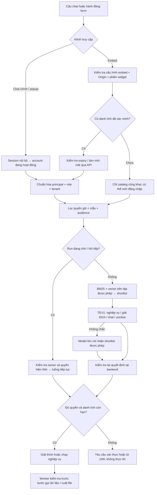
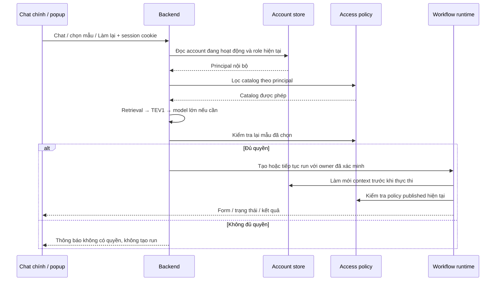
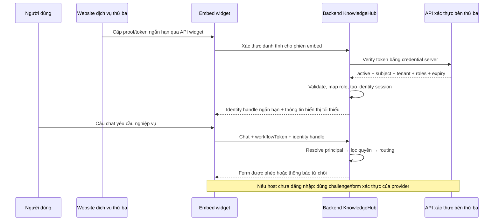

# Kế hoạch phân quyền nghiệp vụ theo danh tính nội bộ và dịch vụ thứ ba

Trạng thái: đề xuất triển khai, chưa phải tính năng đã hoạt động.
Ngày đối chiếu code: 2026-10-09.

## 1. Mục tiêu và phạm vi

- Chat chính và popup: lấy role từ account đang đăng nhập, không hỏi lại thông tin.
- Embed chat: xác minh người dùng qua API dịch vụ thứ ba; ánh xạ role về role nội bộ.
- Quản trị viên cấu hình quyền ở cấp gói và từng mẫu nghiệp vụ.
- Chỉ các nghiệp vụ được phép mới được truy hồi, đưa vào TEV1, model lớn hoặc hiển thị gợi ý.
- Kiểm tra lại quyền tại backend trước khi thực thi, tiếp tục, làm lại, đọc kết quả và tải file.
- Dùng chung cơ chế cho tất cả nghiệp vụ, không hardcode tên nghiệp vụ, mã nhân viên hoặc role phòng ban.

Không bao gồm phân quyền từng dòng dữ liệu trong bản đầu. Quyền chạy một mẫu không tự giới hạn dữ liệu theo người dùng/phòng ban; nếu cần phải bổ sung policy dữ liệu riêng. Không thay toàn bộ hệ thống IAM của dịch vụ thứ ba.

## 2. Hiện trạng đã đối chiếu

| Điểm | Hiện tại | Cần thay đổi |
|---|---|---|
| `automation/registry.js: authorized` | `audience.accountIds`, `tenantIds` | Thêm policy role, nguồn danh tính và tình trạng xác thực |
| `automation/contract.js` | Từ chối audience ngoài hai trường trên | Validate policy mới và role tồn tại |
| `automation/routes.js` | Context có account/tenant/permissions | Xây context chung có principal và roles |
| `routes/router.js: permissionsForAccount` | Account thường và embed có `sql:read`, `knowledge:read` | Quyền công cụ phải lấy từ nguồn được tin cậy và policy dữ liệu |
| `services/embed_chat_service.js: workflowSession` | HMAC ràng buộc embed/session; owner tổng hợp từ token | Giữ bảo vệ phiên, bổ sung danh tính bên thứ ba; token này không chứng minh role |
| `automation/runtime.js` | Kiểm tra owner; worker gọi `authorizeContext` và `canContinue` | Dùng danh tính hiện thời cho mọi thao tác và worker |
| Account | Dùng `account.role`, có nhánh `admin`/`user` | Registry role có cấu hình; tương thích account cũ |
| Retrieval | Bắt đầu từ catalog đã lọc quyền | Áp dụng policy mới trước BM25/vector và sau truy hồi |

Quyền quản trị definition (`permissions: admin`) không đồng nghĩa với quyền chạy mọi mẫu.

## 3. Các quyết định mặc định

1. Admin có quyền cấu hình/sửa/publish theo cơ chế hiện tại; không tự vượt policy chạy nghiệp vụ.
2. Danh sách role trong một policy dùng phép OR: có ít nhất một role phù hợp.
3. Policy gói, mẫu và audience hiện có kết hợp bằng AND; cấu hình cấp dưới không mở rộng quyền cấp trên.
4. Role không biết, tenant không xác minh hoặc danh tính hết hạn không được cấp quyền ngầm.
5. Embed không được nâng quyền bởi Origin, embedId, workflowToken hay role do browser gửi.
6. Không đưa token, OTP, mật khẩu hoặc nội dung form xác thực vào lịch sử chat, prompt, vector hay log.
7. Role chỉ là quyền nghiệp vụ. Capability công cụ và quyền dữ liệu là kiểm tra độc lập, đều phải đạt.

## 4. Mô hình dữ liệu đề xuất

### 4.1 Registry role

Store có cấu trúc, qua lớp persistence PostgreSQL của project:

```json
{
  "id": "hr_reader",
  "label": "Tra cứu nhân sự",
  "enabled": true,
  "revision": 1
}
```

Role ID ổn định; đổi tên hiển thị không đổi ID. Khởi tạo `admin`, `user` từ dữ liệu hiện có. Role đang được policy sử dụng chỉ được ngừng hoạt động, không xóa làm mất tham chiếu. Mọi chỉnh sửa có revision và audit.

Account bổ sung `businessRoleIds`; vẫn giữ `account.role` để tương thích quyền quản trị hiện tại. Roles hiệu lực lấy từ account.role hợp lệ cộng businessRoleIds đang enabled. Không để thêm business role `admin` tự nâng quyền quản trị account.

### 4.2 Policy cấp manifest/template

Giữ nguyên `audience` để tương thích; thêm `access`:

```json
{
  "access": {
    "mode": "roles",
    "roleIds": ["hr_reader"],
    "identitySources": ["internal", "external"]
  }
}
```

Các mode:

| Mode | Ý nghĩa |
|---|---|
| `public` | Không yêu cầu danh tính người dùng; vẫn chịu audience, quyền dữ liệu và giới hạn embed |
| `authenticated` | Cần account nội bộ hoặc external principal đã xác minh |
| `roles` | Cần xác thực và ít nhất một role trong roleIds |

`roleIds` bắt buộc không rỗng khi mode=roles. identitySources được lưu rõ ràng trong UI; public không được giả định có external principal. Không có wildcard role tự động. AccountIds trong audience tiếp tục dùng owner ID hiện có, không dùng external subject thô.

Policy hiệu lực là giao của manifest và template. Bản published hiện tại là nguồn kiểm tra thu hồi quyền; definition snapshot của run không được giữ quyền cũ. Overlay chỉ được siết quyền, không được nới policy gói hoặc mẫu gốc.

### 4.3 Principal chuẩn hóa ở backend

```json
{
  "source": "external",
  "subjectId": "user-123",
  "issuerId": "integration-01",
  "tenantId": "tenant-a",
  "roleIds": ["hr_reader"],
  "verifiedAt": "ISO timestamp",
  "expiresAt": "ISO timestamp",
  "identityVersion": 7,
  "policyVersion": 3
}
```

Context runtime vẫn giữ accountId/tenantId/permissions để tương thích, bổ sung principal. External owner dùng định danh namespaced được server sinh từ integration + tenant + subject + identity session. Conversation gắn bất biến với owner. Hai user không được chia sẻ lịch sử/run dù browser dùng lại sessionId.

### 4.4 Cấu hình integration cho từng embed

- Provider/integration ID, bật/tắt, mode `host_token` hoặc `challenge`.
- Endpoint HTTPS kiểm tra token; endpoint challenge/verify nếu provider hỗ trợ.
- Credential server-to-server lưu qua cơ chế secret của project, UI chỉ trả trạng thái/masked value.
- Mapping response: subject, tenant, roles, active, expiry; validate schema, không thực thi biểu thức tùy ý.
- Mapping role bên ngoài → role nội bộ; role không có mapping không được cấp quyền.
- Mapping tenant được tin cậy; thiếu tenant thì từ chối hoặc gắn tenant cố định đã cấu hình, không nhận tenant tùy ý từ browser.
- Allowlist Origin, timeout, role cache TTL, trường hiển thị form xác thực theo contract provider.
- Giá trị khởi điểm: timeout 5 giây, role cache tối đa 60 giây và không vượt expiry; cần điều chỉnh theo API thực tế.

API bên thứ ba là cấu hình của quản trị viên, không nhận URL từ tin nhắn. Kiểm soát địa chỉ đích và redirect để không trở thành proxy gọi tùy ý.

## 5. Kiến trúc và sơ đồ tổng thể

Các module đề xuất: `identity_context`, `external_identity_service`, `workflow_access_policy`, `role_service`. Controller, router, retrieval và worker cùng gọi các module này; không lặp logic role ở nhiều nơi.



Lối tắt chào hỏi hiện có tiếp tục dùng được. Phân quyền áp dụng trước tất cả đường retrieval, greeting fallback có công cụ, memory, cached decision và model escalation; không riêng TEV1.

## 6. Luồng chat nội bộ



Không nhận accountId/roles từ request body làm nguồn quyền. Account bị khóa hoặc đăng xuất: chặn request mới và worker khi kiểm tra lại.

## 7. Luồng embed và xác thực bên thứ ba



Ưu tiên `host_token`: website đã đăng nhập cấp token dành riêng cho integration này. Không nhúng token lâu hạn vào script URL hoặc HTML. Nếu dùng postMessage phải kiểm tra exact origin và source window.

Mode `challenge`: server trả mô tả các trường cần nhập; widget hiện form riêng ngoài chat. Backend gọi API challenge/verify; OTP dùng một lần, rate limit theo session/principal/IP. Không hỗ trợ chỉ nhập email/mã nhân viên rồi nhận role mà không có bằng chứng xác thực.

### Trạng thái UI xác thực

`anonymous → authenticating → authenticated → expired/revoked`; lỗi xác thực quay lại form, không tự nâng quyền. Phân biệt lỗi credential, timeout provider, thiếu role và hết hạn để người dùng biết bước tiếp theo.

- Chưa xác thực: chỉ công khai danh mục an toàn và lời mời đăng nhập; không tiết lộ tên/mô tả mẫu hạn chế để mời chọn.
- Giữ câu hỏi đang chờ bằng ID phía server, TTL khởi điểm 5 phút; không giữ proof/OTP trong câu hỏi.
- Xác thực xong phải chạy lại routing với catalog mới, không dùng workflow ID do client tự chọn làm quyết định đã được cấp quyền.
- Chỉ tiếp tục một lần với idempotency key; không tạo hai run khi verify hoặc click lặp.
- Khi đổi user/tenant, tách conversation, xóa trạng thái hiển thị nhạy cảm trong widget; không chuyển owner của run cũ sang user mới.
- Danh tính hết hạn có thể xác thực lại để xem/tiếp tục chính run của mình; không tự chuyển run cũ sang chủ sở hữu mới.

## 8. Điểm kiểm tra quyền bắt buộc

| Thao tác | Kiểm tra |
|---|---|
| List template, routing card, giải thích khả năng | Principal, policy gói/mẫu, audience; không trả metadata hạn chế |
| BM25/Qdrant, sibling expansion | Chỉ ID được phép; lọc lại trước dùng kết quả |
| Cache retrieval/quyết định | Key gồm identity scope, roles/policy version, catalog version; invalidation khi quyền thay đổi |
| Tạo run / làm lại | Principal mới nhất, template hiện hành, owner conversation; request idempotency |
| Bổ sung input / resume | Owner + policy hiện tại + revision; không chỉ kiểm tra snapshot |
| Worker / retry tự động | Resolve identity trên server, không suy role từ chuỗi owner; kiểm tra trước từng bước có side effect |
| Đọc run/list/events/history | Owner + quyền hiện tại; không serialize result trái quyền |
| Tải artifact | Owner + quyền hiện tại tại thời điểm tải; không dùng URL tĩnh bypass |
| Hủy run | Cho phép owner đã xác thực hủy run của mình dù vừa mất quyền chạy; không trả kết quả kèm thao tác hủy |
| Sửa/test/publish | Quyền quản trị độc lập; fixture dùng nguồn thật vẫn cần quyền dữ liệu |

Thu hồi quyền được phát hiện trong tối đa TTL cache, không hứa hiệu lực tức thì nếu provider không có webhook. Webhook ký xác thực có thể bổ sung để invalidation sớm. Bước đã gửi đến hệ thống ngoài có thể không thu hồi được; chặn các bước tiếp theo, không tự retry side effect và ghi audit trạng thái thực tế.

## 9. Ngăn đường đi vòng qua chat model / RAG

Chặn một workflow không đủ bảo vệ dữ liệu nếu model lớn vẫn được gọi SQL hoặc tìm tài liệu tương đương.

- Dùng principal chung để xác định capability và phạm vi dữ liệu cho SQL, API source, RAG và công cụ export.
- Không cấp `sql:read` mặc định cho embed chưa xác thực trong mode bảo vệ; policy công cụ phải quyết định rõ.
- Role không tự tạo SQL filter. Nếu yêu cầu chỉ xem hồ sơ bản thân/phòng ban thì binding phải nhận tham số từ verified principal ở server, không lấy từ slot user nhập.
- Chat fallback không được nhận catalog đầy đủ chưa lọc, definition SQL hạn chế hoặc lịch sử của principal khác.
- Câu yêu cầu ngoài quyền trả thông báo chung; không để model tự phán quyền hay suy role từ lời người dùng.
- Tính năng giới hạn role chỉ được coi là hoàn tất sau khi kiểm thử direct SQL/RAG không đi vòng được các tài nguyên đã bảo vệ.

## 10. API đề xuất

Tên endpoint dự kiến, chốt khi triển khai theo router hiện có:

| API | Mục đích |
|---|---|
| `GET/POST /api/business-roles` | Danh mục role, chỉ admin ghi |
| `PUT /api/business-roles/:id` | Đổi label/enabled với revision |
| API account hiện có + businessRoleIds | Gán role nghiệp vụ cho account |
| API cấu hình embed hiện có + identityIntegration | Endpoint/mapping/cache/secret reference |
| `POST /api/embed/identity/challenge` | Bắt đầu xác thực nếu provider hỗ trợ |
| `POST /api/embed/identity/verify` | Verify host proof hoặc challenge response |
| `GET /api/embed/identity` | Trạng thái xác thực của đúng phiên |
| `DELETE /api/embed/identity` | Đăng xuất identity, vô hiệu handle |
| API template draft/publish hiện có | Lưu policy access, validate rồi publish |

Widget và API không được trả credential integration. Identity handle opaque, lưu server-side và ràng buộc integration, widget session, origin được phép, subject/tenant, expiry. Đặt `Cache-Control: no-store` cho response identity và dữ liệu riêng tư.

Mã nghiệp vụ thống nhất: `IDENTITY_REQUIRED`, `IDENTITY_EXPIRED`, `IDENTITY_PROVIDER_UNAVAILABLE`, `WORKFLOW_ACCESS_DENIED`, `WORKFLOW_ACCESS_REVOKED`. Resource không thuộc owner vẫn trả 404; không dùng lỗi để tiết lộ run tồn tại. Rate limit verify riêng với chat để chống thử OTP và tránh poll tiêu tốn quota đăng nhập.

## 11. UI quản trị và chat

### Mẫu nghiệp vụ

Tab Thông tin & đầu vào thêm “Quyền sử dụng”: mode, multi-select role, nguồn danh tính. Hiển thị quyền kế thừa từ gói; cảnh báo policy mẫu không thể nới gói. Preview quyền hiệu lực trước publish; thay đổi quyền áp dụng qua quy trình draft/test/publish hiện tại.

Thẻ mẫu hiển thị badge “Cần đăng nhập” hoặc “Role: …”. Chỉ quản trị viên được thấy toàn bộ mẫu để cấu hình. Người dùng chat chỉ thấy mẫu được phép; không tải catalog hạn chế xuống browser rồi mới ẩn.

### Embed integration

Form cấu hình API, mapping role/tenant, thử kết nối với danh tính mẫu và xem kết quả masked. Không ghi thử token vào lịch sử/audit. Popup xác nhận khi publish policy hoặc đổi mapping ảnh hưởng quyền; không hỏi xác nhận lại mỗi lần chat.

### Chat chính, popup, embed

Các form nghiệp vụ giữ icon, dark mode, thu gọn/mở rộng và animation hiện có. Form xác thực là component riêng, không thành slot nghiệp vụ. Hiển thị tài khoản đang xác thực và nút đổi/đăng xuất cho embed. Khi hết hạn, khóa thao tác chạy và yêu cầu xác thực lại; không làm mất dữ liệu form còn hợp lệ trong cùng principal.

## 12. Migration, cache và backup

1. Thêm role store, external identity session store và policyVersion qua cơ chế migration PostgreSQL hiện có.
2. Không tự ghi lại toàn bộ definition published hoặc vector chỉ để thêm role.
3. Mẫu cũ thiếu access đọc như legacy: giữ audience và hành vi hiện tại. UI đánh dấu cần rà soát; mẫu tạo mới mặc định authenticated.
4. Embed được bật external identity chuyển sang strict mode: mẫu thiếu policy không tự coi là public. Admin phải xác nhận cấu hình và publish trước khi mở tích hợp.
5. Cutover thông báo rõ: run embed cũ là phiên anonymous, không tự gán cho người dùng bên thứ ba; cần tạo phiên/run mới khi xác thực. Giữ luồng legacy cho embed chưa chuyển đổi trong giai đoạn migration.
6. Chuyển policy sang role trên từng mẫu/gói có version và rollback; rollback identity không được làm sống lại token đã thu hồi.
7. ACL được tính từ catalog hiện tại, không tin role/policy cũ lưu trong payload vector. Cache invalidation theo principal/policy version; routing card nội dung không đổi thì không cần embedding lại.
8. Backup bao gồm role, mapping integration, policy, identity configuration và Qdrant như hiện có. Secret dùng cơ chế đóng gói bảo mật của project; không export trong bundle template.
9. Không khôi phục identity session/token/challenge đang hoạt động từ backup; invalidate toàn bộ sau restore, yêu cầu đăng nhập lại. Audit restore và xác minh mapping/secret reference trên máy đích.

## 13. Kế hoạch triển khai theo giai đoạn

| Giai đoạn | Công việc / điểm sửa | Điều kiện hoàn thành |
|---|---|---|
| 1. Policy và role | role_service, contract, access evaluator, account business roles | Unit test ma trận quyền; legacy không đổi |
| 2. Context nội bộ | identity_context; routes.js, router.js, runtime authorizeContext | Chat chính/popup lọc và chạy đúng role, admin không bypass |
| 3. Runtime và dữ liệu | registry.list/getTemplate/canContinue, owned/list/events/artifact, worker; công cụ SQL/RAG | Không có đường API/tool đi vòng, thu hồi quyền chặn bước tiếp |
| 4. Embed identity | external_identity_service, persistence, verify/challenge/logout, mapping provider | Token giả/role giả/đổi tenant bị chặn; expiry và outage đúng |
| 5. Routing/cache | Retrieval ACL, TEV1/model fallback, memory/pending, cache partition | Không leak metadata, không tái dùng quyết định khác quyền |
| 6. UI | Editor policy, account roles, embed integration, form identity ở widget | Dark/light/mobile; main/popup/embed cùng hành vi |
| 7. Migration/rollout | Dry-run policy audit, backup/restore, shadow → enforce từng embed | Báo cáo đánh giá và phương án rollback đã thử |

Giai đoạn có thể phát triển nối tiếp nhưng chỉ bật strict mode khi runtime, data tools và routing cùng enforce. Không triển khai UI giới hạn role như một lớp bảo vệ độc lập.

## 14. Bộ kiểm thử và tiêu chí nghiệm thu

### Ma trận chức năng

- Nội bộ: user/admin/role nghiệp vụ, nhiều role, role disabled, account khóa; quyền quản trị không tự vượt quyền chạy.
- Policy public/authenticated/roles; gói AND mẫu AND audience; overlay không mở rộng quyền.
- Embed: anonymous, host token hợp lệ/giả/hết hạn/sai issuer/sai audience, subject inactive, role unmapped, tenant sai.
- Challenge: sai OTP, OTP lặp, TTL, rate limit; provider timeout/malformed/HTTP lỗi không được cho qua.
- Cross-user/cross-tenant/cross-embed: sessionId trùng, token tráo, runId đoán, đổi account; không đọc được lịch sử/kết quả/file.
- Thu hồi role khi WAITING_INPUT, QUEUED, RUNNING, giữa hai bước và khi download; cancel của owner vẫn dùng được.
- Retry và concurrent verify: một request tạo một run, không dùng cached role đã hết hạn.
- Retrieval: lexical/hybrid, sibling expansion, memoryProbe/slot_answer, explain, TEV1 unclear, model fallback; chỉ được thấy catalog đã lọc.
- SQL/RAG/export trực tiếp và qua model: không lấy dữ liệu nằm ngoài policy dữ liệu của principal.
- Main/popup/embed: form xác thực tách khỏi lịch sử; refresh/reopen, logout, thu gọn, dark mode, bàn phím.
- Backup restore: policy/mapping/role còn đủ, session cũ vô hiệu; secret không xuất hiện ở template export/log/prompt.

### Chỉ số nghiệm thu

- 100% ca truy cập trái quyền trong bộ test bị chặn ở backend; không chỉ ẩn UI.
- 0 SQL/API/file side effect trong ca từ chối trước thực thi; ca thu hồi giữa chừng ghi đúng bước đã xảy ra.
- Role thu hồi có hiệu lực trong giới hạn TTL được cấu hình; outage không dùng cache quá hạn.
- Đo p50/p95 riêng cho policy local, provider verify và chat end-to-end. Mục tiêu policy local dưới 20 ms p95 trên máy thử, cần đo thực tế trước khi chốt.
- Cache role không gây gọi provider theo mọi poll; vẫn kiểm tra freshness trước thao tác bảo vệ.
- Bộ câu chat thật tiếp tục đánh giá routing recall@K trên catalog được phép; không tính mẫu trái quyền là ứng viên bị retrieval bỏ sót.

## 15. Audit và vận hành

Ghi: correlationId, integrationId, principal nội bộ/pseudonymous, template/version, action, allow/deny/reason, identity/policy version, độ trễ provider. Không ghi raw proof, OTP, credential, toàn bộ response xác thực hoặc dữ liệu kết quả.

Dashboard tối thiểu: số verify thành công/thất bại, timeout provider, deny/revoked, cache hit và latency. Lỗi provider không để người dùng phải bấm lại tạo trùng nghiệp vụ; thông báo retry xác thực rõ ràng.

## 16. Thông tin còn cần từ dịch vụ thứ ba

Các phần policy nội bộ có thể triển khai trước. Adapter external production cần:

1. Tài liệu endpoint và mẫu request/response verify, môi trường thử nghiệm.
2. Host có cấp token cho embed được không; issuer/audience/expiry và cơ chế refresh.
3. Nếu chưa đăng nhập: challenge/OTP/redirect nào được hỗ trợ; không tự xây cơ chế chỉ tra mã user để cấp role.
4. Trường subject ổn định, tenant, active, roles; bảng mapping role và tenant được chủ hệ thống xác nhận.
5. Rate limit, timeout, SLA và cơ chế báo thu hồi role/logout (nếu có).

Thiếu contract API không chặn việc xây policy/context và mock test, nhưng không được tự giả lập danh tính hợp lệ trong production.
